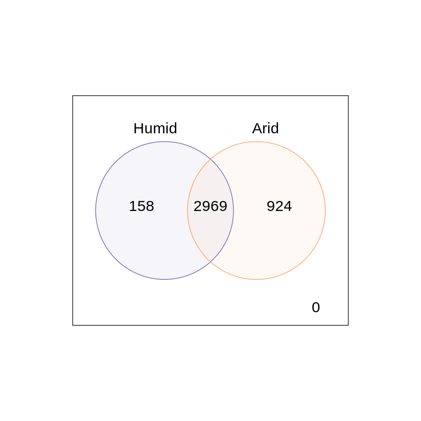
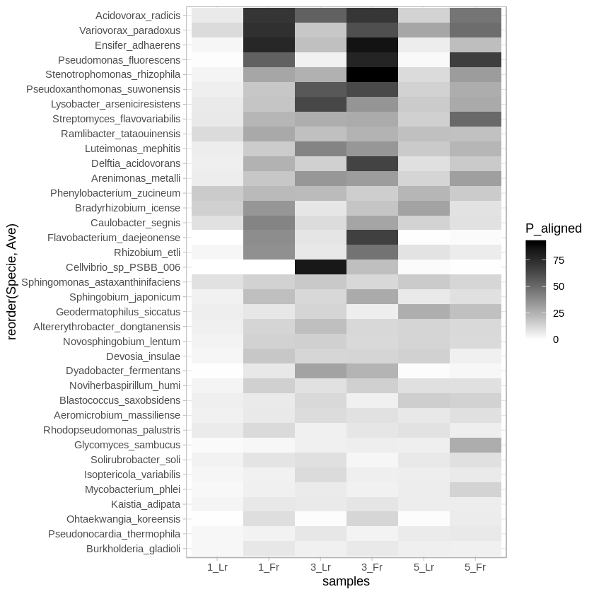

# Metagenomic analysis by protein database and recruitemnts against reference genomes


```R
library(phyloseq)
library(ape)
library(ggplot2)
library(DESeq2)
library (gplots)
library (RColorBrewer)
library(vegan)
library(tidyverse)
library(reshape2)
library(UpSetR)
library(limma)
```

    Loading required package: S4Vectors
    Loading required package: stats4
    Loading required package: BiocGenerics
    Loading required package: parallel
    
    Attaching package: ‘BiocGenerics’
    
    The following objects are masked from ‘package:parallel’:
    
        clusterApply, clusterApplyLB, clusterCall, clusterEvalQ,
        clusterExport, clusterMap, parApply, parCapply, parLapply,
        parLapplyLB, parRapply, parSapply, parSapplyLB
    
    The following objects are masked from ‘package:stats’:
    
        IQR, mad, sd, var, xtabs
    
    The following objects are masked from ‘package:base’:
    
        anyDuplicated, append, as.data.frame, basename, cbind, colMeans,
        colnames, colSums, dirname, do.call, duplicated, eval, evalq,
        Filter, Find, get, grep, grepl, intersect, is.unsorted, lapply,
        lengths, Map, mapply, match, mget, order, paste, pmax, pmax.int,
        pmin, pmin.int, Position, rank, rbind, Reduce, rowMeans, rownames,
        rowSums, sapply, setdiff, sort, table, tapply, union, unique,
        unsplit, which, which.max, which.min
    
    
    Attaching package: ‘S4Vectors’
    
    The following object is masked from ‘package:base’:
    
        expand.grid
    
    Loading required package: IRanges
    
    Attaching package: ‘IRanges’
    
    The following object is masked from ‘package:phyloseq’:
    
        distance
    
    Loading required package: GenomicRanges
    Loading required package: GenomeInfoDb
    Loading required package: SummarizedExperiment
    Loading required package: Biobase
    Welcome to Bioconductor
    
        Vignettes contain introductory material; view with
        'browseVignettes()'. To cite Bioconductor, see
        'citation("Biobase")', and for packages 'citation("pkgname")'.
    
    
    Attaching package: ‘Biobase’
    
    The following object is masked from ‘package:phyloseq’:
    
        sampleNames
    
    Loading required package: DelayedArray
    Loading required package: matrixStats
    
    Attaching package: ‘matrixStats’
    
    The following objects are masked from ‘package:Biobase’:
    
        anyMissing, rowMedians
    
    Loading required package: BiocParallel
    
    Attaching package: ‘DelayedArray’
    
    The following objects are masked from ‘package:matrixStats’:
    
        colMaxs, colMins, colRanges, rowMaxs, rowMins, rowRanges
    
    The following objects are masked from ‘package:base’:
    
        aperm, apply
    
    
    Attaching package: ‘gplots’
    
    The following object is masked from ‘package:IRanges’:
    
        space
    
    The following object is masked from ‘package:S4Vectors’:
    
        space
    
    The following object is masked from ‘package:stats’:
    
        lowess
    
    Loading required package: permute
    Loading required package: lattice
    This is vegan 2.5-5
    ── Attaching packages ─────────────────────────────────────── tidyverse 1.2.1 ──
    ✔ tibble  2.1.3     ✔ purrr   0.3.3
    ✔ tidyr   1.0.0     ✔ dplyr   0.8.3
    ✔ readr   1.3.1     ✔ stringr 1.4.0
    ✔ tibble  2.1.3     ✔ forcats 0.4.0
    ── Conflicts ────────────────────────────────────────── tidyverse_conflicts() ──
    ✖ dplyr::collapse()        masks IRanges::collapse()
    ✖ dplyr::combine()         masks Biobase::combine(), BiocGenerics::combine()
    ✖ dplyr::count()           masks matrixStats::count()
    ✖ dplyr::desc()            masks IRanges::desc()
    ✖ tidyr::expand()          masks S4Vectors::expand()
    ✖ dplyr::filter()          masks stats::filter()
    ✖ dplyr::first()           masks S4Vectors::first()
    ✖ dplyr::lag()             masks stats::lag()
    ✖ BiocGenerics::Position() masks ggplot2::Position(), base::Position()
    ✖ purrr::reduce()          masks GenomicRanges::reduce(), IRanges::reduce()
    ✖ dplyr::rename()          masks S4Vectors::rename()
    ✖ purrr::simplify()        masks DelayedArray::simplify()
    ✖ dplyr::slice()           masks IRanges::slice()
    
    Attaching package: ‘reshape2’
    
    The following object is masked from ‘package:tidyr’:
    
        smiths
    
    
    Attaching package: ‘UpSetR’
    
    The following object is masked from ‘package:lattice’:
    
        histogram
    
    
    Attaching package: ‘limma’
    
    The following object is masked from ‘package:DESeq2’:
    
        plotMA
    
    The following object is masked from ‘package:BiocGenerics’:
    
        plotMA
    


# Analyses using Subsystems from SEED database


```R
#Diseable scientific notation
options(scipen=999)
```


```R
# Load OFU table
ofu <- as.matrix(read.csv("squash.csv", header=T, row.names=1))
OFU <- otu_table(ofu, taxa_are_rows=T)
```


```R
# Load ontology table
onto <- as.matrix(read.csv("Ontology_nr_sq.csv", header=F, row.names=1))
ONTO <- tax_table(onto)
colnames(ONTO) <- c("Level1", "Level2", "Level3", "Level4")
```


```R
# Create phyloseq object with protein counts and ontology
subscalabacita <- phyloseq(OFU, ONTO)
subscalabacita
```


    phyloseq-class experiment-level object
    otu_table()   OTU Table:         [ 32642 taxa and 6 samples ]
    tax_table()   Taxonomy Table:    [ 32642 taxa by 4 taxonomic ranks ]


```R
# Load metadata and denote variables
metadata <- read.csv("mg_metadata.csv", header=T)
sampledata <- sample_data(data.frame(sample=metadata$sample, name=metadata$name, locality=metadata$locality, latitude=metadata$Latitude, longitude=metadata$Longitude, type=metadata$type, treatment=metadata$treatment, surface=metadata$surface, alenght=metadata$alength, stlenght=metadata$stlenght, flowers=metadata$flowers, leaves=metadata$leaves, rlenght=metadata$rlenght, sdiameter=metadata$sdiameter, chlorophyll=metadata$chlorophyll, tchlorophyll=metadata$tchlorophyll, carotenoids=metadata$carotenoids, tcarotenoids=metadata$tcarotenoids, abiomass=metadata$abiomass, sla=metadata$sla, toc=metadata$TOC, tn=metadata$TN, nh4=metadata$NH4, no3=metadata$NO3, pt=metadata$PT, hpo4=metadata$HPO4, cn=metadata$C.N, cp=metadata$C.N, np=metadata$N.P, ph=metadata$pH, mat=metadata$MAT, map=metadata$MAP, ai=metadata$AI, climate=metadata$climate, soil=metadata$soil, samplec=metadata$samplec, samplet=metadata$samplet, specie=metadata$specie, row.names=sample_names(subscalabacita)))
subscalabacita <- phyloseq(OFU, ONTO, sampledata)
```


```R
# Estimate relative abundance of cunts
rsubscalabacita <- transform_sample_counts(subscalabacita, function(x) x / sum(x))
```


```R
#Tax_glom at level1
calabacita1 <- tax_glom(rsubscalabacita, taxrank="Level1")
calabacita1
```


    phyloseq-class experiment-level object
    otu_table()   OTU Table:         [ 28 taxa and 6 samples ]
    sample_data() Sample Data:       [ 6 samples by 38 sample variables ]
    tax_table()   Taxonomy Table:    [ 28 taxa by 4 taxonomic ranks ]


```R
#Comparison between subsystems
#Join taxonomy table, otu table and metadata
ccalabacita1 <- data.frame(cbind(tax_table(calabacita1), otu_table(calabacita1)), row.names=NULL)
ccalabacita1$Level2 <- NULL
ccalabacita1$Level3 <- NULL
ccalabacita1$Level4 <- NULL
tccalabacita1 <- data.frame(t(ccalabacita1))
colnames(tccalabacita1) <- NULL

#Export table to repeat analysis without loading otu and taxa tables if necessary
write.table(tccalabacita1, "tccalabacita1.tsv", quote = TRUE, sep = "\t")

#Cargar tabla
tcalabacita1 <- read.table("tccalabacita1.tsv", header = TRUE, sep = "\t")

#Load climatic metadata
climate <- data.frame(metadata$climate)


#Merge climatic data and Level 1 Subsystems data
ccalabacita1 <- cbind(climate, tcalabacita1)
mcalabacita <- melt(ccalabacita1)
colnames(mcalabacita) <- c("Climate", "Sample", "Level1", "Relative_abundance")
head(mcalabacita)
```

    Using metadata.climate, Level1 as id variables


<table>
<thead><tr><th scope=col>Climate</th><th scope=col>Sample</th><th scope=col>Level1</th><th scope=col>Relative_abundance</th></tr></thead>
<tbody>
	<tr><td>arid         </td><td>WGS_3_Fr.hout</td><td>Miscellaneous</td><td>0.05934403   </td></tr>
	<tr><td>arid         </td><td>WGS_3_Lr.hout</td><td>Miscellaneous</td><td>0.06763828   </td></tr>
	<tr><td>humid        </td><td>WGS_1_Fr.hout</td><td>Miscellaneous</td><td>0.05083197   </td></tr>
	<tr><td>humid        </td><td>WGS_1_Lr.hout</td><td>Miscellaneous</td><td>0.05044266   </td></tr>
	<tr><td>arid         </td><td>WGS_5_Lr.hout</td><td>Miscellaneous</td><td>0.05603036   </td></tr>
	<tr><td>arid         </td><td>WGS_5_Fr.hout</td><td>Miscellaneous</td><td>0.06067719   </td></tr>
</tbody>
</table>


```R
#Make plot
#Cambiar los nombres de las variables que se quiere agregar a las gráficas

plot_mcalabacita <- ggplot(mcalabacita, aes(x= reorder(Level1, -Relative_abundance), y=Relative_abundance, 
                                            fill=Climate)) + 
                            geom_boxplot(outlier.size = 0.5) + 
                            scale_fill_manual(values = c("#5c5cafff", "#ff9a58ff")) +
                            theme_light(base_size = 10) +
                            theme(axis.text.y = element_text(size = 10), 
                                  axis.text.x = element_text(angle = 90, size = 10)) 
                                    
ggsave("plot_mcalabacita.pdf", width=25, height=25, units="cm")

plot_mcalabacita
```


    

    


```R
#Make wilcox-test comparisons for relative abundance at Level 1

print("Carbohydrates")
wilcox.test(Relative_abundance~Climate, filter(mcalabacita, Level1 == "Carbohydrates"))

print("Clustering.based_subsystems")
wilcox.test(Relative_abundance~Climate, filter(mcalabacita, Level1 == "Clustering.based_subsystems"))

print("Amino_Acids_and_Derivatives")
wilcox.test(Relative_abundance~Climate, filter(mcalabacita, Level1 == "Amino_Acids_and_Derivatives"))

print("Membrane_Transport")
wilcox.test(Relative_abundance~Climate, filter(mcalabacita, Level1 == "Membrane_Transport"))

print("Miscellaneous")
wilcox.test(Relative_abundance~Climate, filter(mcalabacita, Level1 == "Miscellaneous"), alternative="less")

print("Cofactors_Vitamins_Prosthetic_Groups_Pigments")
wilcox.test(Relative_abundance~Climate, filter(mcalabacita, Level1 == "Cofactors_Vitamins_Prosthetic_Groups_Pigments"))

print("DNA_Metabolism")
wilcox.test(Relative_abundance~Climate, filter(mcalabacita, Level1 == "DNA_Metabolism"))

print("RNA_Metabolism")
wilcox.test(Relative_abundance~Climate, filter(mcalabacita, Level1 == "RNA_Metabolism"))

print("Cell_Wall_and_Capsule")
wilcox.test(Relative_abundance~Climate, filter(mcalabacita, Level1 == "Cell_Wall_and_Capsule"))

print("Respiration")
wilcox.test(Relative_abundance~Climate, filter(mcalabacita, Level1 == "Respiration"))

print("Virulence_Disease_and_Defense")
wilcox.test(Relative_abundance~Climate, filter(mcalabacita, Level1 == "Virulence_Disease_and_Defense"))

print("Fatty_Acids_Lipids_and_Isoprenoids")
wilcox.test(Relative_abundance~Climate, filter(mcalabacita, Level1 == "Fatty_Acids_Lipids_and_Isoprenoids"))

print("Nitrogen_Metabolism")
wilcox.test(Relative_abundance~Climate, filter(mcalabacita, Level1 == "Nitrogen_Metabolism"))

print("Nucleosides_and_Nucleotides")
wilcox.test(Relative_abundance~Climate, filter(mcalabacita, Level1 == "Nucleosides_and_Nucleotides"))

print("Motility_and_Chemotaxis")
wilcox.test(Relative_abundance~Climate, filter(mcalabacita, Level1 == "Motility_and_Chemotaxis"))

print("Motility_and_Chemotaxis")
wilcox.test(Relative_abundance~Climate, filter(mcalabacita, Level1 == "Stress_Response"))

print("Iron_acquisition_and_metabolism")
wilcox.test(Relative_abundance~Climate, filter(mcalabacita, Level1 == "Iron_acquisition_and_metabolism"))

print("Metabolism_of_Aromatic_Compounds")
wilcox.test(Relative_abundance~Climate, filter(mcalabacita, Level1 == "Metabolism_of_Aromatic_Compounds"), alternative="less")

print("Regulation_and_Cell_signaling")
wilcox.test(Relative_abundance~Climate, filter(mcalabacita, Level1 == "Regulation_and_Cell_signaling"))

print("Phosphorus_Metabolism")
wilcox.test(Relative_abundance~Climate, filter(mcalabacita, Level1 == "Phosphorus_Metabolism"))

print("Phages_Prophages_Transposable_elements_Plasmids")
wilcox.test(Relative_abundance~Climate, filter(mcalabacita, Level1 == "Phages_Prophages_Transposable_elements_Plasmids"))

print("Sulfur_Metabolism")
wilcox.test(Relative_abundance~Climate, filter(mcalabacita, Level1 == "Sulfur_Metabolism"))

print("Potassium_metabolism")
wilcox.test(Relative_abundance~Climate, filter(mcalabacita, Level1 == "Potassium_metabolism"))

print("Cell_Division_and_Cell_Cycle")
wilcox.test(Relative_abundance~Climate, filter(mcalabacita, Level1 == "Cell_Division_and_Cell_Cycle"))

print("Secondary_Metabolism")
wilcox.test(Relative_abundance~Climate, filter(mcalabacita, Level1 == "Secondary_Metabolism"))

print("Dormancy_and_Sporulation")
wilcox.test(Relative_abundance~Climate, filter(mcalabacita, Level1 == "Dormancy_and_Sporulation"))

print("Photosynthesis")
wilcox.test(Relative_abundance~Climate, filter(mcalabacita, Level1 == "Photosynthesis"))
```

    [1] "Carbohydrates"


    
    	Wilcoxon rank sum test
    
    data:  Relative_abundance by Climate
    W = 6, p-value = 0.5333
    alternative hypothesis: true location shift is not equal to 0


    [1] "Clustering.based_subsystems"


    
    	Wilcoxon rank sum test
    
    data:  Relative_abundance by Climate
    W = 4, p-value = 1
    alternative hypothesis: true location shift is not equal to 0


    [1] "Amino_Acids_and_Derivatives"


    
    	Wilcoxon rank sum test
    
    data:  Relative_abundance by Climate
    W = 3, p-value = 0.8
    alternative hypothesis: true location shift is not equal to 0


    [1] "Membrane_Transport"


    
    	Wilcoxon rank sum test
    
    data:  Relative_abundance by Climate
    W = 3, p-value = 0.8
    alternative hypothesis: true location shift is not equal to 0


    [1] "Miscellaneous"


    
    	Wilcoxon rank sum test
    
    data:  Relative_abundance by Climate
    W = 8, p-value = 1
    alternative hypothesis: true location shift is less than 0


    [1] "Cofactors_Vitamins_Prosthetic_Groups_Pigments"


    
    	Wilcoxon rank sum test
    
    data:  Relative_abundance by Climate
    W = 5, p-value = 0.8
    alternative hypothesis: true location shift is not equal to 0


    [1] "DNA_Metabolism"


    
    	Wilcoxon rank sum test
    
    data:  Relative_abundance by Climate
    W = 7, p-value = 0.2667
    alternative hypothesis: true location shift is not equal to 0


    [1] "RNA_Metabolism"


    
    	Wilcoxon rank sum test
    
    data:  Relative_abundance by Climate
    W = 6, p-value = 0.5333
    alternative hypothesis: true location shift is not equal to 0


    [1] "Cell_Wall_and_Capsule"


    
    	Wilcoxon rank sum test
    
    data:  Relative_abundance by Climate
    W = 5, p-value = 0.8
    alternative hypothesis: true location shift is not equal to 0


    [1] "Respiration"


    
    	Wilcoxon rank sum test
    
    data:  Relative_abundance by Climate
    W = 3, p-value = 0.8
    alternative hypothesis: true location shift is not equal to 0


    [1] "Virulence_Disease_and_Defense"


    
    	Wilcoxon rank sum test
    
    data:  Relative_abundance by Climate
    W = 3, p-value = 0.8
    alternative hypothesis: true location shift is not equal to 0


    [1] "Fatty_Acids_Lipids_and_Isoprenoids"


    
    	Wilcoxon rank sum test
    
    data:  Relative_abundance by Climate
    W = 4, p-value = 1
    alternative hypothesis: true location shift is not equal to 0


    [1] "Nitrogen_Metabolism"


    
    	Wilcoxon rank sum test
    
    data:  Relative_abundance by Climate
    W = 4, p-value = 1
    alternative hypothesis: true location shift is not equal to 0


    [1] "Nucleosides_and_Nucleotides"


    
    	Wilcoxon rank sum test
    
    data:  Relative_abundance by Climate
    W = 5, p-value = 0.8
    alternative hypothesis: true location shift is not equal to 0


    [1] "Motility_and_Chemotaxis"


    
    	Wilcoxon rank sum test
    
    data:  Relative_abundance by Climate
    W = 1, p-value = 0.2667
    alternative hypothesis: true location shift is not equal to 0


    [1] "Motility_and_Chemotaxis"


    
    	Wilcoxon rank sum test
    
    data:  Relative_abundance by Climate
    W = 3, p-value = 0.8
    alternative hypothesis: true location shift is not equal to 0


    [1] "Iron_acquisition_and_metabolism"


    
    	Wilcoxon rank sum test
    
    data:  Relative_abundance by Climate
    W = 7, p-value = 0.2667
    alternative hypothesis: true location shift is not equal to 0


    [1] "Metabolism_of_Aromatic_Compounds"


    
    	Wilcoxon rank sum test
    
    data:  Relative_abundance by Climate
    W = 0, p-value = 0.06667
    alternative hypothesis: true location shift is less than 0


    [1] "Regulation_and_Cell_signaling"


    
    	Wilcoxon rank sum test
    
    data:  Relative_abundance by Climate
    W = 4, p-value = 1
    alternative hypothesis: true location shift is not equal to 0


    [1] "Phosphorus_Metabolism"


    
    	Wilcoxon rank sum test
    
    data:  Relative_abundance by Climate
    W = 6, p-value = 0.5333
    alternative hypothesis: true location shift is not equal to 0


    [1] "Phages_Prophages_Transposable_elements_Plasmids"


    
    	Wilcoxon rank sum test
    
    data:  Relative_abundance by Climate
    W = 7, p-value = 0.2667
    alternative hypothesis: true location shift is not equal to 0


    [1] "Sulfur_Metabolism"


    
    	Wilcoxon rank sum test
    
    data:  Relative_abundance by Climate
    W = 1, p-value = 0.2667
    alternative hypothesis: true location shift is not equal to 0


    [1] "Potassium_metabolism"


    
    	Wilcoxon rank sum test
    
    data:  Relative_abundance by Climate
    W = 2, p-value = 0.5333
    alternative hypothesis: true location shift is not equal to 0


    [1] "Cell_Division_and_Cell_Cycle"


    
    	Wilcoxon rank sum test
    
    data:  Relative_abundance by Climate
    W = 2, p-value = 0.5333
    alternative hypothesis: true location shift is not equal to 0


    [1] "Secondary_Metabolism"


    
    	Wilcoxon rank sum test
    
    data:  Relative_abundance by Climate
    W = 6, p-value = 0.5333
    alternative hypothesis: true location shift is not equal to 0


    [1] "Dormancy_and_Sporulation"


    
    	Wilcoxon rank sum test
    
    data:  Relative_abundance by Climate
    W = 5, p-value = 0.8
    alternative hypothesis: true location shift is not equal to 0


    [1] "Photosynthesis"


    
    	Wilcoxon rank sum test
    
    data:  Relative_abundance by Climate
    W = 5, p-value = 0.8
    alternative hypothesis: true location shift is not equal to 0


```R
#Make t-test comparisons for relative abundance at Level 1

print("Carbohydrates")
t.test(Relative_abundance~Climate, filter(mcalabacita, Level1 == "Carbohydrates"))

print("Clustering.based_subsystems")
t.test(Relative_abundance~Climate, filter(mcalabacita, Level1 == "Clustering.based_subsystems"))

print("Amino_Acids_and_Derivatives")
t.test(Relative_abundance~Climate, filter(mcalabacita, Level1 == "Amino_Acids_and_Derivatives"))

print("Membrane_Transport")
t.test(Relative_abundance~Climate, filter(mcalabacita, Level1 == "Membrane_Transport"))

print("Miscellaneous")
t.test(Relative_abundance~Climate, filter(mcalabacita, Level1 == "Miscellaneous"))

print("Cofactors_Vitamins_Prosthetic_Groups_Pigments")
t.test(Relative_abundance~Climate, filter(mcalabacita, Level1 == "Cofactors_Vitamins_Prosthetic_Groups_Pigments"))

print("DNA_Metabolism")
t.test(Relative_abundance~Climate, filter(mcalabacita, Level1 == "DNA_Metabolism"))

print("RNA_Metabolism")
t.test(Relative_abundance~Climate, filter(mcalabacita, Level1 == "RNA_Metabolism"))

print("Cell_Wall_and_Capsule")
t.test(Relative_abundance~Climate, filter(mcalabacita, Level1 == "Cell_Wall_and_Capsule"))

print("Respiration")
t.test(Relative_abundance~Climate, filter(mcalabacita, Level1 == "Respiration"))

print("Virulence_Disease_and_Defense")
t.test(Relative_abundance~Climate, filter(mcalabacita, Level1 == "Virulence_Disease_and_Defense"))

print("Fatty_Acids_Lipids_and_Isoprenoids")
t.test(Relative_abundance~Climate, filter(mcalabacita, Level1 == "Fatty_Acids_Lipids_and_Isoprenoids"))

print("Nitrogen_Metabolism")
t.test(Relative_abundance~Climate, filter(mcalabacita, Level1 == "Nitrogen_Metabolism"))

print("Nucleosides_and_Nucleotides")
t.test(Relative_abundance~Climate, filter(mcalabacita, Level1 == "Nucleosides_and_Nucleotides"))

print("Motility_and_Chemotaxis")
t.test(Relative_abundance~Climate, filter(mcalabacita, Level1 == "Motility_and_Chemotaxis"))

print("Motility_and_Chemotaxis")
t.test(Relative_abundance~Climate, filter(mcalabacita, Level1 == "Stress_Response"))

print("Iron_acquisition_and_metabolism")
t.test(Relative_abundance~Climate, filter(mcalabacita, Level1 == "Iron_acquisition_and_metabolism"))

print("Metabolism_of_Aromatic_Compounds")
t.test(Relative_abundance~Climate, filter(mcalabacita, Level1 == "Metabolism_of_Aromatic_Compounds"))

print("Regulation_and_Cell_signaling")
t.test(Relative_abundance~Climate, filter(mcalabacita, Level1 == "Regulation_and_Cell_signaling"))

print("Phosphorus_Metabolism")
t.test(Relative_abundance~Climate, filter(mcalabacita, Level1 == "Phosphorus_Metabolism"))

print("Phages_Prophages_Transposable_elements_Plasmids")
t.test(Relative_abundance~Climate, filter(mcalabacita, Level1 == "Phages_Prophages_Transposable_elements_Plasmids"))

print("Sulfur_Metabolism")
t.test(Relative_abundance~Climate, filter(mcalabacita, Level1 == "Sulfur_Metabolism"))

print("Potassium_metabolism")
t.test(Relative_abundance~Climate, filter(mcalabacita, Level1 == "Potassium_metabolism"))

print("Cell_Division_and_Cell_Cycle")
t.test(Relative_abundance~Climate, filter(mcalabacita, Level1 == "Cell_Division_and_Cell_Cycle"))

print("Secondary_Metabolism")
t.test(Relative_abundance~Climate, filter(mcalabacita, Level1 == "Secondary_Metabolism"))

print("Dormancy_and_Sporulation")
t.test(Relative_abundance~Climate, filter(mcalabacita, Level1 == "Dormancy_and_Sporulation"))

print("Photosynthesis")
t.test(Relative_abundance~Climate, filter(mcalabacita, Level1 == "Photosynthesis"))
```

    [1] "Carbohydrates"


    
    	Welch Two Sample t-test
    
    data:  Relative_abundance by Climate
    t = 1.269, df = 3.2759, p-value = 0.2871
    alternative hypothesis: true difference in means is not equal to 0
    95 percent confidence interval:
     -0.005303885  0.012921442
    sample estimates:
     mean in group arid mean in group humid 
              0.1317310           0.1279222 


    [1] "Clustering.based_subsystems"


    
    	Welch Two Sample t-test
    
    data:  Relative_abundance by Climate
    t = -0.194, df = 2.8227, p-value = 0.8593
    alternative hypothesis: true difference in means is not equal to 0
    95 percent confidence interval:
     -0.02261429  0.02010204
    sample estimates:
     mean in group arid mean in group humid 
              0.1219912           0.1232474 


    [1] "Amino_Acids_and_Derivatives"


    
    	Welch Two Sample t-test
    
    data:  Relative_abundance by Climate
    t = -0.8048, df = 3.3024, p-value = 0.4748
    alternative hypothesis: true difference in means is not equal to 0
    95 percent confidence interval:
     -0.02287558  0.01325827
    sample estimates:
     mean in group arid mean in group humid 
             0.08867577          0.09348443 


    [1] "Membrane_Transport"


    
    	Welch Two Sample t-test
    
    data:  Relative_abundance by Climate
    t = -0.71949, df = 1.3186, p-value = 0.5777
    alternative hypothesis: true difference in means is not equal to 0
    95 percent confidence interval:
     -0.07297173  0.05991799
    sample estimates:
     mean in group arid mean in group humid 
             0.06585061          0.07237748 


    [1] "Miscellaneous"


    
    	Welch Two Sample t-test
    
    data:  Relative_abundance by Climate
    t = 4.1977, df = 3.0379, p-value = 0.02407
    alternative hypothesis: true difference in means is not equal to 0
    95 percent confidence interval:
     0.002542245 0.018028055
    sample estimates:
     mean in group arid mean in group humid 
             0.06092247          0.05063732 


    [1] "Cofactors_Vitamins_Prosthetic_Groups_Pigments"


    
    	Welch Two Sample t-test
    
    data:  Relative_abundance by Climate
    t = 0.098898, df = 1.2275, p-value = 0.9349
    alternative hypothesis: true difference in means is not equal to 0
    95 percent confidence interval:
     -0.04213079  0.04314764
    sample estimates:
     mean in group arid mean in group humid 
             0.05263896          0.05213053 


    [1] "DNA_Metabolism"


    
    	Welch Two Sample t-test
    
    data:  Relative_abundance by Climate
    t = 1.5359, df = 2.6753, p-value = 0.2328
    alternative hypothesis: true difference in means is not equal to 0
    95 percent confidence interval:
     -0.005371411  0.014163382
    sample estimates:
     mean in group arid mean in group humid 
             0.05095686          0.04656088 


    [1] "RNA_Metabolism"


    
    	Welch Two Sample t-test
    
    data:  Relative_abundance by Climate
    t = 0.62306, df = 3.7376, p-value = 0.5692
    alternative hypothesis: true difference in means is not equal to 0
    95 percent confidence interval:
     -0.004362302  0.006797787
    sample estimates:
     mean in group arid mean in group humid 
             0.04358279          0.04236504 


    [1] "Cell_Wall_and_Capsule"


    
    	Welch Two Sample t-test
    
    data:  Relative_abundance by Climate
    t = 0.27696, df = 3.6751, p-value = 0.7967
    alternative hypothesis: true difference in means is not equal to 0
    95 percent confidence interval:
     -0.01110078  0.01346660
    sample estimates:
     mean in group arid mean in group humid 
             0.03973902          0.03855611 


    [1] "Respiration"


    
    	Welch Two Sample t-test
    
    data:  Relative_abundance by Climate
    t = -0.78409, df = 1.3283, p-value = 0.5485
    alternative hypothesis: true difference in means is not equal to 0
    95 percent confidence interval:
     -0.06509971  0.05237092
    sample estimates:
     mean in group arid mean in group humid 
             0.03406237          0.04042677 


    [1] "Virulence_Disease_and_Defense"


    
    	Welch Two Sample t-test
    
    data:  Relative_abundance by Climate
    t = -0.23644, df = 1.494, p-value = 0.8414
    alternative hypothesis: true difference in means is not equal to 0
    95 percent confidence interval:
     -0.03884270  0.03592112
    sample estimates:
     mean in group arid mean in group humid 
             0.03375026          0.03521105 


    [1] "Fatty_Acids_Lipids_and_Isoprenoids"


    
    	Welch Two Sample t-test
    
    data:  Relative_abundance by Climate
    t = -0.085563, df = 2.7673, p-value = 0.9376
    alternative hypothesis: true difference in means is not equal to 0
    95 percent confidence interval:
     -0.002133804  0.002027188
    sample estimates:
     mean in group arid mean in group humid 
             0.02614015          0.02619346 


    [1] "Nitrogen_Metabolism"


    
    	Welch Two Sample t-test
    
    data:  Relative_abundance by Climate
    t = 0.11309, df = 2.0186, p-value = 0.9202
    alternative hypothesis: true difference in means is not equal to 0
    95 percent confidence interval:
     -0.02083671  0.02197181
    sample estimates:
     mean in group arid mean in group humid 
             0.02391815          0.02335060 


    [1] "Nucleosides_and_Nucleotides"


    
    	Welch Two Sample t-test
    
    data:  Relative_abundance by Climate
    t = 0.31609, df = 2.3243, p-value = 0.7781
    alternative hypothesis: true difference in means is not equal to 0
    95 percent confidence interval:
     -0.007255558  0.008581397
    sample estimates:
     mean in group arid mean in group humid 
             0.02155942          0.02089650 


    [1] "Motility_and_Chemotaxis"


    
    	Welch Two Sample t-test
    
    data:  Relative_abundance by Climate
    t = -1.629, df = 1.9173, p-value = 0.2501
    alternative hypothesis: true difference in means is not equal to 0
    95 percent confidence interval:
     -0.03849648  0.01798468
    sample estimates:
     mean in group arid mean in group humid 
             0.01766433          0.02792023 


    [1] "Motility_and_Chemotaxis"


    
    	Welch Two Sample t-test
    
    data:  Relative_abundance by Climate
    t = -0.15541, df = 1.8526, p-value = 0.8918
    alternative hypothesis: true difference in means is not equal to 0
    95 percent confidence interval:
     -0.01788413  0.01672682
    sample estimates:
     mean in group arid mean in group humid 
             0.01747691          0.01805556 


    [1] "Iron_acquisition_and_metabolism"


    
    	Welch Two Sample t-test
    
    data:  Relative_abundance by Climate
    t = 2.1491, df = 3.48, p-value = 0.1083
    alternative hypothesis: true difference in means is not equal to 0
    95 percent confidence interval:
     -0.005682145  0.036253034
    sample estimates:
     mean in group arid mean in group humid 
            0.022683004         0.007397559 


    [1] "Metabolism_of_Aromatic_Compounds"


    
    	Welch Two Sample t-test
    
    data:  Relative_abundance by Climate
    t = -3.7716, df = 3.7711, p-value = 0.02178
    alternative hypothesis: true difference in means is not equal to 0
    95 percent confidence interval:
     -0.004983257 -0.000698541
    sample estimates:
     mean in group arid mean in group humid 
             0.01493037          0.01777127 


    [1] "Regulation_and_Cell_signaling"


    
    	Welch Two Sample t-test
    
    data:  Relative_abundance by Climate
    t = 0.067512, df = 1.1101, p-value = 0.9562
    alternative hypothesis: true difference in means is not equal to 0
    95 percent confidence interval:
     -0.05586931  0.05662246
    sample estimates:
     mean in group arid mean in group humid 
             0.01558908          0.01521251 


    [1] "Phosphorus_Metabolism"


    
    	Welch Two Sample t-test
    
    data:  Relative_abundance by Climate
    t = 1.133, df = 3.9866, p-value = 0.3207
    alternative hypothesis: true difference in means is not equal to 0
    95 percent confidence interval:
     -0.001756745  0.004173498
    sample estimates:
     mean in group arid mean in group humid 
             0.01326178          0.01205340 


    [1] "Phages_Prophages_Transposable_elements_Plasmids"


    
    	Welch Two Sample t-test
    
    data:  Relative_abundance by Climate
    t = 1.2343, df = 3.976, p-value = 0.285
    alternative hypothesis: true difference in means is not equal to 0
    95 percent confidence interval:
     -0.003781264  0.009808289
    sample estimates:
     mean in group arid mean in group humid 
            0.012446399         0.009432886 


    [1] "Sulfur_Metabolism"


    
    	Welch Two Sample t-test
    
    data:  Relative_abundance by Climate
    t = -2.0447, df = 3.9998, p-value = 0.1104
    alternative hypothesis: true difference in means is not equal to 0
    95 percent confidence interval:
     -0.0059963511  0.0009102108
    sample estimates:
     mean in group arid mean in group humid 
            0.009802294         0.012345364 


    [1] "Potassium_metabolism"


    
    	Welch Two Sample t-test
    
    data:  Relative_abundance by Climate
    t = -1.0158, df = 3.9971, p-value = 0.3672
    alternative hypothesis: true difference in means is not equal to 0
    95 percent confidence interval:
     -0.006507870  0.003022204
    sample estimates:
     mean in group arid mean in group humid 
            0.006232802         0.007975635 


    [1] "Cell_Division_and_Cell_Cycle"


    
    	Welch Two Sample t-test
    
    data:  Relative_abundance by Climate
    t = -1.358, df = 3.9797, p-value = 0.2463
    alternative hypothesis: true difference in means is not equal to 0
    95 percent confidence interval:
     -0.003863006  0.001328709
    sample estimates:
     mean in group arid mean in group humid 
            0.004517872         0.005785021 


    [1] "Secondary_Metabolism"


    
    	Welch Two Sample t-test
    
    data:  Relative_abundance by Climate
    t = 0.71502, df = 3.0929, p-value = 0.5248
    alternative hypothesis: true difference in means is not equal to 0
    95 percent confidence interval:
     -0.001621008  0.002581278
    sample estimates:
     mean in group arid mean in group humid 
            0.004205469         0.003725334 


    [1] "Dormancy_and_Sporulation"


    
    	Welch Two Sample t-test
    
    data:  Relative_abundance by Climate
    t = 0.66089, df = 3.1343, p-value = 0.554
    alternative hypothesis: true difference in means is not equal to 0
    95 percent confidence interval:
     -0.0003334454  0.0005136529
    sample estimates:
     mean in group arid mean in group humid 
           0.0008311351        0.0007410313 


    [1] "Photosynthesis"


    
    	Welch Two Sample t-test
    
    data:  Relative_abundance by Climate
    t = 1.1539, df = 3.1171, p-value = 0.3293
    alternative hypothesis: true difference in means is not equal to 0
    95 percent confidence interval:
     -0.0003584171  0.0007799898
    sample estimates:
     mean in group arid mean in group humid 
           0.0008539963        0.0006432099 


```R
#Tax glom at protein level (Level 4)
calabacita4 <- tax_glom(subscalabacita, taxrank="Level4")
calabacita4
```


    phyloseq-class experiment-level object
    otu_table()   OTU Table:         [ 4051 taxa and 6 samples ]
    sample_data() Sample Data:       [ 6 samples by 38 sample variables ]
    tax_table()   Taxonomy Table:    [ 4051 taxa by 4 taxonomic ranks ]


```R
#Comparisons between arid and humid groups

mhumid <- subset_samples(calabacita4, climate=="humid")
marid <- subset_samples(calabacita4, climate=="arid")

m_arid_humid <- merge_samples(merge_phyloseq(mhumid, marid), "climate")
m_arid_humid <- filter_taxa(m_arid_humid, function (x) {sum(x > 0) > 0}, prune=TRUE)
arid_humid_d <- t(as.data.frame(as(otu_table(m_arid_humid), "matrix"),row.names = FALSE))
colnames(arid_humid_d) <- c("Humid", "Arid")
arid_humid_t <- as.data.frame(as(tax_table(m_arid_humid), "matrix"),row.names = FALSE)
arid_humid_mi <- cbind(arid_humid_t, arid_humid_d)
arid_humid_mi <- arid_humid_mi %>% select(Level4, Humid, Arid)
arid_humid_dat <- as.data.frame(arid_humid_mi)
arid_humid_dat <- unique(arid_humid_dat)
row.names(arid_humid_dat) <- NULL

print("Proteins according to climatic source")
head(arid_humid_dat, 10)

#Venn diagram
print("Venn diagram")
arid_humid_dat$Level4 <- NULL
vennDiagram(vennCounts(arid_humid_dat), circle.col=c("#5c5cafff", "#ff9a58ff"))

#Get genus list from arid and humid climates

#Arid protein list
maridm <- merge_samples(marid, "climate")
farid <- filter_taxa(maridm, function (x) {x > 0}, prune=TRUE)
arid_prot <- tax_table(farid)
write.csv(arid_prot, "arid_prot.csv")

#Humid protein list
mhumidm <- merge_samples(mhumid, "climate")
fhumid <- filter_taxa(mhumidm, function (x) {x > 0}, prune=TRUE)
humid_prot <- tax_table(fhumid)
write.csv(humid_prot, "humid_prot.csv")

#Make Venn diagrams with online tool:
#Alternatively, venn diagrams can be made from protein lists in ontology.csv files:

#http://bioinformatics.psb.ugent.be/webtools/Venn/
```

    [1] "Proteins according to climatic source"


<table>
<thead><tr><th scope=col>Level4</th><th scope=col>Humid</th><th scope=col>Arid</th></tr></thead>
<tbody>
	<tr><td>putative_glycosyltransferase_protein                       </td><td>33                                                         </td><td> 88                                                        </td></tr>
	<tr><td>Methionine_transporter_MetT                                </td><td> 0                                                         </td><td> 47                                                        </td></tr>
	<tr><td>Archaeal_DNA_polymerase_II_large_subunit_(EC_2.7.7.7)      </td><td> 0                                                         </td><td>  3                                                        </td></tr>
	<tr><td>Acyl-CoA_thioesterase_II_(EC_3.1.2.-)                      </td><td> 3                                                         </td><td>110                                                        </td></tr>
	<tr><td>Undecaprenyl-diphosphatase_(EC_3.6.1.27)                   </td><td>78                                                         </td><td>273                                                        </td></tr>
	<tr><td>Type_III_effector_HrpW_hairpin_with_pectate_lyase_domain   </td><td>23                                                         </td><td> 23                                                        </td></tr>
	<tr><td>Alpha-glucosides-binding_periplasmic_protein_AglE_precursor</td><td> 2                                                         </td><td> 40                                                        </td></tr>
	<tr><td>Protein_of_unknown_function_DUF374                         </td><td> 0                                                         </td><td>  5                                                        </td></tr>
	<tr><td>Phosphoglucosamine_mutase_(EC_5.4.2.10)                    </td><td> 8                                                         </td><td> 73                                                        </td></tr>
	<tr><td>Sulfate_adenylyltransferase_subunit_1_(EC_2.7.7.4)         </td><td> 9                                                         </td><td>  7                                                        </td></tr>
</tbody>
</table>


    [1] "Venn diagram"


    

    


```R
# Differetial abundance analyses
#Arid vs perhumid

alpha = 0.05
ar.hu.phy <- merge_phyloseq(subset_samples(calabacita4, climate=="arid"), 
               subset_samples(calabacita4, climate=="humid"))
ar.hu.ds <- phyloseq_to_deseq2(ar.hu.phy, ~climate)
ar.hu.ds <- DESeq(ar.hu.ds, test="Wald", fitType="local")
ar.hu.ds.res <- results(ar.hu.ds, cooksCutoff = FALSE)
ar.hu.ds.res

sigtab.ar.hu <- ar.hu.ds.res[which(ar.hu.ds.res$padj < alpha), ]
sigtab.ar.hu <- cbind(as(sigtab.ar.hu, "data.frame"), as(tax_table(ar.hu.phy)[rownames(sigtab.ar.hu), ], "matrix"))
sigtab.ar.hu.x=tapply(sigtab.ar.hu$log2FoldChange, sigtab.ar.hu$Level4, function(x) max(x))
sigtab.ar.hu.x=sort(sigtab.ar.hu.x, TRUE)
sigtab.ar.hu$Level4 = factor(as.character(sigtab.ar.hu$Level4), levels=names(sigtab.ar.hu.x))
write.csv(sigtab.ar.hu, "ar.hu.csv" )

sigtab.ar.hu$colour <- ifelse(sigtab.ar.hu$log2FoldChange < 0, "negative","positive")                      

arhudes <- ggplot(sigtab.ar.hu, aes(x=Level4, y=log2FoldChange, color=colour)) + 
                      scale_color_manual(values=c(positive="#5c5cafff",negative="#ff9a58ff")) +
                      geom_point(size=2)+ theme_light() + theme(text = element_text(size=10), 
                                                                          axis.text.x = element_text(angle = -90,
                                                                                                     hjust = 0, 
                                                                                                     vjust=0.5)) +
ggtitle("Perhumid vs arid ; a=0.05") +
ggsave("arhudes.pdf", width = 15, height = 15, units = "cm")       
arhudes               
```

    converting counts to integer mode
    estimating size factors
    estimating dispersions
    gene-wise dispersion estimates
    mean-dispersion relationship
    final dispersion estimates
    fitting model and testing


    log2 fold change (MLE): climate humid vs arid 
    Wald test p-value: climate humid vs arid 
    DataFrame with 4051 rows and 6 columns
                                              baseMean     log2FoldChange
                                             <numeric>          <numeric>
    1fa59ab9ea1f24b54046d81e9ed6f3df  11.0977546612375 -0.348422574631427
    924581aee0355a721cfd714424f44ed2  4.85380873976326  -4.54294513962945
    25081a17d5850d016257f2406b26c68b 0.266066452837457 -0.402996558867473
    5fc7fe9af503510dea1f0fae4a13d2f3  18.6282611554231  -2.87824426596487
    33c143829e2e914375e1f765a46df2c2  45.0774721234645 -0.542839069947509
    ...                                            ...                ...
    dd129f47629dfb50b1efacf521e6ff7b  11.4490527975878   1.44583131015183
    743894d395c60c99ca7d1010bd4a765b  5.32371600128849  -1.70899878486631
    b8e3519e3d588168d21779bbb5dce03d  73.3042966451945 -0.719682701575203
    3bb71f8507d8cdb83bd9311f2922d776   10.833777605544  0.155475655260651
    147e03370ba2780d46127020653c1fa6 0.266698709730409 -0.405423608892267
                                                 lfcSE                stat
                                             <numeric>           <numeric>
    1fa59ab9ea1f24b54046d81e9ed6f3df  1.34830054700031  -0.258416104188785
    924581aee0355a721cfd714424f44ed2  2.09015313362028   -2.17349871000158
    25081a17d5850d016257f2406b26c68b  4.27002026936552 -0.0943781372090194
    5fc7fe9af503510dea1f0fae4a13d2f3  1.35165076806477   -2.12942894271855
    33c143829e2e914375e1f765a46df2c2 0.707239401343045  -0.767546419100322
    ...                                            ...                 ...
    dd129f47629dfb50b1efacf521e6ff7b  1.23221851146494    1.17335626489894
    743894d395c60c99ca7d1010bd4a765b  1.74708568593588  -0.978199752092205
    b8e3519e3d588168d21779bbb5dce03d 0.734635911211666  -0.979645414268137
    3bb71f8507d8cdb83bd9311f2922d776   1.2223400685565   0.127195090188164
    147e03370ba2780d46127020653c1fa6  4.26990815155348 -0.0949490233753073
                                                 pvalue              padj
                                              <numeric>         <numeric>
    1fa59ab9ea1f24b54046d81e9ed6f3df  0.796085789235056 0.958481330769594
    924581aee0355a721cfd714424f44ed2 0.0297428028016245                NA
    25081a17d5850d016257f2406b26c68b  0.924808782255944                NA
    5fc7fe9af503510dea1f0fae4a13d2f3 0.0332187880021612 0.325152310581514
    33c143829e2e914375e1f765a46df2c2  0.442756705389599 0.830052720522324
    ...                                             ...               ...
    dd129f47629dfb50b1efacf521e6ff7b  0.240652967891356 0.690888807453728
    743894d395c60c99ca7d1010bd4a765b  0.327975539059353                NA
    b8e3519e3d588168d21779bbb5dce03d  0.327261179313907 0.761097757772465
    3bb71f8507d8cdb83bd9311f2922d776  0.898785991281895 0.979721208843572
    147e03370ba2780d46127020653c1fa6  0.924355317355988                NA


    

    


# Analyses with KO (KEGG Orthology) database


```R
#Load table of KO annotation
KO <- read.csv("KO_sq.csv", header=F)
colnames(KO) <- c("md5", "KO", "Protein")
uKO <- KO[!duplicated(KO$md5), ]
write.csv(uKO, "KO_nr.csv", row.names=FALSE)

# Load KO annotation table in phyloseq
konto <- as.matrix(read.csv("KO_nr.csv", header=T, row.names=1))
KONTO <- tax_table(konto)

kocalabacita <- phyloseq(OFU, KONTO)
```


```R
# Load metadata and denote variables
metadata <- read.csv("mg_metadata.csv", header=T)
sampledata <- sample_data(data.frame(sample=metadata$sample, name=metadata$name, locality=metadata$locality, latitude=metadata$Latitude, longitude=metadata$Longitude, type=metadata$type, treatment=metadata$treatment, surface=metadata$surface, alenght=metadata$alength, stlenght=metadata$stlenght, flowers=metadata$flowers, leaves=metadata$leaves, rlenght=metadata$rlenght, sdiameter=metadata$sdiameter, chlorophyll=metadata$chlorophyll, tchlorophyll=metadata$tchlorophyll, carotenoids=metadata$carotenoids, tcarotenoids=metadata$tcarotenoids, abiomass=metadata$abiomass, sla=metadata$sla, toc=metadata$TOC, tn=metadata$TN, nh4=metadata$NH4, no3=metadata$NO3, pt=metadata$PT, hpo4=metadata$HPO4, cn=metadata$C.N, cp=metadata$C.N, np=metadata$N.P, ph=metadata$pH, mat=metadata$MAT, map=metadata$MAP, ai=metadata$AI, climate=metadata$climate, soil=metadata$soil, samplec=metadata$samplec, samplet=metadata$samplet, specie=metadata$specie, row.names=sample_names(kocalabacita)))
kocalabacita <- phyloseq(OFU, KONTO, sampledata)
```


```R
# Load metadata and denote variables
# Colapse proteins 
kocalabacita4 <- tax_glom(kocalabacita, taxrank="Protein")
kocalabacita4
```


    phyloseq-class experiment-level object
    otu_table()   OTU Table:         [ 4659 taxa and 6 samples ]
    sample_data() Sample Data:       [ 6 samples by 38 sample variables ]
    tax_table()   Taxonomy Table:    [ 4659 taxa by 2 taxonomic ranks ]


```R
# Differetial abundance analyses
#Arid vs perhumid
alpha = 0.05
kar.khu.phy <- merge_phyloseq(subset_samples(kocalabacita4, climate=="arid"), 
               subset_samples(kocalabacita4, climate=="humid"))
kar.khu.ds <- phyloseq_to_deseq2(kar.khu.phy, ~climate)
kar.khu.ds <- DESeq(kar.khu.ds, test="Wald", fitType="local")
kar.khu.ds.res <- results(kar.khu.ds, cooksCutoff = FALSE)
kar.khu.ds.res

sigtab.kar.khu <- kar.khu.ds.res[which(kar.khu.ds.res$padj < alpha), ]
sigtab.kar.khu <- cbind(as(sigtab.kar.khu, "data.frame"), as(tax_table(kar.khu.phy)[rownames(sigtab.kar.khu), ],
                                                             "matrix"))
sigtab.kar.khu.x=tapply(sigtab.kar.khu$log2FoldChange, sigtab.kar.khu$Protein, function(x) max(x))
sigtab.kar.khu.x=sort(sigtab.kar.khu.x, TRUE)
sigtab.kar.khu$Protein = factor(as.character(sigtab.kar.khu$Protein), levels=names(sigtab.kar.khu.x))
write.csv(sigtab.kar.khu, "kar.khu.csv" )

sigtab.kar.khu$colour <- ifelse(sigtab.kar.khu$log2FoldChange < 0, "negative","positive")                      
                      
karhudes <- ggplot(sigtab.kar.khu, aes(x=Protein, y=log2FoldChange, color=colour)) +    
                      scale_color_manual(values=c(positive="#5c5cafff",negative="#ff9a58ff")) +                        
                      geom_point(size=2)+theme_light() + theme(text = element_text(size=10), 
                                                                          axis.text.x = element_text(angle = -90,
                                                                                                     hjust = 0, 
                                                                                                     vjust=0.5)) +
ggtitle("Humid vs arid ; a=0.05") +
ggsave("karhudes.pdf", width = 40, height = 30, units = "cm")       
karhudes
```

    converting counts to integer mode
    estimating size factors
    estimating dispersions
    gene-wise dispersion estimates
    mean-dispersion relationship
    final dispersion estimates
    fitting model and testing


    log2 fold change (MLE): climate humid vs arid 
    Wald test p-value: climate humid vs arid 
    DataFrame with 4659 rows and 6 columns
                                             baseMean      log2FoldChange
                                            <numeric>           <numeric>
    8bcd9cdc656351ddc55976baf9aae448 39.3226143448607 -0.0372930328254575
    b4c1a53a4f4fa04fcc570f815161d0df 62.3693469324419   0.339011447921243
    07cf839b0dde29e101ae5daaff4d0342 88.0124012948467   0.191391134119737
    4530f275ed29ef8608c658d29398caef 163.385754214323   0.260107116908634
    c7da03ac9381d5a6587257107211394b 164.726587206819  -0.261021978222899
    ...                                           ...                 ...
    217d0cf08d73900025a1ba5ca4a41b97 2.63595750023842   -3.48805450368218
    f390d0612db81b0266ffd280c4718ccc 261.773863217243   0.389384952081928
    89b60805f85c42c1a0344bde9009fba2 7.39509027768967  -0.838853563864152
    f85edf2d43316b401a5b992a69e29481 87.2608406102094    1.41502482174863
    8958979e0bcdfe62823d5d3d7e76939f 1109.38595055057  0.0940492920269862
                                                 lfcSE               stat
                                             <numeric>          <numeric>
    8bcd9cdc656351ddc55976baf9aae448 0.815867971350155 -0.045709641921281
    b4c1a53a4f4fa04fcc570f815161d0df 0.689327668026334  0.491800146208975
    07cf839b0dde29e101ae5daaff4d0342 0.682522938192186  0.280417145578549
    4530f275ed29ef8608c658d29398caef 0.406948732342134  0.639164337511572
    c7da03ac9381d5a6587257107211394b 0.513216483622374 -0.508600145460176
    ...                                            ...                ...
    217d0cf08d73900025a1ba5ca4a41b97  2.46973207653744  -1.41232101118128
    f390d0612db81b0266ffd280c4718ccc 0.402389850440222  0.967680848947689
    89b60805f85c42c1a0344bde9009fba2  1.48575220129136 -0.564598567065929
    f85edf2d43316b401a5b992a69e29481 0.619305413245658   2.28485782859989
    8958979e0bcdfe62823d5d3d7e76939f 0.305384330448451   0.30797026124057
                                                 pvalue              padj
                                              <numeric>         <numeric>
    8bcd9cdc656351ddc55976baf9aae448  0.963541678701799  0.99801186327834
    b4c1a53a4f4fa04fcc570f815161d0df  0.622860633166053  0.95263795516858
    07cf839b0dde29e101ae5daaff4d0342  0.779157484250028 0.981429877296947
    4530f275ed29ef8608c658d29398caef  0.522716029310207 0.935358318498594
    c7da03ac9381d5a6587257107211394b  0.611032526989911  0.95263795516858
    ...                                             ...               ...
    217d0cf08d73900025a1ba5ca4a41b97  0.157855462493531                NA
    f390d0612db81b0266ffd280c4718ccc  0.333203785457178  0.84918589029101
    89b60805f85c42c1a0344bde9009fba2  0.572346840142745 0.946396009044766
    f85edf2d43316b401a5b992a69e29481 0.0223211654980983 0.350023681740762
    8958979e0bcdfe62823d5d3d7e76939f  0.758104961342851 0.976934275599654


    

    


```R
#Get genus list from arid and humid climates according to KO database
khumid <- subset_samples(kocalabacita4, climate=="humid")
karid <- subset_samples(kocalabacita4, climate=="arid")

#Arid protein list
karidm <- merge_samples(karid, "climate")
fkarid <- filter_taxa(karidm, function (x) {x > 0}, prune=TRUE)
karid_prot <- as.data.frame(as(tax_table(fkarid), "matrix"),row.names = FALSE, quote = FALSE)
rownames(karid_prot) <- NULL
KO_arid_list <- as.vector(karid_prot$KO)
write.csv(karid_prot, "karid_prot.csv")

#Humid protein list
khumidm <- merge_samples(khumid, "climate")
fkhumid <- filter_taxa(khumidm, function (x) {x > 0}, prune=TRUE)
khumid_prot <- as.data.frame(as(tax_table(fkhumid), "matrix"),row.names = FALSE, quote = FALSE)
rownames(khumid_prot) <- NULL
KO_humid_list <- as.vector(khumid_prot$KO)
write.csv(khumid_prot, "khumid_prot.csv")

#Get list of unique elements and shared proteins
ko_exclusive_arid <- setdiff(KO_arid_list, KO_humid_list)
ko_exclusive_humid <- setdiff(KO_humid_list, KO_arid_list)
humid_arid_core <- intersect(KO_humid_list, KO_arid_list)

#Export lists of exclusive source proteins and shared proteins from both climatic sources
write.table(ko_exclusive_arid, "ko_exclusive_arid.txt", row.names = FALSE, quote = FALSE, col.names = FALSE)
write.table(ko_exclusive_humid, "ko_exclusive_humid.txt", row.names = FALSE, quote = FALSE, col.names = FALSE)
write.table(humid_arid_core, "humid_arid_core.txt", row.names = FALSE, quote = FALSE, col.names = FALSE)

#Pathway reconstruction was made using DESeq results as well as unique and exclusive protein by climate in:
#https://www.genome.jp/kegg/tool/map_pathway.html
```

# Analysis of mapped sequences against reference genomes


```R
#Load file with percetange of aligned sequences and taxonomy
tab_aligned <- read.table("edited_genome_aligned", sep="\t")
colnames(tab_aligned) <- c("Genus", "Specie", "Genome_name", "Sample", "P_aligned")

#Estimate average of mapped sequences by specie
tab_aligned$Ave <- ave(tab_aligned$P_aligned, tab_aligned$Specie, FUN=ave)
```


```R
#Subset to samples from core and LFC enriched by climatic source with possitive correlation with plant phenotype
library(data.table)

#Load the list of genus from corrplot and those from all samples
r_genera <- c("Rhizobium", "Methylotenera", "Luteimonas", "Pseudoxanthomonas", "Flavobacterium", "Chryseobacterium", "Novosphingobium", "Sphingobium", "Sphingomonas", "Phenylobacterium", "Stenotrophomonas", "Pedobacter", "Gemmata", "Aeromicrobium", "Mycobacterium", "Streptomyces", "Bdellovibrio", "Opitutus", "Delftia", "Variovorax", "Ramlibacter", "Acidovorax", "Dyadobacter", "Devosia", "Mycoplana", "Ensifer", "Pseudomonas", "Caulobacter", "Luteolibacter", "Paenibacillus", "Bacillus", "Lysobacter", "Burkholderia", "Arenimonas", "Pontibacter", "Methylobacterium", "Adhaeribacter", "Geodermatophilus", "Bradyrhizobium","Paracoccus", "Cellvibrio", "Ammoniphilus", "Glycomyces", "Pseudonocardia", "Rhodopseudomonas", "Kaistia", "Alsobacter", "Rhizorhapis", "Rhodopila", "Craurococcus", "Chitinophaga", "Solirubrobacter", "Sumerlaea", "Chthoniobacter", "Noviherbaspirillum", "Ohtaekwangia", "Corticibacterium", "Altererythrobacter", "Amaricoccus", "Sandaracinus", "Isoptericola", "Blastococcus", "Actinophytocola", "Virgisporangium", "Parviterribacter", "Luteimonas", "Roseisolibacter", "Methylotenera", "Ferrovibrio", "Nubsella", "Krasilnikovia")


f_tab_aligned <- subset(tab_aligned, Genus %in% r_genera)

#Get list of species with the major average proportion of aligned genome
most_a <- setkey(setDT(f_tab_aligned), Genus)[, .SD[which.max(Ave)], Genus]
most_a <- as.vector(most_a$Specie)

#Filter table to show just one specie for genus
mf_tab_aligned <- subset(f_tab_aligned, Specie %in% most_a)

#Filter by average alignment lower than 5%
mf_tab_aligned <- filter(mf_tab_aligned, Ave > 5)


print("Percentage of sequences aligned")
head(mf_tab_aligned)
```

    
    Attaching package: ‘data.table’
    
    The following objects are masked from ‘package:reshape2’:
    
        dcast, melt
    
    The following objects are masked from ‘package:dplyr’:
    
        between, first, last
    
    The following object is masked from ‘package:purrr’:
    
        transpose
    
    The following object is masked from ‘package:SummarizedExperiment’:
    
        shift
    
    The following object is masked from ‘package:GenomicRanges’:
    
        shift
    
    The following object is masked from ‘package:IRanges’:
    
        shift
    
    The following objects are masked from ‘package:S4Vectors’:
    
        first, second
    


    [1] "Percentage of sequences aligned"


<table>
<thead><tr><th scope=col>Genus</th><th scope=col>Specie</th><th scope=col>Genome_name</th><th scope=col>Sample</th><th scope=col>P_aligned</th><th scope=col>Ave</th></tr></thead>
<tbody>
	<tr><td>Acidovorax                        </td><td>Acidovorax_radicis                </td><td>Acidovorax_radicis_NZ_AFBG01000030</td><td>3_Fr                              </td><td>70.56                             </td><td>43.75333                          </td></tr>
	<tr><td>Acidovorax                        </td><td>Acidovorax_radicis                </td><td>Acidovorax_radicis_NZ_AFBG01000030</td><td>3_Lr                              </td><td>53.70                             </td><td>43.75333                          </td></tr>
	<tr><td>Acidovorax                        </td><td>Acidovorax_radicis                </td><td>Acidovorax_radicis_NZ_AFBG01000030</td><td>1_Fr                              </td><td>70.87                             </td><td>43.75333                          </td></tr>
	<tr><td>Acidovorax                        </td><td>Acidovorax_radicis                </td><td>Acidovorax_radicis_NZ_AFBG01000030</td><td>1_Lr                              </td><td> 6.80                             </td><td>43.75333                          </td></tr>
	<tr><td>Acidovorax                        </td><td>Acidovorax_radicis                </td><td>Acidovorax_radicis_NZ_AFBG01000030</td><td>5_Lr                              </td><td>14.12                             </td><td>43.75333                          </td></tr>
	<tr><td>Acidovorax                        </td><td>Acidovorax_radicis                </td><td>Acidovorax_radicis_NZ_AFBG01000030</td><td>5_Fr                              </td><td>46.47                             </td><td>43.75333                          </td></tr>
</tbody>
</table>


```R
#Subset to samples from core and LFC enriched by climatic source with possitive correlation with plant phenotype
library(data.table)

#Load the list of genus from corrplot and those from all samples
r_genera <- c("Rhizobium", "Methylotenera", "Luteimonas", "Pseudoxanthomonas", "Flavobacterium", "Chryseobacterium", "Novosphingobium", "Sphingobium", "Sphingomonas", "Phenylobacterium", "Stenotrophomonas", "Pedobacter", "Gemmata", "Aeromicrobium", "Mycobacterium", "Streptomyces", "Bdellovibrio", "Opitutus", "Delftia", "Variovorax", "Ramlibacter", "Acidovorax", "Dyadobacter", "Devosia", "Mycoplana", "Ensifer", "Pseudomonas", "Caulobacter", "Luteolibacter", "Paenibacillus", "Bacillus", "Lysobacter", "Burkholderia", "Arenimonas", "Pontibacter", "Methylobacterium", "Adhaeribacter", "Geodermatophilus", "Bradyrhizobium","Paracoccus", "Cellvibrio", "Ammoniphilus", "Glycomyces", "Pseudonocardia", "Rhodopseudomonas", "Kaistia", "Alsobacter", "Rhizorhapis", "Rhodopila", "Craurococcus", "Chitinophaga", "Solirubrobacter", "Sumerlaea", "Chthoniobacter", "Noviherbaspirillum", "Ohtaekwangia", "Corticibacterium", "Altererythrobacter", "Amaricoccus", "Sandaracinus", "Isoptericola", "Blastococcus", "Actinophytocola", "Virgisporangium", "Parviterribacter", "Luteimonas", "Roseisolibacter", "Methylotenera", "Ferrovibrio", "Nubsella", "Krasilnikovia")


f_tab_aligned <- subset(tab_aligned, Genus %in% r_genera)

#Get list of species with the major average proportion of aligned genome
most_a <- setkey(setDT(f_tab_aligned), Genus)[, .SD[which.max(Ave)], Genus]
most_a <- as.vector(most_a$Specie)

#Filter table to show just one specie for genus
mf_tab_aligned <- subset(f_tab_aligned, Specie %in% most_a)

#Filter by average alignment lower than 5%
mf_tab_aligned <- filter(mf_tab_aligned, Ave > 5)


print("Percentage of sequences aligned")
head(mf_tab_aligned)
```

    [1] "Percentage of sequences aligned"


<table>
<thead><tr><th scope=col>Genus</th><th scope=col>Specie</th><th scope=col>Genome_name</th><th scope=col>Sample</th><th scope=col>P_aligned</th><th scope=col>Ave</th></tr></thead>
<tbody>
	<tr><td>Acidovorax                        </td><td>Acidovorax_radicis                </td><td>Acidovorax_radicis_NZ_AFBG01000030</td><td>3_Fr                              </td><td>70.56                             </td><td>43.75333                          </td></tr>
	<tr><td>Acidovorax                        </td><td>Acidovorax_radicis                </td><td>Acidovorax_radicis_NZ_AFBG01000030</td><td>3_Lr                              </td><td>53.70                             </td><td>43.75333                          </td></tr>
	<tr><td>Acidovorax                        </td><td>Acidovorax_radicis                </td><td>Acidovorax_radicis_NZ_AFBG01000030</td><td>1_Fr                              </td><td>70.87                             </td><td>43.75333                          </td></tr>
	<tr><td>Acidovorax                        </td><td>Acidovorax_radicis                </td><td>Acidovorax_radicis_NZ_AFBG01000030</td><td>1_Lr                              </td><td> 6.80                             </td><td>43.75333                          </td></tr>
	<tr><td>Acidovorax                        </td><td>Acidovorax_radicis                </td><td>Acidovorax_radicis_NZ_AFBG01000030</td><td>5_Lr                              </td><td>14.12                             </td><td>43.75333                          </td></tr>
	<tr><td>Acidovorax                        </td><td>Acidovorax_radicis                </td><td>Acidovorax_radicis_NZ_AFBG01000030</td><td>5_Fr                              </td><td>46.47                             </td><td>43.75333                          </td></tr>
</tbody>
</table>


```R
print("Bubble plot of nucmer recruitments")
samples <- factor(mf_tab_aligned$Sample, levels= c( "1_Lr", "1_Fr", "3_Lr", "3_Fr", "5_Lr", "5_Fr"))
bc <- ggplot(mf_tab_aligned, aes(x = samples, y = reorder(Specie, Ave), fill=P_aligned)) + 
            geom_tile() +  scale_fill_gradient(low = "white", high = "black") +
            theme(axis.text.x = element_text(angle = 90)) + theme_light()
bc

ggsave("bc.pdf", width = 7, height = 8)
```

    [1] "Bubble plot of nucmer recruitments"


    

    


# Diverisity analysis of all predicted proteins
This analyses includes all predicted proteins


```R
# Load table count containing all proteins
ofu <- as.matrix(read.csv("all_squash.csv", header=T, row.names=1))
OFU <- otu_table(ofu, taxa_are_rows=T)
```


```R
# Load table from predicted and Refseq proteins
onto <- as.matrix(read.csv("all_proteins.csv", header=F, row.names=1))
ONTO <- tax_table(onto)
colnames(ONTO) <- c("Access", "Protein", "Specie", "Protein_specie")
```


```R
# Create phyloseq from all proteins
todo_calabacita <- phyloseq(OFU, ONTO)
todo_calabacita
```


```R
# Load metadata and denote variables
metadata <- read.csv("mg_metadata.csv", header=T)
sampledata <- sample_data(data.frame(sample=metadata$sample, name=metadata$name, locality=metadata$locality, latitude=metadata$Latitude, longitude=metadata$Longitude, type=metadata$type, treatment=metadata$treatment, surface=metadata$surface, alenght=metadata$alength, stlenght=metadata$stlenght, flowers=metadata$flowers, leaves=metadata$leaves, rlenght=metadata$rlenght, sdiameter=metadata$sdiameter, chlorophyll=metadata$chlorophyll, tchlorophyll=metadata$tchlorophyll, carotenoids=metadata$carotenoids, tcarotenoids=metadata$tcarotenoids, abiomass=metadata$abiomass, sla=metadata$sla, toc=metadata$TOC, tn=metadata$TN, nh4=metadata$NH4, no3=metadata$NO3, pt=metadata$PT, hpo4=metadata$HPO4, cn=metadata$C.N, cp=metadata$C.N, np=metadata$N.P, ph=metadata$pH, mat=metadata$MAT, map=metadata$MAP, ai=metadata$AI, climate=metadata$climate, soil=metadata$soil, samplec=metadata$samplec, samplet=metadata$samplet, specie=metadata$specie, order=metadata$order,row.names=sample_names(todo_calabacita)))
todo_calabacita <- phyloseq(OFU, ONTO, sampledata)
```


```R
# Shannon diversity estimations
#Get diversity measurments
tot_richness <- estimate_richness(todo_calabacita, measures=Shannon)
```

# Analysis of core proteins in Refseq database
#First, non annotated proteins are filtered using bash. 
grep -v 'Without_match' all_proteins.csv > filt_allproteins.csv

```R
#Load proteins annotated in Refseq
onto <- as.matrix(read.csv("filt_allproteins.csv", header=F, row.names=1))
ONTO <- tax_table(onto)
colnames(ONTO) <- c("Database", "key", "Protein", "Specie", "Protein_specie")
```


```R
# Create phyloseq object with taxonomy and ontology
refseq_calabacita <- phyloseq(OFU, ONTO, sampledata)
```


```R
#Obtain strict core metagenome and core from arid and humid samples
#List of uniq proteins per sample
#Transfor in a binary matrix of presence/absence
ocalabacita <- otu_table(refseq_calabacita)
ocalabacita[ocalabacita > 0] = 1
colnames(ocalabacita) <- c("3_Fr", "3_Lr", "1_Fr", "1_Lr", "5_Lr", "5_Fr")

#Export and reimport object to avoid format problems
write.csv(ocalabacita, "mocalabacita.csv")
rocalabacita <- read.csv("mocalabacita.csv", header=T, row.names=1)
head(rocalabacita, 5)
```


```R
#Export upset plot
pdf(file="upset_filt.pdf", onefile=FALSE)
calabacita_ups <- upset(rocalabacita, nsets = 6, number.angles = 0, point.size = 1.5, line.size = 0.5, 
      sets.bar.color= c("#ff5656ff", "#8181c0ff", "#ff5656ff", "#ff5656ff", "#ff5656ff", "#8181c0ff"), 
      mainbar.y.label = "Protein intersections", sets.x.label = "Proteins per sample", nintersects=60, 
                        order.by="freq")
dev.off()

##In the upset diagram, strict core is definid as the set of proteins shared between all samples.
```


```R
#Load function to get names from intersections
get_intersect_members <- function (x, ...){
 require(dplyr)
 require(tibble)
 x <- x[,sapply(x, is.numeric)][,0<=colMeans(x[,sapply(x, is.numeric)],na.rm=T) & colMeans(x[,sapply(x, is.numeric)],na.rm=T)<=1]
 n <- names(x)
 x %>% rownames_to_column() -> x
 l <- c(...)
 a <- intersect(names(x), l)
 ar <- vector('list',length(n)+1)
 ar[[1]] <- x
 i=2
 for (item in n) {
   if (item %in% a){
     if (class(x[[item]])=='integer'){
       ar[[i]] <- paste(item, '>= 1')
       i <- i + 1
     }
   } else {
     if (class(x[[item]])=='integer'){
       ar[[i]] <- paste(item, '== 0')
       i <- i + 1
     }
   }
 }
 do.call(filter_, ar) %>% column_to_rownames() -> x
 return(x)
}
```


```R
#Get intersection's names
core <- get_intersect_members(rocalabacita,c('X1_Lr','X1_Fr', 'X3_Lr','X3_Fr', 'X5_Lr','X5_Fr')) #intersección del core, se puede cambiar para cualquier subconjunto de intersecciones!
length(row.names(core)) #número de elementos del core
core_names <- c(row.names(core))
```


```R
#Make Phyloseq object of core annotated proteins
core_phy <- subset(otu_table(todo_calabacita), rownames(otu_table(todo_calabacita)) %in% core_names)
core_calabacita <- phyloseq(core_phy, ONTO, sampledata)
```


```R
# Differetial abundance analyses from strict core proteins
#Arid vs humid (humid + perhumid)
alpha = 0.05
car.chu.phy <- merge_phyloseq(subset_samples(core_calabacita, climate=="arid"), 
               subset_samples(core_calabacita, climate=="humid"))
car.chu.ds <- phyloseq_to_deseq2(car.chu.phy, ~climate)
car.chu.ds <- DESeq(car.chu.ds, test="Wald", fitType="local")
car.chu.ds.res <- results(car.chu.ds, cooksCutoff = FALSE)
car.chu.ds.res
```
