# Bacterial diversity analyses and interaction with plant phenotype


```R
library(phyloseq)
library(ggplot2)
library(ape)
library(vegan)
library(gridExtra)
library(phylogeo)
library(ggrepel)
library(reshape2)
library(RColorBrewer)
library(ggsignif)
library(forcats)
library(tidyverse)
library(limma)
library(microbiome)
```

    Loading required package: permute
    Loading required package: lattice
    This is vegan 2.5-5
    Warning message:
    “replacing previous import ‘dplyr::combine’ by ‘gridExtra::combine’ when loading ‘phylogeo’”── Attaching packages ─────────────────────────────────────── tidyverse 1.2.1 ──
    ✔ tibble  2.1.3     ✔ purrr   0.3.3
    ✔ tidyr   1.0.0     ✔ dplyr   0.8.3
    ✔ readr   1.3.1     ✔ stringr 1.4.0
    ── Conflicts ────────────────────────────────────────── tidyverse_conflicts() ──
    ✖ dplyr::combine() masks gridExtra::combine()
    ✖ dplyr::filter()  masks stats::filter()
    ✖ dplyr::lag()     masks stats::lag()
    
    microbiome R package (microbiome.github.com)
        
    
    
     Copyright (C) 2011-2018 Leo Lahti et al. <microbiome.github.io>
    
    
    Attaching package: ‘microbiome’
    
    The following object is masked from ‘package:base’:
    
        transform
    


```R
# Load OTU table
otu <- as.matrix(read.table("otusquash.txt", header=T, row.names=1))
colnames(otu) <- c("16S_3_Fe", "16S_3_Fr", "16S_3_Ie", "16S_3_Ir", "16S_3_Ze", "16S_Ce", "16S_2_Ze", "16S_2_Zr", "16S_1_Ze", "16S_4_Ir", "16S_4_Ze", "16S_5_Le", "16S_5_Ze", "16S_5_Zr", "16S_4_Ie", "16S_3_Le", "16S_3_Lr", "16S_3_Ls", "16S_5_Ls", "16S_3_Zr", "16S_4_Zr", "16S_Cr", "16S_2_Le", "16S_2_Ls", "16S_1_Ir", "16S_1_Ls", "16S_4_Fr", "16S_4_Le", "16S_4_Ls", "16S_5_Ir", "16S_5_Lr", "16S_1_Fr", "16S_1_Fe", "16S_1_Zr", "16S_2_Ie", "16S_4_Fe", "16S_2_Fe", "16S_2_Fr", "16S_2_Lr", "16S_1_Ie", "16S_1_Le", "16S_1_Lr", "16S_2_Ir", "16S_5_Ie", "16S_4_Lr", "16S_5_Fr", "16S_5_Fe", "16S_Cn")
OTU <- otu_table(otu, taxa_are_rows=T)
```


```R
taxa <- as.matrix(read.table("nc_silva_taxonomy.tsv", header=T, sep="\t", row.names = 1))
TAXA <- tax_table(taxa)
```


```R
# Create phyloseq object with metadata, taxonomy, OTU table and tree
calabacita <- phyloseq(OTU, TAXA)
```


```R
calabacita
```


    phyloseq-class experiment-level object
    otu_table()   OTU Table:         [ 73920 taxa and 48 samples ]
    tax_table()   Taxonomy Table:    [ 73920 taxa by 6 taxonomic ranks ]


```R
# Load metadata and denote variable
metadata <- read.csv("sqmetadata.csv", header=T)
sampledata <- sample_data(data.frame(sample=metadata$sample, name=metadata$name, locality=metadata$locality, latitude=metadata$Latitude, longitude=metadata$Longitude, type=metadata$type, treatment=metadata$treatment, surface=metadata$surface, alenght=metadata$alength, stlenght=metadata$stlenght, flowers=metadata$flowers, leaves=metadata$leaves, rlenght=metadata$rlenght, sdiameter=metadata$sdiameter, chlorophyll=metadata$chlorophyll, tchlorophyll=metadata$tchlorophyll, carotenoids=metadata$carotenoids, tcarotenoids=metadata$tcarotenoids, abiomass=metadata$abiomass, sla=metadata$sla, toc=metadata$TOC, tn=metadata$TN, nh4=metadata$NH4, no3=metadata$NO3, pt=metadata$PT, hpo4=metadata$HPO4, cn=metadata$C.N, cp=metadata$C.N, np=metadata$N.P, ph=metadata$pH, mat=metadata$MAT, map=metadata$MAP, ai=metadata$AI, climate=metadata$climate, soil=metadata$soil, climetrat=metadata$climetrat, samplec=metadata$samplec, samplet=metadata$samplet, local_commongarden=metadata$local_commongarden, specie=metadata$specie,row.names=sample_names(calabacita)))
sampledata
```


<table>
<thead><tr><th></th><th scope=col>sample</th><th scope=col>name</th><th scope=col>locality</th><th scope=col>latitude</th><th scope=col>longitude</th><th scope=col>type</th><th scope=col>treatment</th><th scope=col>surface</th><th scope=col>alenght</th><th scope=col>stlenght</th><th scope=col>⋯</th><th scope=col>mat</th><th scope=col>map</th><th scope=col>ai</th><th scope=col>climate</th><th scope=col>soil</th><th scope=col>climetrat</th><th scope=col>samplec</th><th scope=col>samplet</th><th scope=col>local_commongarden</th><th scope=col>specie</th></tr></thead>
<tbody>
	<tr><th scope=row>16S_3_Fe</th><td>16S_3_Fe                    </td><td>3_Fe                        </td><td>3                           </td><td>     NA                     </td><td>       NA                   </td><td>endosphere                  </td><td>fertilized                  </td><td>312.864                     </td><td>14.49                       </td><td>5.5                         </td><td>⋯                           </td><td>18.40                       </td><td> 705                        </td><td>38.30                       </td><td>arid                        </td><td>vertisol                    </td><td>arid                        </td><td>endosphere_arid             </td><td>fertilized_endosphere       </td><td>C                           </td><td>Cucurbita_pepo_var_Zuchini  </td></tr>
	<tr><th scope=row>16S_3_Fr</th><td>16S_3_Fr                    </td><td>3_Fr                        </td><td>3                           </td><td>     NA                     </td><td>       NA                   </td><td>rhizosphere                 </td><td>fertilized                  </td><td>312.864                     </td><td>14.49                       </td><td>5.5                         </td><td>⋯                           </td><td>18.40                       </td><td> 705                        </td><td>38.30                       </td><td>arid                        </td><td>vertisol                    </td><td>arid                        </td><td>rhizosphere_arid            </td><td>fertilized_rhizosphere      </td><td>C                           </td><td>Cucurbita_pepo_var_Zuchini  </td></tr>
	<tr><th scope=row>16S_3_Ie</th><td>16S_3_Ie                    </td><td>3_Ie                        </td><td>3                           </td><td>     NA                     </td><td>       NA                   </td><td>endosphere                  </td><td>inoculum                    </td><td>213.190                     </td><td>14.61                       </td><td>7.5                         </td><td>⋯                           </td><td>18.40                       </td><td> 705                        </td><td>38.30                       </td><td>arid                        </td><td>vertisol                    </td><td>arid                        </td><td>endosphere_arid             </td><td>inoculum_endosphere         </td><td>C                           </td><td>Cucurbita_pepo_var_Zuchini  </td></tr>
	<tr><th scope=row>16S_3_Ir</th><td>16S_3_Ir                    </td><td>3_Ir                        </td><td>3                           </td><td>     NA                     </td><td>       NA                   </td><td>rhizosphere                 </td><td>inoculum                    </td><td>213.190                     </td><td>14.61                       </td><td>7.5                         </td><td>⋯                           </td><td>18.40                       </td><td> 705                        </td><td>38.30                       </td><td>arid                        </td><td>vertisol                    </td><td>arid                        </td><td>rhizosphere_arid            </td><td>inoculum_rhizosphere        </td><td>C                           </td><td>Cucurbita_pepo_var_Zuchini  </td></tr>
	<tr><th scope=row>16S_3_Ze</th><td>16S_3_Ze                    </td><td>3_Ze                        </td><td>3                           </td><td>     NA                     </td><td>       NA                   </td><td>endosphere                  </td><td>sterilized                  </td><td>465.203                     </td><td>16.04                       </td><td>7.0                         </td><td>⋯                           </td><td>18.40                       </td><td> 705                        </td><td>38.30                       </td><td>arid                        </td><td>vertisol                    </td><td>arid_sterilized             </td><td>endosphere_arid_sterilized  </td><td>sterilized_endosphere       </td><td>C                           </td><td>Cucurbita_pepo_var_Zuchini  </td></tr>
	<tr><th scope=row>16S_Ce</th><td>16S_Ce                      </td><td>Ce                          </td><td>c                           </td><td>     NA                     </td><td>       NA                   </td><td>endosphere                  </td><td>sterilized                  </td><td> 17.469                     </td><td> 4.70                       </td><td>2.8                         </td><td>⋯                           </td><td>18.40                       </td><td>  NA                        </td><td>   NA                       </td><td>NA                          </td><td>substrate                   </td><td>none                        </td><td>endosphere_none             </td><td>sterilized_endosphere       </td><td>C                           </td><td>Cucurbita_pepo_var_Zuchini  </td></tr>
	<tr><th scope=row>16S_2_Ze</th><td>16S_2_Ze                    </td><td>2_Ze                        </td><td>2                           </td><td>     NA                     </td><td>       NA                   </td><td>endosphere                  </td><td>sterilized                  </td><td>100.904                     </td><td>12.75                       </td><td>3.1                         </td><td>⋯                           </td><td>15.75                       </td><td> 801                        </td><td>50.80                       </td><td>humid                       </td><td>phaeozem                    </td><td>humid_sterilized            </td><td>endosphere_humid_sterilized </td><td>sterilized_endosphere       </td><td>C                           </td><td>Cucurbita_pepo_var_Zuchini  </td></tr>
	<tr><th scope=row>16S_2_Zr</th><td>16S_2_Zr                    </td><td>2_Zr                        </td><td>2                           </td><td>     NA                     </td><td>       NA                   </td><td>rhizosphere                 </td><td>sterilized                  </td><td>100.904                     </td><td>12.75                       </td><td>3.1                         </td><td>⋯                           </td><td>15.75                       </td><td> 801                        </td><td>50.80                       </td><td>humid                       </td><td>phaeozem                    </td><td>humid_sterilized            </td><td>rhizosphere_humid_sterilized</td><td>sterilized_rhizosphere      </td><td>C                           </td><td>Cucurbita_pepo_var_Zuchini  </td></tr>
	<tr><th scope=row>16S_1_Ze</th><td>16S_1_Ze                    </td><td>1_Ze                        </td><td>1                           </td><td>     NA                     </td><td>       NA                   </td><td>endosphere                  </td><td>sterilized                  </td><td>140.477                     </td><td>12.59                       </td><td>4.3                         </td><td>⋯                           </td><td>19.70                       </td><td>1958                        </td><td>99.40                       </td><td>humid                       </td><td>vertisol                    </td><td>humid_sterilized            </td><td>endosphere_humid_sterilized </td><td>sterilized_endosphere       </td><td>C                           </td><td>Cucurbita_pepo_var_Zuchini  </td></tr>
	<tr><th scope=row>16S_4_Ir</th><td>16S_4_Ir                    </td><td>4_Ir                        </td><td>4                           </td><td>     NA                     </td><td>       NA                   </td><td>rhizosphere                 </td><td>inoculum                    </td><td>141.820                     </td><td>18.03                       </td><td>8.5                         </td><td>⋯                           </td><td>17.27                       </td><td> 427                        </td><td>24.70                       </td><td>arid                        </td><td>phaeozem                    </td><td>arid                        </td><td>rhizosphere_arid            </td><td>inoculum_rhizosphere        </td><td>C                           </td><td>Cucurbita_pepo_var_Zuchini  </td></tr>
	<tr><th scope=row>16S_4_Ze</th><td>16S_4_Ze                    </td><td>4_Ze                        </td><td>4                           </td><td>     NA                     </td><td>       NA                   </td><td>endosphere                  </td><td>sterilized                  </td><td>118.356                     </td><td>16.51                       </td><td>8.0                         </td><td>⋯                           </td><td>17.27                       </td><td> 427                        </td><td>24.70                       </td><td>arid                        </td><td>phaeozem                    </td><td>arid_sterilized             </td><td>endosphere_arid_sterilized  </td><td>sterilized_endosphere       </td><td>C                           </td><td>Cucurbita_pepo_var_Zuchini  </td></tr>
	<tr><th scope=row>16S_5_Le</th><td>16S_5_Le                    </td><td>5_Le                        </td><td>5                           </td><td>22.4528                     </td><td>-100.6976                   </td><td>endosphere                  </td><td>local                       </td><td>     NA                     </td><td>   NA                       </td><td> NA                         </td><td>⋯                           </td><td>18.33                       </td><td> 386                        </td><td>21.06                       </td><td>arid                        </td><td>xerosol                     </td><td>arid                        </td><td>endosphere_arid             </td><td>local_endosphere            </td><td>L                           </td><td>Cucurbita_pepo              </td></tr>
	<tr><th scope=row>16S_5_Ze</th><td>16S_5_Ze                    </td><td>5_Ze                        </td><td>5                           </td><td>     NA                     </td><td>       NA                   </td><td>endosphere                  </td><td>sterilized                  </td><td>214.452                     </td><td>17.58                       </td><td>8.8                         </td><td>⋯                           </td><td>18.33                       </td><td> 386                        </td><td>21.06                       </td><td>arid                        </td><td>xerosol                     </td><td>arid_sterilized             </td><td>endosphere_arid_sterilized  </td><td>sterilized_endosphere       </td><td>C                           </td><td>Cucurbita_pepo_var_Zuchini  </td></tr>
	<tr><th scope=row>16S_5_Zr</th><td>16S_5_Zr                    </td><td>5_Zr                        </td><td>5                           </td><td>     NA                     </td><td>       NA                   </td><td>rhizosphere                 </td><td>sterilized                  </td><td>214.452                     </td><td>17.58                       </td><td>8.8                         </td><td>⋯                           </td><td>18.33                       </td><td> 386                        </td><td>21.06                       </td><td>arid                        </td><td>xerosol                     </td><td>arid_sterilized             </td><td>rhizosphere_arid_sterilized </td><td>sterilized_rhizosphere      </td><td>C                           </td><td>Cucurbita_pepo_var_Zuchini  </td></tr>
	<tr><th scope=row>16S_4_Ie</th><td>16S_4_Ie                    </td><td>4_Ie                        </td><td>4                           </td><td>     NA                     </td><td>       NA                   </td><td>endosphere                  </td><td>inoculum                    </td><td>141.820                     </td><td>18.03                       </td><td>8.5                         </td><td>⋯                           </td><td>17.27                       </td><td> 427                        </td><td>24.70                       </td><td>arid                        </td><td>phaeozem                    </td><td>arid                        </td><td>endosphere_arid             </td><td>inoculum_endosphere         </td><td>C                           </td><td>Cucurbita_pepo_var_Zuchini  </td></tr>
	<tr><th scope=row>16S_3_Le</th><td>16S_3_Le                    </td><td>3_Le                        </td><td>3                           </td><td>20.0612                     </td><td>-100.8154                   </td><td>endosphere                  </td><td>local                       </td><td>     NA                     </td><td>   NA                       </td><td> NA                         </td><td>⋯                           </td><td>18.40                       </td><td> 705                        </td><td>38.30                       </td><td>arid                        </td><td>vertisol                    </td><td>arid                        </td><td>endosphere_arid             </td><td>local_endosphere            </td><td>L                           </td><td>Cucurbita_sp                </td></tr>
	<tr><th scope=row>16S_3_Lr</th><td>16S_3_Lr                    </td><td>3_Lr                        </td><td>3                           </td><td>20.0612                     </td><td>-100.8154                   </td><td>rhizosphere                 </td><td>local                       </td><td>     NA                     </td><td>   NA                       </td><td> NA                         </td><td>⋯                           </td><td>18.40                       </td><td> 705                        </td><td>38.30                       </td><td>arid                        </td><td>vertisol                    </td><td>arid                        </td><td>rhizosphere_arid            </td><td>local_rhizosphere           </td><td>L                           </td><td>Cucurbita_sp                </td></tr>
	<tr><th scope=row>16S_3_Ls</th><td>16S_3_Ls                    </td><td>3_Ls                        </td><td>3                           </td><td>20.0612                     </td><td>-100.8154                   </td><td>soil                        </td><td>local                       </td><td>     NA                     </td><td>   NA                       </td><td> NA                         </td><td>⋯                           </td><td>18.40                       </td><td> 705                        </td><td>38.30                       </td><td>arid                        </td><td>vertisol                    </td><td>arid                        </td><td>soil_arid                   </td><td>local_soil                  </td><td>L                           </td><td>No_plant                    </td></tr>
	<tr><th scope=row>16S_5_Ls</th><td>16S_5_Ls                    </td><td>5_Ls                        </td><td>5                           </td><td>22.4528                     </td><td>-100.6976                   </td><td>soil                        </td><td>local                       </td><td>     NA                     </td><td>   NA                       </td><td> NA                         </td><td>⋯                           </td><td>18.33                       </td><td> 386                        </td><td>21.06                       </td><td>arid                        </td><td>xerosol                     </td><td>arid                        </td><td>soil_arid                   </td><td>local_soil                  </td><td>L                           </td><td>No_plant                    </td></tr>
	<tr><th scope=row>16S_3_Zr</th><td>16S_3_Zr                    </td><td>3_Zr                        </td><td>3                           </td><td>     NA                     </td><td>       NA                   </td><td>rhizosphere                 </td><td>sterilized                  </td><td>465.203                     </td><td>16.04                       </td><td>7.0                         </td><td>⋯                           </td><td>18.40                       </td><td> 705                        </td><td>38.30                       </td><td>arid                        </td><td>vertisol                    </td><td>arid_sterilized             </td><td>rhizosphere_arid_sterilized </td><td>sterilized_rhizosphere      </td><td>C                           </td><td>Cucurbita_pepo_var_Zuchini  </td></tr>
	<tr><th scope=row>16S_4_Zr</th><td>16S_4_Zr                    </td><td>4_Zr                        </td><td>4                           </td><td>     NA                     </td><td>       NA                   </td><td>rhizosphere                 </td><td>sterilized                  </td><td>118.356                     </td><td>16.51                       </td><td>8.0                         </td><td>⋯                           </td><td>17.27                       </td><td> 427                        </td><td>24.70                       </td><td>arid                        </td><td>phaeozem                    </td><td>arid_sterilized             </td><td>rhizosphere_arid_sterilized </td><td>sterilized_rhizosphere      </td><td>C                           </td><td>Cucurbita_pepo_var_Zuchini  </td></tr>
	<tr><th scope=row>16S_Cr</th><td>16S_Cr                      </td><td>Cr                          </td><td>c                           </td><td>     NA                     </td><td>       NA                   </td><td>rhizosphere                 </td><td>sterilized                  </td><td> 17.469                     </td><td> 4.70                       </td><td>2.8                         </td><td>⋯                           </td><td>   NA                       </td><td>  NA                        </td><td>   NA                       </td><td>NA                          </td><td>substrate                   </td><td>none                        </td><td>rhizosphere_none            </td><td>sterilized_rhizosphere      </td><td>C                           </td><td>Cucurbita_pepo_var_Zuchini  </td></tr>
	<tr><th scope=row>16S_2_Le</th><td>16S_2_Le                    </td><td>2_Le                        </td><td>2                           </td><td>20.3874                     </td><td>-100.2825                   </td><td>endosphere                  </td><td>local                       </td><td>     NA                     </td><td>   NA                       </td><td> NA                         </td><td>⋯                           </td><td>15.75                       </td><td> 801                        </td><td>50.80                       </td><td>humid                       </td><td>phaeozem                    </td><td>humid                       </td><td>endosphere_humid            </td><td>local_endosphere            </td><td>L                           </td><td>Cucurbita_pepo              </td></tr>
	<tr><th scope=row>16S_2_Ls</th><td>16S_2_Ls                    </td><td>2_Ls                        </td><td>2                           </td><td>20.3874                     </td><td>-100.2825                   </td><td>soil                        </td><td>local                       </td><td>     NA                     </td><td>   NA                       </td><td> NA                         </td><td>⋯                           </td><td>15.75                       </td><td> 801                        </td><td>50.80                       </td><td>humid                       </td><td>phaeozem                    </td><td>humid                       </td><td>soil_humid                  </td><td>local_soil                  </td><td>L                           </td><td>No_plant                    </td></tr>
	<tr><th scope=row>16S_1_Ir</th><td>16S_1_Ir                    </td><td>1_Ir                        </td><td>1                           </td><td>     NA                     </td><td>       NA                   </td><td>rhizosphere                 </td><td>inoculum                    </td><td> 80.117                     </td><td> 8.67                       </td><td>4.2                         </td><td>⋯                           </td><td>19.70                       </td><td>1958                        </td><td>99.40                       </td><td>humid                       </td><td>vertisol                    </td><td>humid                       </td><td>rhizosphere_humid           </td><td>inoculum_rhizosphere        </td><td>C                           </td><td>Cucurbita_pepo_var_Zuchini  </td></tr>
	<tr><th scope=row>16S_1_Ls</th><td>16S_1_Ls                    </td><td>1_Ls                        </td><td>1                           </td><td>18.8060                     </td><td> -97.0843                   </td><td>soil                        </td><td>local                       </td><td>     NA                     </td><td>   NA                       </td><td> NA                         </td><td>⋯                           </td><td>19.70                       </td><td>1958                        </td><td>99.40                       </td><td>humid                       </td><td>vertisol                    </td><td>humid                       </td><td>soil_humid                  </td><td>local_soil                  </td><td>L                           </td><td>No_plant                    </td></tr>
	<tr><th scope=row>16S_4_Fr</th><td>16S_4_Fr                    </td><td>4_Fr                        </td><td>4                           </td><td>     NA                     </td><td>       NA                   </td><td>rhizosphere                 </td><td>fertilized                  </td><td>220.129                     </td><td>17.98                       </td><td>7.5                         </td><td>⋯                           </td><td>17.27                       </td><td> 427                        </td><td>24.70                       </td><td>arid                        </td><td>phaeozem                    </td><td>arid                        </td><td>rhizosphere_arid            </td><td>fertilized_rhizosphere      </td><td>C                           </td><td>Cucurbita_pepo_var_Zuchini  </td></tr>
	<tr><th scope=row>16S_4_Le</th><td>16S_4_Le                    </td><td>4_Le                        </td><td>4                           </td><td>21.5945                     </td><td>-101.0839                   </td><td>endosphere                  </td><td>local                       </td><td>     NA                     </td><td>   NA                       </td><td> NA                         </td><td>⋯                           </td><td>17.27                       </td><td> 427                        </td><td>24.70                       </td><td>arid                        </td><td>phaeozem                    </td><td>arid                        </td><td>endosphere_arid             </td><td>local_endosphere            </td><td>L                           </td><td>Cucurbita_pepo              </td></tr>
	<tr><th scope=row>16S_4_Ls</th><td>16S_4_Ls                    </td><td>4_Ls                        </td><td>4                           </td><td>21.5945                     </td><td>-101.0839                   </td><td>soil                        </td><td>local                       </td><td>     NA                     </td><td>   NA                       </td><td> NA                         </td><td>⋯                           </td><td>17.27                       </td><td> 427                        </td><td>24.70                       </td><td>arid                        </td><td>phaeozem                    </td><td>arid                        </td><td>soil_arid                   </td><td>local_soil                  </td><td>L                           </td><td>No_plant                    </td></tr>
	<tr><th scope=row>16S_5_Ir</th><td>16S_5_Ir                    </td><td>5_Ir                        </td><td>5                           </td><td>     NA                     </td><td>       NA                   </td><td>rhizosphere                 </td><td>inoculum                    </td><td>134.080                     </td><td>14.55                       </td><td>5.7                         </td><td>⋯                           </td><td>18.33                       </td><td> 386                        </td><td>21.06                       </td><td>arid                        </td><td>xerosol                     </td><td>arid                        </td><td>rhizosphere_arid            </td><td>inoculum_rhizosphere        </td><td>C                           </td><td>Cucurbita_pepo_var_Zuchini  </td></tr>
	<tr><th scope=row>16S_5_Lr</th><td>16S_5_Lr                    </td><td>5_Lr                        </td><td>5                           </td><td>22.4528                     </td><td>-100.6976                   </td><td>rhizosphere                 </td><td>local                       </td><td>     NA                     </td><td>   NA                       </td><td> NA                         </td><td>⋯                           </td><td>18.33                       </td><td> 386                        </td><td>21.06                       </td><td>arid                        </td><td>xerosol                     </td><td>arid                        </td><td>rhizosphere_arid            </td><td>local_rhizosphere           </td><td>L                           </td><td>Cucurbita_pepo              </td></tr>
	<tr><th scope=row>16S_1_Fr</th><td>16S_1_Fr                    </td><td>1_Fr                        </td><td>1                           </td><td>     NA                     </td><td>       NA                   </td><td>rhizosphere                 </td><td>fertilized                  </td><td>146.714                     </td><td>14.57                       </td><td>6.5                         </td><td>⋯                           </td><td>19.70                       </td><td>1958                        </td><td>99.40                       </td><td>humid                       </td><td>vertisol                    </td><td>humid                       </td><td>rhizosphere_humid           </td><td>fertilized_rhizosphere      </td><td>C                           </td><td>Cucurbita_pepo_var_Zuchini  </td></tr>
	<tr><th scope=row>16S_1_Fe</th><td>16S_1_Fe                    </td><td>1_Fe                        </td><td>1                           </td><td>     NA                     </td><td>       NA                   </td><td>endosphere                  </td><td>fertilized                  </td><td>146.714                     </td><td>14.57                       </td><td>6.5                         </td><td>⋯                           </td><td>19.70                       </td><td>1958                        </td><td>99.40                       </td><td>humid                       </td><td>vertisol                    </td><td>humid                       </td><td>endosphere_humid            </td><td>fertilized_endosphere       </td><td>C                           </td><td>Cucurbita_pepo_var_Zuchini  </td></tr>
	<tr><th scope=row>16S_1_Zr</th><td>16S_1_Zr                    </td><td>1_Zr                        </td><td>1                           </td><td>     NA                     </td><td>       NA                   </td><td>rhizosphere                 </td><td>sterilized                  </td><td>140.477                     </td><td>12.59                       </td><td>4.3                         </td><td>⋯                           </td><td>19.70                       </td><td>1958                        </td><td>99.40                       </td><td>humid                       </td><td>vertisol                    </td><td>humid_sterilized            </td><td>rhizosphere_humid_sterilized</td><td>sterilized_rhizosphere      </td><td>C                           </td><td>Cucurbita_pepo_var_Zuchini  </td></tr>
	<tr><th scope=row>16S_2_Ie</th><td>16S_2_Ie                    </td><td>2_Ie                        </td><td>2                           </td><td>     NA                     </td><td>       NA                   </td><td>endosphere                  </td><td>inoculum                    </td><td>109.261                     </td><td>15.15                       </td><td>8.0                         </td><td>⋯                           </td><td>15.75                       </td><td> 801                        </td><td>50.80                       </td><td>humid                       </td><td>phaeozem                    </td><td>humid                       </td><td>endosphere_humid            </td><td>inoculum_endosphere         </td><td>C                           </td><td>Cucurbita_pepo_var_Zuchini  </td></tr>
	<tr><th scope=row>16S_4_Fe</th><td>16S_4_Fe                    </td><td>4_Fe                        </td><td>4                           </td><td>     NA                     </td><td>       NA                   </td><td>endosphere                  </td><td>fertilized                  </td><td>220.129                     </td><td>17.98                       </td><td>7.5                         </td><td>⋯                           </td><td>17.27                       </td><td> 427                        </td><td>24.70                       </td><td>arid                        </td><td>phaeozem                    </td><td>arid                        </td><td>endosphere_arid             </td><td>fertilized_endosphere       </td><td>C                           </td><td>Cucurbita_pepo_var_Zuchini  </td></tr>
	<tr><th scope=row>16S_2_Fe</th><td>16S_2_Fe                    </td><td>2_Fe                        </td><td>2                           </td><td>     NA                     </td><td>       NA                   </td><td>endosphere                  </td><td>fertilized                  </td><td>216.119                     </td><td>15.86                       </td><td>4.5                         </td><td>⋯                           </td><td>15.75                       </td><td> 801                        </td><td>50.80                       </td><td>humid                       </td><td>phaeozem                    </td><td>humid                       </td><td>endosphere_humid            </td><td>fertilized_endosphere       </td><td>C                           </td><td>Cucurbita_pepo_var_Zuchini  </td></tr>
	<tr><th scope=row>16S_2_Fr</th><td>16S_2_Fr                    </td><td>2_Fr                        </td><td>2                           </td><td>     NA                     </td><td>       NA                   </td><td>rhizosphere                 </td><td>fertilized                  </td><td>216.119                     </td><td>15.86                       </td><td>4.5                         </td><td>⋯                           </td><td>15.75                       </td><td> 801                        </td><td>50.80                       </td><td>humid                       </td><td>phaeozem                    </td><td>humid                       </td><td>rhizosphere_humid           </td><td>fertilized_rhizosphere      </td><td>C                           </td><td>Cucurbita_pepo_var_Zuchini  </td></tr>
	<tr><th scope=row>16S_2_Lr</th><td>16S_2_Lr                    </td><td>2_Lr                        </td><td>2                           </td><td>20.3874                     </td><td>-100.2825                   </td><td>rhizosphere                 </td><td>local                       </td><td>     NA                     </td><td>   NA                       </td><td> NA                         </td><td>⋯                           </td><td>15.75                       </td><td> 801                        </td><td>50.80                       </td><td>humid                       </td><td>phaeozem                    </td><td>humid                       </td><td>rhizosphere_humid           </td><td>local_rhizosphere           </td><td>L                           </td><td>Cucurbita_pepo              </td></tr>
	<tr><th scope=row>16S_1_Ie</th><td>16S_1_Ie                    </td><td>1_Ie                        </td><td>1                           </td><td>     NA                     </td><td>       NA                   </td><td>endosphere                  </td><td>inoculum                    </td><td> 80.117                     </td><td> 8.67                       </td><td>4.2                         </td><td>⋯                           </td><td>19.70                       </td><td>1958                        </td><td>99.40                       </td><td>humid                       </td><td>vertisol                    </td><td>humid                       </td><td>endosphere_humid            </td><td>inoculum_endosphere         </td><td>C                           </td><td>Cucurbita_pepo_var_Zuchini  </td></tr>
	<tr><th scope=row>16S_1_Le</th><td>16S_1_Le                    </td><td>1_Le                        </td><td>1                           </td><td>18.8060                     </td><td> -97.0843                   </td><td>endosphere                  </td><td>local                       </td><td>     NA                     </td><td>   NA                       </td><td> NA                         </td><td>⋯                           </td><td>19.70                       </td><td>1958                        </td><td>99.40                       </td><td>humid                       </td><td>vertisol                    </td><td>humid                       </td><td>endosphere_humid            </td><td>local_endosphere            </td><td>L                           </td><td>Cucurbita_pepo              </td></tr>
	<tr><th scope=row>16S_1_Lr</th><td>16S_1_Lr                    </td><td>1_Lr                        </td><td>1                           </td><td>18.8060                     </td><td> -97.0843                   </td><td>rhizosphere                 </td><td>local                       </td><td>     NA                     </td><td>   NA                       </td><td> NA                         </td><td>⋯                           </td><td>19.70                       </td><td>1958                        </td><td>99.40                       </td><td>humid                       </td><td>vertisol                    </td><td>humid                       </td><td>rhizosphere_humid           </td><td>local_rhizosphere           </td><td>L                           </td><td>Cucurbita_pepo              </td></tr>
	<tr><th scope=row>16S_2_Ir</th><td>16S_2_Ir                    </td><td>2_Ir                        </td><td>2                           </td><td>     NA                     </td><td>       NA                   </td><td>rhizosphere                 </td><td>inoculum                    </td><td>109.261                     </td><td>15.15                       </td><td>8.0                         </td><td>⋯                           </td><td>15.75                       </td><td> 801                        </td><td>50.80                       </td><td>humid                       </td><td>phaeozem                    </td><td>humid                       </td><td>rhizosphere_humid           </td><td>inoculum_rhizosphere        </td><td>C                           </td><td>Cucurbita_pepo_var_Zuchini  </td></tr>
	<tr><th scope=row>16S_5_Ie</th><td>16S_5_Ie                    </td><td>5_Ie                        </td><td>5                           </td><td>     NA                     </td><td>       NA                   </td><td>endosphere                  </td><td>inoculum                    </td><td>134.080                     </td><td>14.55                       </td><td>5.7                         </td><td>⋯                           </td><td>18.33                       </td><td> 386                        </td><td>21.06                       </td><td>arid                        </td><td>xerosol                     </td><td>arid                        </td><td>endosphere_arid             </td><td>inoculum_endosphere         </td><td>C                           </td><td>Cucurbita_pepo_var_Zuchini  </td></tr>
	<tr><th scope=row>16S_4_Lr</th><td>16S_4_Lr                    </td><td>4_Lr                        </td><td>4                           </td><td>21.5945                     </td><td>-101.0839                   </td><td>rhizosphere                 </td><td>local                       </td><td>     NA                     </td><td>   NA                       </td><td> NA                         </td><td>⋯                           </td><td>17.27                       </td><td> 427                        </td><td>24.70                       </td><td>arid                        </td><td>phaeozem                    </td><td>arid                        </td><td>rhizosphere_arid            </td><td>local_rhizosphere           </td><td>L                           </td><td>Cucurbita_pepo              </td></tr>
	<tr><th scope=row>16S_5_Fr</th><td>16S_5_Fe                    </td><td>5_Fe                        </td><td>5                           </td><td>     NA                     </td><td>       NA                   </td><td>endosphere                  </td><td>fertilized                  </td><td>276.373                     </td><td>15.68                       </td><td>6.5                         </td><td>⋯                           </td><td>18.33                       </td><td> 386                        </td><td>21.06                       </td><td>arid                        </td><td>xerosol                     </td><td>arid                        </td><td>endosphere_arid             </td><td>fertilized_endosphere       </td><td>C                           </td><td>Cucurbita_pepo_var_Zuchini  </td></tr>
	<tr><th scope=row>16S_5_Fe</th><td>16S_5_Fr                    </td><td>5_Fr                        </td><td>5                           </td><td>     NA                     </td><td>       NA                   </td><td>rhizosphere                 </td><td>fertilized                  </td><td>276.373                     </td><td>15.68                       </td><td>6.5                         </td><td>⋯                           </td><td>18.33                       </td><td> 386                        </td><td>21.06                       </td><td>arid                        </td><td>xerosol                     </td><td>arid                        </td><td>rhizosphere_arid            </td><td>fertilized_rhizosphere      </td><td>C                           </td><td>Cucurbita_pepo_var_Zuchini  </td></tr>
	<tr><th scope=row>16S_Cn</th><td>16S_Cn                      </td><td>Cn                          </td><td>cc                          </td><td>     NA                     </td><td>       NA                   </td><td>substrate                   </td><td>substrate                   </td><td>     NA                     </td><td>   NA                       </td><td> NA                         </td><td>⋯                           </td><td>   NA                       </td><td>  NA                        </td><td>   NA                       </td><td>NA                          </td><td>substrate                   </td><td>none                        </td><td>substrate                   </td><td>sterilized_substrate        </td><td>C                           </td><td>No_plant                    </td></tr>
</tbody>
</table>


```R
# Load tree
squash_tree <- read.tree("nc_squash.tree")
```


```R
# Create phyloseq object with metadata, taxonomy, OTU table and tree
calabacita <- phyloseq(OTU, TAXA, sampledata, squash_tree)
calabacita
```


    phyloseq-class experiment-level object
    otu_table()   OTU Table:         [ 73277 taxa and 48 samples ]
    sample_data() Sample Data:       [ 48 samples by 40 sample variables ]
    tax_table()   Taxonomy Table:    [ 73277 taxa by 6 taxonomic ranks ]
    phy_tree()    Phylogenetic Tree: [ 73277 tips and 73275 internal nodes ]


##ANALYSES OF ALPHA AND BETA DIVERSITY


```R
# Sampling locality map
mapl <- map_phyloseq(calabacita, region="mexico", color="climate") + 
        scale_colour_manual(values = c("#ff9a58ff", "#5c5cafff", "black", "black")) + 
        theme_bw()
        
ggsave("mapl.pdf", width = 25, height = 15.85, units = "cm")
"Sampling map by aridity"
mapl
```

    Warning message:
    “Removed 33 rows containing missing values (geom_point).”


'Sampling map by aridity'


    Warning message:
    “Removed 33 rows containing missing values (geom_point).”


    
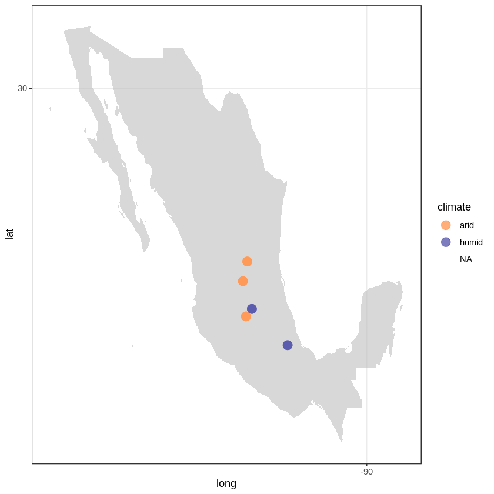
    


```R
# Shannon diversity estimations
#Get diversity measurments
richness <- estimate_richness(calabacita)
write.csv(richness, "calabacita_richness.csv")

head(richness)
```


<table>
<thead><tr><th></th><th scope=col>Observed</th><th scope=col>Chao1</th><th scope=col>se.chao1</th><th scope=col>ACE</th><th scope=col>se.ACE</th><th scope=col>Shannon</th><th scope=col>Simpson</th><th scope=col>InvSimpson</th><th scope=col>Fisher</th></tr></thead>
<tbody>
	<tr><th scope=row>X16S_3_Fe</th><td>3362     </td><td> 6014.848</td><td>183.6287 </td><td> 6225.092</td><td>47.89703 </td><td>4.403393 </td><td>0.9165296</td><td>11.98030 </td><td> 718.6809</td></tr>
	<tr><th scope=row>X16S_3_Fr</th><td>4221     </td><td> 8390.463</td><td>241.8600 </td><td> 9205.401</td><td>63.10398 </td><td>4.753620 </td><td>0.9406889</td><td>16.86024 </td><td> 964.7879</td></tr>
	<tr><th scope=row>X16S_3_Ie</th><td>9183     </td><td>16283.347</td><td>289.1715 </td><td>17514.253</td><td>82.64884 </td><td>6.331441 </td><td>0.9835853</td><td>60.92104 </td><td>2279.5289</td></tr>
	<tr><th scope=row>X16S_3_Ir</th><td>8564     </td><td>15351.216</td><td>284.7895 </td><td>16661.272</td><td>82.48040 </td><td>6.315464 </td><td>0.9831061</td><td>59.19303 </td><td>2192.9261</td></tr>
	<tr><th scope=row>X16S_3_Ze</th><td>3527     </td><td> 7416.273</td><td>246.3295 </td><td> 8255.192</td><td>59.54711 </td><td>4.079923 </td><td>0.9141947</td><td>11.65430 </td><td> 758.5721</td></tr>
	<tr><th scope=row>X16S_Ce</th><td>2449     </td><td> 5130.451</td><td>202.7562 </td><td> 5782.069</td><td>50.55197 </td><td>3.904730 </td><td>0.9443646</td><td>17.97418 </td><td> 452.3749</td></tr>
</tbody>
</table>


```R
#Plot shannon diversity
div_tab <- read.csv("calabacita_richness.csv")
div_tab_data <- cbind(div_tab, sampledata)
div_tab_data$name <- factor(div_tab_data$name, levels=c("1_Ls", "1_Lr", "1_Le", "1_Ir", "1_Ie", "1_Fr", "1_Fe", "1_Zr", "1_Ze", "2_Ls", "2_Lr", "2_Le", "2_Ir", "2_Ie", "2_Fr", "2_Fe", "2_Zr", "2_Ze", "3_Ls", "3_Lr", "3_Le", "3_Ir", "3_Ie", "3_Fr", "3_Fe", "3_Zr", "3_Ze", "4_Ls", "4_Lr", "4_Le", "4_Ir", "4_Ie", "4_Fr", "4_Fe", "4_Zr", "4_Ze", "5_Ls", "5_Lr", "5_Le", "5_Ir", "5_Ie", "5_Fr", "5_Fe", "5_Zr", "5_Ze", "Cr", "Ce", "Cn"))
shannon <- ggplot(div_tab_data, aes(name, Shannon, color=climate)) + geom_point(stat="identity", size=2.5) +
                  scale_colour_manual(values = c("#ff9a58ff", "#5c5cafff"), na.value = "black") + 
                  theme_bw()  + theme(axis.text.x = element_text(angle = 90))
ggsave("shannon.pdf", width = 35, height = 6, units = "cm")

print("Shannon diversity by sample")
shannon
```

    [1] "Shannon diversity by sample"


    
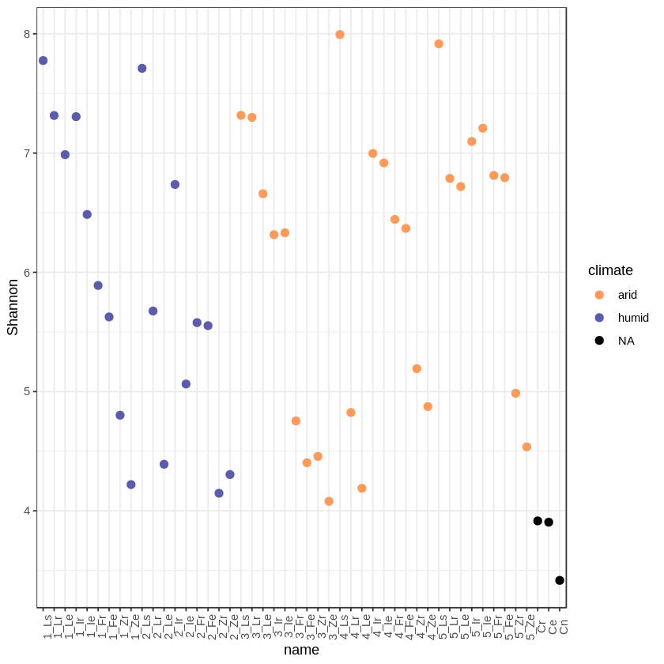
    


```R
#Estimate relative abundance
rel_phy <- transform_sample_counts(calabacita, function(x) x / sum(x))
                                   
#Most abundant phylum
#Tax glom at Phylum level
phy_calabacita <- tax_glom(rel_phy, "Phylum")
phy_calabacita
```


    phyloseq-class experiment-level object
    otu_table()   OTU Table:         [ 50 taxa and 48 samples ]
    sample_data() Sample Data:       [ 48 samples by 40 sample variables ]
    tax_table()   Taxonomy Table:    [ 50 taxa by 6 taxonomic ranks ]
    phy_tree()    Phylogenetic Tree: [ 50 tips and 49 internal nodes ]


```R
#Export the file with taxa names and taxa counts
calabacita_otu_phy <- otu_table(phy_calabacita)
calabacita_tax_phy <- tax_table(phy_calabacita)
calabacita_otu_tax <- cbind(calabacita_otu_phy, calabacita_tax_phy)
calabacita_otu_tax <- calabacita_otu_tax[, 1:50]
write.table(calabacita_otu_tax, "calabacita_otu_tax.tsv", sep = "\t")

calabacita_otu_tax <- read.table("calabacita_otu_tax.tsv", header=TRUE, row.names=1, 
                                 stringsAsFactors = FALSE, check.names=FALSE)

m_calabacita_otu_tax <- melt(calabacita_otu_tax, measure.vars = c(
    "16S_1_Ls", "16S_1_Lr", "16S_1_Le", "16S_1_Ir", "16S_1_Ie", "16S_1_Fr", "16S_1_Fe", "16S_1_Zr", "16S_1_Ze", 
    "16S_2_Ls", "16S_2_Lr", "16S_2_Le", "16S_2_Ir", "16S_2_Ie", "16S_2_Fr", "16S_2_Fe", "16S_2_Zr", "16S_2_Ze", 
    "16S_3_Ls", "16S_3_Lr", "16S_3_Le", "16S_3_Ir", "16S_3_Ie", "16S_3_Fr", "16S_3_Fe", "16S_3_Zr", "16S_3_Ze", 
    "16S_4_Ls", "16S_4_Lr", "16S_4_Le", "16S_4_Ir", "16S_4_Ie", "16S_4_Fr", "16S_4_Fe", "16S_4_Zr", "16S_4_Ze", 
    "16S_5_Ls", "16S_5_Lr", "16S_5_Le", "16S_5_Ir", "16S_5_Ie", "16S_5_Fr", "16S_5_Fe", "16S_5_Zr", "16S_5_Ze", 
    "16S_Cr", "16S_Ce", "16S_Cn"))
colnames(m_calabacita_otu_tax) <- c("Kingdom", "Phylum", "Sample", "Relative_abundance")
m_calabacita_otu_tax <- m_calabacita_otu_tax[, 2:4]

#Collapse Phylum with low abundance
m_calabacita_otu_tax$Phylum[m_calabacita_otu_tax$Relative_abundance <= 0.015] <- "Low_abundance"
cm_calabacita_otu_tax <- aggregate(m_calabacita_otu_tax$Relative_abundance 
                                          ,by=list(m_calabacita_otu_tax$Phylum, 
                                           m_calabacita_otu_tax$Sample),sum)
colnames(cm_calabacita_otu_tax) <- c("Phylum", "Sample", "Relative_abundance")

#Plot most abundant Phyla
phylum_plot <- ggplot(cm_calabacita_otu_tax, aes(x=Sample, y=Relative_abundance,
                                          fill=fct_reorder(Phylum, Relative_abundance))) + 
        scale_fill_manual(values = c("Acidobacteriota" = "#dd87b4ff", 
                              "Actinobacteriota" = "#d26d7aff",
                              "Bacteroidota" = "#b6742aff", 
                              "Chloroflexi" = "#f6ef32ff",                        
                              "Firmicutes" = "#ffad12ff", 
                              "Gemmatimonadota" = "#d96d3bff",
                              "Planctomycetota" = "#5a9d5aff", 
                              "Proteobacteria" = "#419486ff", 
                              "Verrucomicrobiota" = "#66628dff",
                              "Patescibacteria" = "#7a61baff",
                              "Bdellovibrionota" = "#d8b655ff",
                              "Methylomirabilota" = "#4198d7ff",
                              "Myxococcota" = "#91569aff",
                               "Low_abundance" = "#999999ff")) +
       geom_bar(stat="identity", color="black", width=0.8) + scale_y_continuous(expand = c(0 ,0)) + 
       theme_light(base_size = 7) + theme(axis.text.y = element_text(size = 18),
                                          axis.text.x = element_text(size= 8, angle= 90)) 
ggsave("bact_phylum_plot.pdf", width=35, height=20, units="cm")

print("Most abundant Phylum")
phylum_plot
```

    [1] "Most abundant Phylum"


    
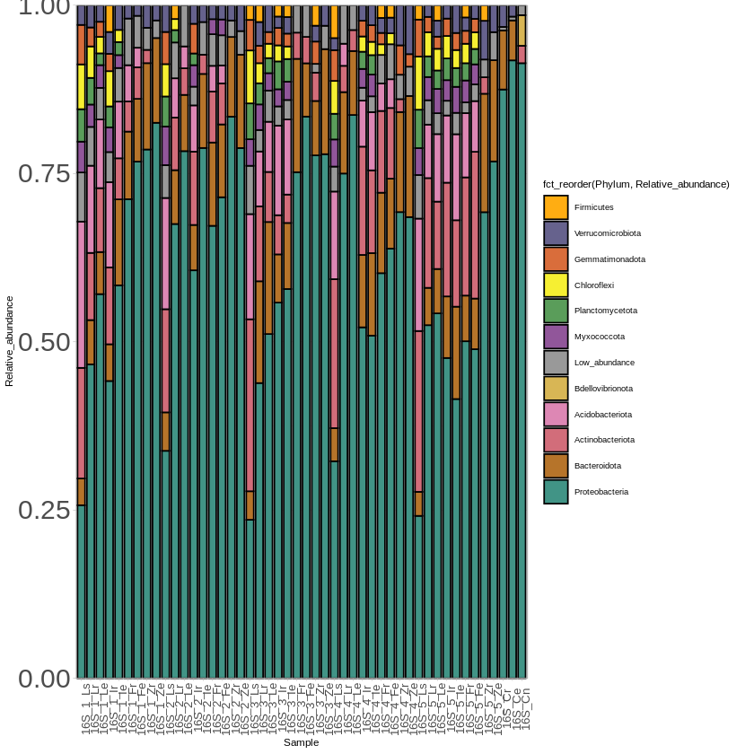
    


```R
#Shannon diversity by soil, rhizosphere and endosphere
div_tab_data_ns <- subset(div_tab_data, type!= "substrate")
div_tab_data_ns$type <- factor(div_tab_data_ns$type, levels=c("soil", "rhizosphere", "endosphere"))

shannon_type <- ggplot(div_tab_data_ns, aes(type, Shannon, fill=type)) + geom_boxplot() + geom_point(size = 1.5) + 
                scale_fill_manual(values = c("#ff5599ff", "#00aad4ff", "#afdde9ff")) + 
                stat_signif(test = wilcox.test, map_signif_level = TRUE, comparisons = 
                            list(c("endosphere", "rhizosphere"), c("endosphere", "soil"), 
                                 c("rhizosphere", "soil"))) + 
                                theme_light() + theme(text = element_text(size=20), legend.position = "none") +
                                scale_x_discrete(labels=c("Soil", "Rhizosphere", "Endosphere")) 

ggsave("shannon_type.pdf", width = 20, height = 15, units = "cm")

print("Shannon diversity by sample type")
shannon_type
```

    [1] "Shannon diversity by sample type"


    
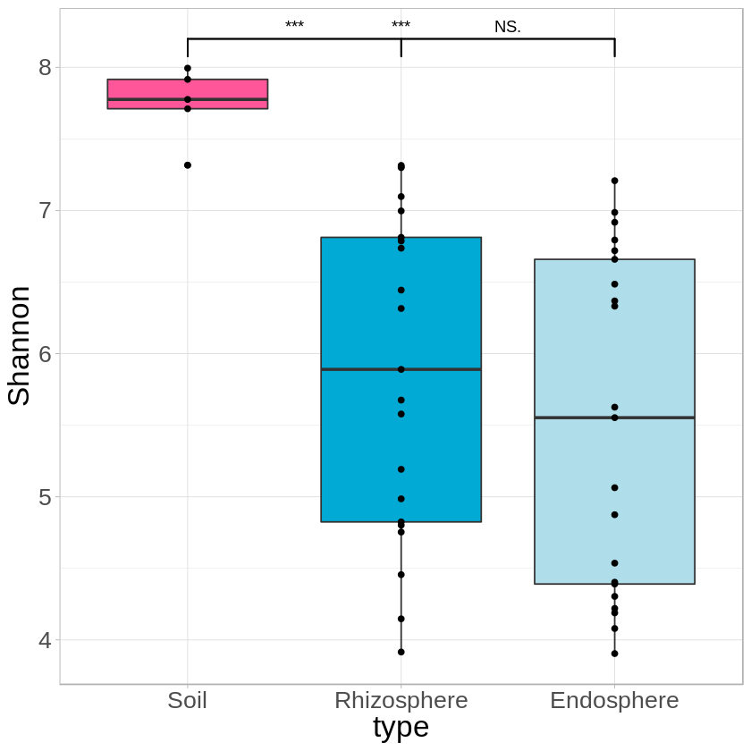
    


```R
#Comparisons of Shannon diversity by sample type
print("Normality in soil samples")
soil <- div_tab_data_ns %>% filter(type == "soil")
ssoil <- soil$Shannon
shapiro.test(ssoil)

print("Normality in rhizosphere samples")
rhizosphere <- div_tab_data_ns %>% filter(type == "rhizosphere")
srhizosphere <- rhizosphere$Shannon
shapiro.test(srhizosphere)

print("Normality in endosphere samples")
endosphere <- div_tab_data_ns %>% filter(type == "endosphere")
sendosphere <- endosphere$Shannon
shapiro.test(sendosphere)

#Kruskall-wallis
kruskal.test(Shannon ~ type, data = div_tab_data_ns) 

pairwise.wilcox.test(x = div_tab_data_ns$Shannon, g = div_tab_data_ns$type, p.adjust.method = "holm" )
```

    [1] "Normality in soil samples"


    
    	Shapiro-Wilk normality test
    
    data:  ssoil
    W = 0.90237, p-value = 0.4231


    [1] "Normality in rhizosphere samples"


    
    	Shapiro-Wilk normality test
    
    data:  srhizosphere
    W = 0.91894, p-value = 0.08265


    [1] "Normality in endosphere samples"


    
    	Shapiro-Wilk normality test
    
    data:  sendosphere
    W = 0.87888, p-value = 0.01393


    
    	Kruskal-Wallis rank sum test
    
    data:  Shannon by type
    Kruskal-Wallis chi-squared = 14.317, df = 2, p-value = 0.0007784


    
    	Pairwise comparisons using Wilcoxon rank sum test 
    
    data:  div_tab_data_ns$Shannon and div_tab_data_ns$type 
    
                soil    rhizosphere
    rhizosphere 9.1e-05 -          
    endosphere  9.1e-05 0.23       
    
    P value adjustment method: holm 


```R
#Comparisons of Simpson diversity by sample type
print("Normality in soil samples")
soil <- div_tab_data_ns %>% filter(type == "soil")
ssoil <- soil$Simpson
shapiro.test(ssoil)

print("Normality in rhizosphere samples")
rhizosphere <- div_tab_data_ns %>% filter(type == "rhizosphere")
srhizosphere <- rhizosphere$Simpson
shapiro.test(srhizosphere)

print("Normality in endosphere samples")
endosphere <- div_tab_data_ns %>% filter(type == "endosphere")
sendosphere <- endosphere$Simpson
shapiro.test(sendosphere)

#Kruskall-wallis
kruskal.test(Simpson ~ type, data = div_tab_data_ns) 

pairwise.wilcox.test(x = div_tab_data_ns$Simpson, g = div_tab_data_ns$type, p.adjust.method = "holm" )
```

    [1] "Normality in soil samples"


    
    	Shapiro-Wilk normality test
    
    data:  ssoil
    W = 0.71031, p-value = 0.01224


    [1] "Normality in rhizosphere samples"


    
    	Shapiro-Wilk normality test
    
    data:  srhizosphere
    W = 0.85151, p-value = 0.004511


    [1] "Normality in endosphere samples"


    
    	Shapiro-Wilk normality test
    
    data:  sendosphere
    W = 0.80588, p-value = 0.0008082


    
    	Kruskal-Wallis rank sum test
    
    data:  Simpson by type
    Kruskal-Wallis chi-squared = 13.245, df = 2, p-value = 0.00133


    
    	Pairwise comparisons using Wilcoxon rank sum test 
    
    data:  div_tab_data_ns$Simpson and div_tab_data_ns$type 
    
                soil    rhizosphere
    rhizosphere 0.00012 -          
    endosphere  9.1e-05 0.51702    
    
    P value adjustment method: holm 


```R
#Plot relative abundance of Phylum by sample type

#Get relative abundances by sample type
Samples_toKeep <- c("soil", "rhizosphere", "endosphere")
phy_calabacita_ns <- subset_samples(phy_calabacita, type %in% Samples_toKeep)
calabacita_type <- merge_samples(phy_calabacita_ns, "type")
calabacita_type <- transform_sample_counts(calabacita_type, function(x) x / sum(x))

#Prepare table with information about taxonomy and relative abundances
calabacita_type_otu_phy <- t(otu_table(calabacita_type))
calabacita_type_tax_phy <- tax_table(calabacita_type)
calabacita_type_otu_tax <- cbind(calabacita_type_otu_phy, calabacita_type_tax_phy)
calabacita_type_otu_tax <- calabacita_type_otu_tax[, 1:5]
write.table(calabacita_type_otu_tax, "calabacita_type_otu_tax.tsv", sep = "\t")

calabacita_type_otu_tax <- read.table("calabacita_type_otu_tax.tsv", header=TRUE, row.names=1, 
                                 stringsAsFactors = FALSE, check.names=FALSE)
m_calabacita_type_otu_tax <- melt(calabacita_type_otu_tax, measure.vars = c("soil", "rhizosphere", "endosphere"))
colnames(m_calabacita_type_otu_tax) <- c("Kingdom", "Phylum", "Type", "Relative_abundance")

m_calabacita_type_otu_tax$Phylum[m_calabacita_type_otu_tax$Relative_abundance <= 0.01] <- "Low_abundance"

cm_calabacita_type_otu_tax <- aggregate(m_calabacita_type_otu_tax$Relative_abundance 
                                          ,by=list(m_calabacita_type_otu_tax$Phylum, 
                                           m_calabacita_type_otu_tax$Type),sum)
colnames(cm_calabacita_type_otu_tax) <- c("Phylum", "Type", "Relative_abundance")

#Create the plot in ggplot2
print("Most abundant Phylum")
phylum__type_plot <- ggplot(cm_calabacita_type_otu_tax, aes(x=Type, y=Relative_abundance,
                                          fill=fct_reorder(Phylum, Relative_abundance))) + 
        scale_fill_manual(values = c("Acidobacteriota" = "#dd87b4ff", 
                              "Actinobacteriota" = "#d26d7aff",
                              "Bacteroidota" = "#b6742aff", 
                              "Chloroflexi" = "#f6ef32ff",                        
                              "Firmicutes" = "#ffad12ff", 
                              "Gemmatimonadota" = "#d96d3bff",
                              "Planctomycetota" = "#5a9d5aff", 
                              "Proteobacteria" = "#419486ff", 
                              "Verrucomicrobiota" = "#66628dff",
                              "Patescibacteria" = "#7a61baff",
                              "Bdellovibrionota" = "#d8b655ff",
                              "Methylomirabilota" = "#4198d7ff",
                              "Myxococcota" = "#91569aff",
                               "Low_abundance" = "#999999ff")) +
       geom_bar(stat="identity", color="black", width=0.8) + scale_y_continuous(expand = c(0 ,0)) + 
       theme_light(base_size = 7) + theme(axis.text.y = element_text(size = 20),
                                          axis.text.x = element_text(size= 17)) +
                                          scale_x_discrete(labels=c("Soil", "Rhizosphere", "Endosphere")) 
ggsave("phylum__type_plot.pdf", width=35, height=40, units="cm") 

phylum__type_plot
```

    [1] "Most abundant Phylum"


    
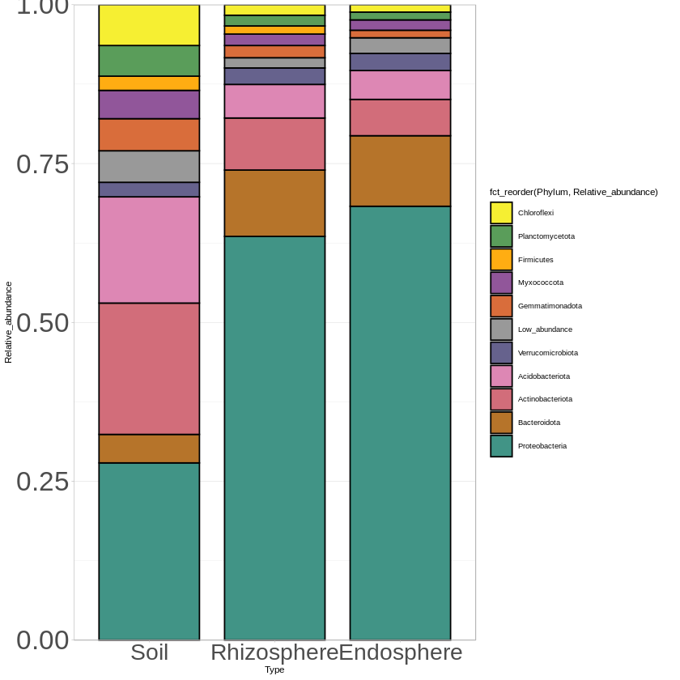
    


```R
#Shannon diversity by climate and sample type
div_tab_data_nz <- subset(div_tab_data, treatment!= "sterilized")
div_tab_data_nz <- subset(div_tab_data_nz, treatment!= "substrate")
div_tab_data_nz$samplec <- factor(div_tab_data_nz$samplec, levels=c("soil_humid", "soil_arid",
                            "rhizosphere_humid", "rhizosphere_arid", "endosphere_humid", "endosphere_arid"))
div_tab_data_nz$type <- factor(div_tab_data_nz$type, levels=c("soil", "rhizosphere", "endosphere"))

#t-test for significance between groups
print("t-test paired comparisons")
shannon_type_clime <- ggplot(div_tab_data_nz, aes(samplec, Shannon, fill=climate)) + geom_boxplot() + 
                geom_point(size = 1) +  scale_fill_manual(values = c("#ff9a58ff", "#5c5cafff")) + ylim(4,8) + 
                                theme_bw() + theme(text = element_text(size=20)) + 
                                theme(axis.text.x = element_text(angle = 90))                

s_sig <- shannon_type_clime + stat_signif(test = t.test, map_signif_level = TRUE, comparisons = 
                                list(c("soil_humid", "soil_arid"), c("rhizosphere_humid", "rhizosphere_arid"), 
                                 c("endosphere_humid", "endosphere_arid")))
s_sig

#Facet plot by sample type
s_facet <- shannon_type_clime + facet_wrap(~type, scale="free") + theme(axis.text.x = element_text(angle = 0))  +
              scale_x_discrete(labels=c("Humid", "Arid")) +
              theme(strip.background = element_rect(fill="white", color="black")) +
              theme(strip.text = element_text(colour="black", size=18.5))


ggsave("shannon_facet_type.pdf", width = 30, height = 10, units = "cm")

s_facet
print("Facet plot by sample type")

                                
```

    [1] "t-test paired comparisons"


    Warning message:
    “Removed 9 rows containing missing values (geom_signif).”


    
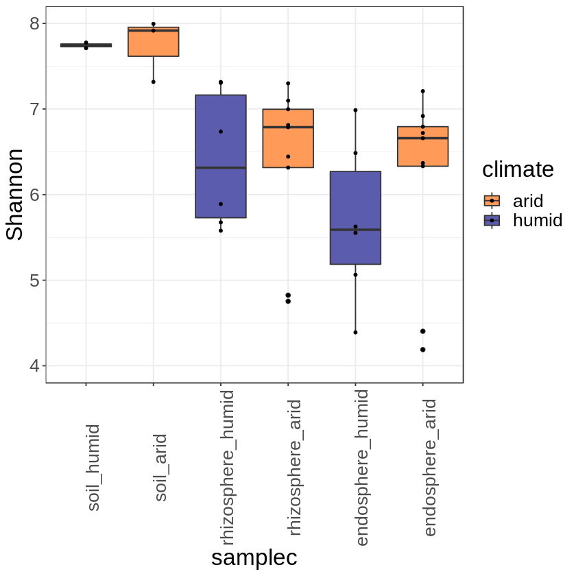
    


    [1] "Facet plot by sample type"


    
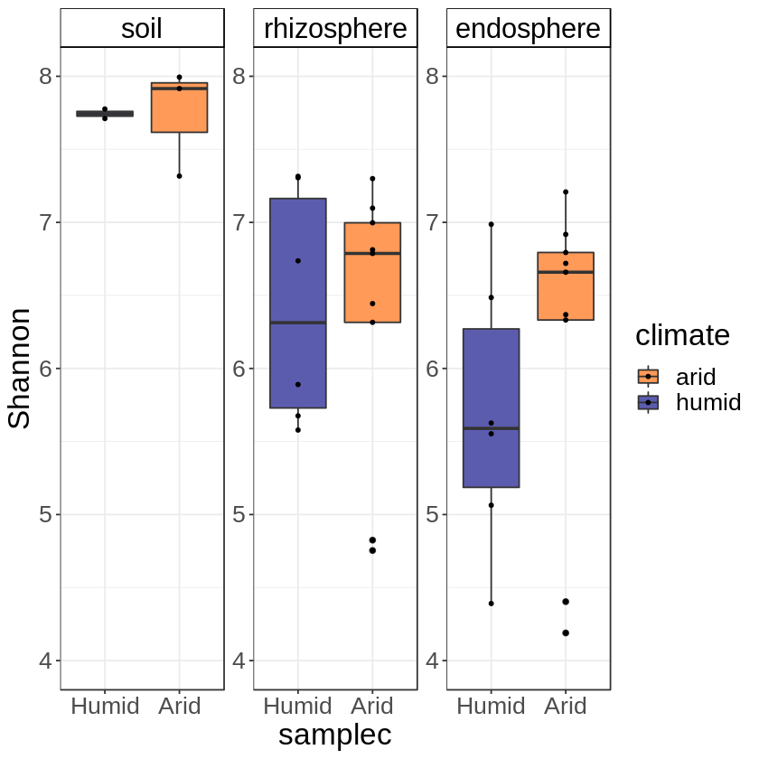
    


```R
#Plot relative abundance of Phylum by sample type and climate

#Get relative abundances by sample type and climate
Samples_toKeep <- c("local", "inoculum", "fertilized")
phy_calabacita_nst <- subset_samples(phy_calabacita, treatment %in% Samples_toKeep)
calabacita_samplec <- merge_samples(phy_calabacita_nst, "samplec")
calabacita_samplec <- transform_sample_counts(calabacita_samplec, function(x) x / sum(x))

#Prepare table with information about taxonomy and relative abundances
calabacita_samplec_otu_phy <- t(otu_table(calabacita_samplec))
calabacita_samplec_tax_phy <- tax_table(calabacita_samplec)
calabacita_samplec_otu_tax <- cbind(calabacita_samplec_otu_phy, calabacita_samplec_tax_phy)
calabacita_samplec_otu_tax <- calabacita_samplec_otu_tax[, 1:8]

write.table(calabacita_samplec_otu_tax, "calabacita_samplec_otu_tax.tsv", sep = "\t")

calabacita_samplec_otu_tax <- read.table("calabacita_samplec_otu_tax.tsv", header=TRUE, row.names=1, 
                                 stringsAsFactors = FALSE, check.names=FALSE)
                                              
m_calabacita_samplec_otu_tax <- melt(calabacita_samplec_otu_tax, 
                                     measure.vars = c("soil_humid",  "soil_arid",                               
                                                     "rhizosphere_humid", "rhizosphere_arid",                                                  
                                                     "endosphere_humid", "endosphere_arid"))
                                              
colnames(m_calabacita_samplec_otu_tax) <- c("Kingdom", "Phylum", "Type_climate", "Relative_abundance")
m_calabacita_samplec_otu_tax$Phylum[m_calabacita_samplec_otu_tax$Relative_abundance <= 0.01] <- "Low_abundance"
                                              
cm_calabacita_samplec_otu_tax <- aggregate(m_calabacita_samplec_otu_tax$Relative_abundance 
                                          ,by=list(m_calabacita_samplec_otu_tax$Phylum, 
                                           m_calabacita_samplec_otu_tax$Type),sum)
                                              
#Add information about sample type before making facet plot in ggplot2                                             
colnames(cm_calabacita_samplec_otu_tax) <- c("Phylum", "Type_climate", "Relative_abundance")
cm_calabacita_samplec_otu_tax$Type <- factor(c(rep(c("soil"), times=22), rep(c("rhizosphere"), 
                                      times=22), rep(c("endosphere"), times=21)), 
                                            levels= c("soil", "rhizosphere", "endosphere"))

#Create the plot in ggplot2
print("Most abundant Phylum, by sample type, climate and treatment")
phylum__type_clime_plot <- ggplot(cm_calabacita_samplec_otu_tax, aes(x=Type_climate, y=Relative_abundance,
                                          fill=fct_reorder(Phylum, Relative_abundance))) + 
        scale_fill_manual(values = c("Acidobacteriota" = "#dd87b4ff", 
                              "Actinobacteriota" = "#d26d7aff",
                              "Bacteroidota" = "#b6742aff", 
                              "Chloroflexi" = "#f6ef32ff",                        
                              "Firmicutes" = "#ffad12ff", 
                              "Gemmatimonadota" = "#d96d3bff",
                              "Planctomycetota" = "#5a9d5aff", 
                              "Proteobacteria" = "#419486ff", 
                              "Verrucomicrobiota" = "#66628dff",
                              "Patescibacteria" = "#7a61baff",
                              "Bdellovibrionota" = "#d8b655ff",
                              "Methylomirabilota" = "#4198d7ff",
                              "Myxococcota" = "#91569aff",
                              "Nitrospirota" = "#ffc0cbff",
                               "Low_abundance" = "#999999ff")) +
       geom_bar(stat="identity", color="black", width=0.8) + scale_y_continuous(expand = c(0 ,0)) + 
       theme_light(base_size = 7) + theme(axis.text.y = element_text(size = 20),
                                          axis.text.x = element_text(size = 15)) + 
       facet_grid(~Type, scale="free") + scale_x_discrete(labels=c("Humid", "Arid"))  +
       theme(strip.background = element_rect(fill="white", color="black")) +
       theme(strip.text = element_text(colour="black", size=18.5))                      

ggsave("phylum__type_clime_plot.pdf", width=35, height=40, units="cm") 

phylum__type_clime_plot
                                              
                                            
```

    [1] "Most abundant Phylum, by sample type, climate and treatment"


    
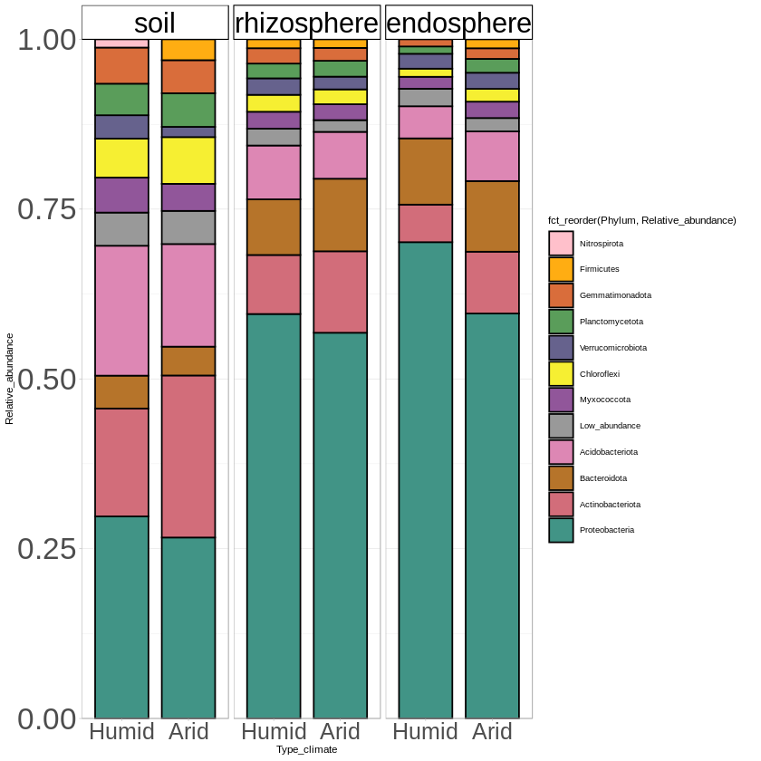
    


```R
#Test statistically signifficant differences in relative abundance of phylum by climate

#Get relative abundances by sample type and climate
Samples_toKeep <- c("local", "inoculum", "fertilized")
phy_calabacita_nst <- subset_samples(phy_calabacita, treatment %in% Samples_toKeep)

#Join taxonomy table, otu table and metadata
#Get count table for the abundance of each genus
taxa_phy <- as.data.frame(as(tax_table(phy_calabacita_nst), "matrix"),row.names = FALSE)
otu_phy <- as.data.frame(as(t(otu_table(phy_calabacita_nst)), "matrix"),row.names = FALSE)
colnames(otu_phy) <- as.vector(taxa_phy$Phylum)

#Load climatic metadata
meta_phy_nst <- as.data.frame(meta(phy_calabacita_nst))
type <- meta_phy_nst$type
clime <- meta_phy_nst$clime
phy_nst_tab <- cbind(type, clime, otu_phy)

mphy_nst_tab <- melt(phy_nst_tab)
colnames(mphy_nst_tab) <- c("Sample_type", "Climate", "Phylum", "Relative_abundance")
head(mphy_nst_tab)
```

    Using type, clime as id variables


<table>
<thead><tr><th scope=col>Sample_type</th><th scope=col>Climate</th><th scope=col>Phylum</th><th scope=col>Relative_abundance</th></tr></thead>
<tbody>
	<tr><td>endosphere   </td><td>arid         </td><td>Nanoarchaeota</td><td>0.000000e+00 </td></tr>
	<tr><td>rhizosphere  </td><td>arid         </td><td>Nanoarchaeota</td><td>0.000000e+00 </td></tr>
	<tr><td>endosphere   </td><td>arid         </td><td>Nanoarchaeota</td><td>0.000000e+00 </td></tr>
	<tr><td>rhizosphere  </td><td>arid         </td><td>Nanoarchaeota</td><td>0.000000e+00 </td></tr>
	<tr><td>rhizosphere  </td><td>arid         </td><td>Nanoarchaeota</td><td>0.000000e+00 </td></tr>
	<tr><td>endosphere   </td><td>arid         </td><td>Nanoarchaeota</td><td>3.242367e-05 </td></tr>
</tbody>
</table>


```R
#Test statistically signifficant differences in relative abundance of phylum by climate

#Test effect of climate in relative abundance at phylum level in soil samples
print("t-test  in soil samples")
soil <- filter(mphy_nst_tab, Sample_type == "soil")

print("Firmicutes")
t.test(Relative_abundance~Climate, filter(soil, Phylum == "Firmicutes"), alternative="greater")

print("Myxococcota")
t.test(Relative_abundance~Climate, filter(soil, Phylum == "Myxococcota"), alternative="less")

print("Planctomycetota")
t.test(Relative_abundance~Climate, filter(soil, Phylum == "Planctomycetota"), alternative="less")

print("Verrucomicrobiota")
t.test(Relative_abundance~Climate, filter(soil, Phylum == "Verrucomicrobiota"), alternative="less")

print("Gemmatimonadota")
t.test(Relative_abundance~Climate, filter(soil, Phylum == "Gemmatimonadota"), alternative="less")

print("Chloroflexi")
t.test(Relative_abundance~Climate, filter(soil, Phylum == "Chloroflexi"), alternative="greater")

print("Acidobacteriota")
t.test(Relative_abundance~Climate, filter(soil, Phylum == "Acidobacteriota"), alternative="less")

print("Bacteroidota")
t.test(Relative_abundance~Climate, filter(soil, Phylum == "Bacteroidota"), alternative="less")

print("Actinobacteriota")
t.test(Relative_abundance~Climate, filter(soil, Phylum == "Actinobacteriota"), alternative="greater")

print("Proteobacteria")
t.test(Relative_abundance~Climate, filter(soil, Phylum == "Proteobacteria"), alternative="less")

print("Bdellovibrionota")
t.test(Relative_abundance~Climate, filter(soil, Phylum == "Bdellovibrionota"), alternative="less")

print("Methylomirabilota")
t.test(Relative_abundance~Climate, filter(soil, Phylum == "Methylomirabilota"), alternative="less")

print("Myxococcota")
t.test(Relative_abundance~Climate, filter(soil, Phylum == "Myxococcota"), alternative="less")
```

    [1] "t-test  in soil samples"
    [1] "Firmicutes"


    
    	Welch Two Sample t-test
    
    data:  Relative_abundance by Climate
    t = 2.2499, df = 2.1232, p-value = 0.07299
    alternative hypothesis: true difference in means is greater than 0
    95 percent confidence interval:
     -0.005142124          Inf
    sample estimates:
     mean in group arid mean in group humid 
            0.030646885         0.009904626 


    [1] "Myxococcota"


    
    	Welch Two Sample t-test
    
    data:  Relative_abundance by Climate
    t = -2.023, df = 1.0039, p-value = 0.1458
    alternative hypothesis: true difference in means is less than 0
    95 percent confidence interval:
           -Inf 0.02450622
    sample estimates:
     mean in group arid mean in group humid 
             0.03988722          0.05155487 


    [1] "Planctomycetota"


    
    	Welch Two Sample t-test
    
    data:  Relative_abundance by Climate
    t = 0.50405, df = 2.3481, p-value = 0.6712
    alternative hypothesis: true difference in means is less than 0
    95 percent confidence interval:
          -Inf 0.0190108
    sample estimates:
     mean in group arid mean in group humid 
             0.04949695          0.04645416 


    [1] "Verrucomicrobiota"


    
    	Welch Two Sample t-test
    
    data:  Relative_abundance by Climate
    t = -3.5644, df = 1.1551, p-value = 0.07356
    alternative hypothesis: true difference in means is less than 0
    95 percent confidence interval:
            -Inf 0.008087148
    sample estimates:
     mean in group arid mean in group humid 
             0.01510145          0.03446895 


    [1] "Gemmatimonadota"


    
    	Welch Two Sample t-test
    
    data:  Relative_abundance by Climate
    t = -0.7227, df = 1.6907, p-value = 0.2783
    alternative hypothesis: true difference in means is less than 0
    95 percent confidence interval:
           -Inf 0.01632502
    sample estimates:
     mean in group arid mean in group humid 
             0.04867693          0.05322119 


    [1] "Chloroflexi"


    
    	Welch Two Sample t-test
    
    data:  Relative_abundance by Climate
    t = 0.84323, df = 2.7957, p-value = 0.2326
    alternative hypothesis: true difference in means is greater than 0
    95 percent confidence interval:
     -0.02152556         Inf
    sample estimates:
     mean in group arid mean in group humid 
             0.06878447          0.05731051 


    [1] "Acidobacteriota"


    
    	Welch Two Sample t-test
    
    data:  Relative_abundance by Climate
    t = -1.4229, df = 1.3628, p-value = 0.1705
    alternative hypothesis: true difference in means is less than 0
    95 percent confidence interval:
           -Inf 0.07558571
    sample estimates:
     mean in group arid mean in group humid 
              0.1511278           0.1912765 


    [1] "Bacteroidota"


    
    	Welch Two Sample t-test
    
    data:  Relative_abundance by Climate
    t = -0.6308, df = 1.4169, p-value = 0.3073
    alternative hypothesis: true difference in means is less than 0
    95 percent confidence interval:
           -Inf 0.03147042
    sample estimates:
     mean in group arid mean in group humid 
             0.04242937          0.04844663 


    [1] "Actinobacteriota"


    
    	Welch Two Sample t-test
    
    data:  Relative_abundance by Climate
    t = 7.0437, df = 2.8859, p-value = 0.003335
    alternative hypothesis: true difference in means is greater than 0
    95 percent confidence interval:
     0.05269297        Inf
    sample estimates:
     mean in group arid mean in group humid 
              0.2385932           0.1588080 


    [1] "Proteobacteria"


    
    	Welch Two Sample t-test
    
    data:  Relative_abundance by Climate
    t = -0.63209, df = 1.967, p-value = 0.2964
    alternative hypothesis: true difference in means is less than 0
    95 percent confidence interval:
          -Inf 0.1142231
    sample estimates:
     mean in group arid mean in group humid 
              0.2664761           0.2975755 


    [1] "Bdellovibrionota"


    
    	Welch Two Sample t-test
    
    data:  Relative_abundance by Climate
    t = -3.0104, df = 2.9995, p-value = 0.0286
    alternative hypothesis: true difference in means is less than 0
    95 percent confidence interval:
              -Inf -0.0004000276
    sample estimates:
     mean in group arid mean in group humid 
            0.002927420         0.004760827 


    [1] "Methylomirabilota"


    
    	Welch Two Sample t-test
    
    data:  Relative_abundance by Climate
    t = 0.1139, df = 1.0792, p-value = 0.5366
    alternative hypothesis: true difference in means is less than 0
    95 percent confidence interval:
           -Inf 0.02048554
    sample estimates:
     mean in group arid mean in group humid 
            0.004479798         0.004070262 


    [1] "Myxococcota"


    
    	Welch Two Sample t-test
    
    data:  Relative_abundance by Climate
    t = -2.023, df = 1.0039, p-value = 0.1458
    alternative hypothesis: true difference in means is less than 0
    95 percent confidence interval:
           -Inf 0.02450622
    sample estimates:
     mean in group arid mean in group humid 
             0.03988722          0.05155487 


```R
#Test effect of climate in relative abundance at phylum level in soil samples
print("t-test  in rhizosphere samples")
rhizosphere <- filter(mphy_nst_tab, Sample_type == "rhizosphere")

print("Firmicutes")
t.test(Relative_abundance~Climate, filter(rhizosphere, Phylum == "Firmicutes"), alternative="greater")

print("Myxococcota")
t.test(Relative_abundance~Climate, filter(rhizosphere, Phylum == "Myxococcota"), alternative="less")

print("Planctomycetota")
t.test(Relative_abundance~Climate, filter(rhizosphere, Phylum == "Planctomycetota"), alternative="less")

print("Verrucomicrobiota")
t.test(Relative_abundance~Climate, filter(rhizosphere, Phylum == "Verrucomicrobiota"), alternative="less")

print("Gemmatimonadota")
t.test(Relative_abundance~Climate, filter(rhizosphere, Phylum == "Gemmatimonadota"), alternative="less")

print("Chloroflexi")
t.test(Relative_abundance~Climate, filter(rhizosphere, Phylum == "Chloroflexi"), alternative="greater")

print("Acidobacteriota")
t.test(Relative_abundance~Climate, filter(rhizosphere, Phylum == "Acidobacteriota"), alternative="less")

print("Bacteroidota")
t.test(Relative_abundance~Climate, filter(rhizosphere, Phylum == "Bacteroidota"), alternative="less")

print("Actinobacteriota")
t.test(Relative_abundance~Climate, filter(rhizosphere, Phylum == "Actinobacteriota"), alternative="greater")

print("Proteobacteria")
t.test(Relative_abundance~Climate, filter(rhizosphere, Phylum == "Proteobacteria"), alternative="less")

print("Bdellovibrionota")
t.test(Relative_abundance~Climate, filter(rhizosphere, Phylum == "Bdellovibrionota"), alternative="less")

print("Methylomirabilota")
t.test(Relative_abundance~Climate, filter(rhizosphere, Phylum == "Methylomirabilota"), alternative="less")

print("Myxococcota")
t.test(Relative_abundance~Climate, filter(rhizosphere, Phylum == "Myxococcota"), alternative="less")

```

    [1] "t-test  in rhizosphere samples"
    [1] "Firmicutes"


    
    	Welch Two Sample t-test
    
    data:  Relative_abundance by Climate
    t = -0.067391, df = 6.4073, p-value = 0.5258
    alternative hypothesis: true difference in means is greater than 0
    95 percent confidence interval:
     -0.01283732         Inf
    sample estimates:
     mean in group arid mean in group humid 
             0.01264516          0.01308018 


    [1] "Myxococcota"


    
    	Welch Two Sample t-test
    
    data:  Relative_abundance by Climate
    t = -0.25975, df = 11.953, p-value = 0.3997
    alternative hypothesis: true difference in means is less than 0
    95 percent confidence interval:
            -Inf 0.009026005
    sample estimates:
     mean in group arid mean in group humid 
             0.02344406          0.02498334 


    [1] "Planctomycetota"


    
    	Welch Two Sample t-test
    
    data:  Relative_abundance by Climate
    t = 0.26099, df = 11.689, p-value = 0.6007
    alternative hypothesis: true difference in means is less than 0
    95 percent confidence interval:
           -Inf 0.01268159
    sample estimates:
     mean in group arid mean in group humid 
             0.02334288          0.02172621 


    [1] "Verrucomicrobiota"


    
    	Welch Two Sample t-test
    
    data:  Relative_abundance by Climate
    t = -1.2465, df = 11.344, p-value = 0.1189
    alternative hypothesis: true difference in means is less than 0
    95 percent confidence interval:
            -Inf 0.002417353
    sample estimates:
     mean in group arid mean in group humid 
             0.01873953          0.02427408 


    [1] "Gemmatimonadota"


    
    	Welch Two Sample t-test
    
    data:  Relative_abundance by Climate
    t = -0.61688, df = 7.9461, p-value = 0.2773
    alternative hypothesis: true difference in means is less than 0
    95 percent confidence interval:
            -Inf 0.007384235
    sample estimates:
     mean in group arid mean in group humid 
              0.0189186           0.0225794 


    [1] "Chloroflexi"


    
    	Welch Two Sample t-test
    
    data:  Relative_abundance by Climate
    t = -0.35418, df = 7.2693, p-value = 0.6334
    alternative hypothesis: true difference in means is greater than 0
    95 percent confidence interval:
     -0.01950911         Inf
    sample estimates:
     mean in group arid mean in group humid 
             0.02184696          0.02493407 


    [1] "Acidobacteriota"


    
    	Welch Two Sample t-test
    
    data:  Relative_abundance by Climate
    t = -0.50711, df = 10.434, p-value = 0.3113
    alternative hypothesis: true difference in means is less than 0
    95 percent confidence interval:
           -Inf 0.02618796
    sample estimates:
     mean in group arid mean in group humid 
             0.06900065          0.07923413 


    [1] "Bacteroidota"


    
    	Welch Two Sample t-test
    
    data:  Relative_abundance by Climate
    t = 1.5223, df = 12.952, p-value = 0.924
    alternative hypothesis: true difference in means is less than 0
    95 percent confidence interval:
          -Inf 0.0537803
    sample estimates:
     mean in group arid mean in group humid 
             0.10683222          0.08197592 


    [1] "Actinobacteriota"


    
    	Welch Two Sample t-test
    
    data:  Relative_abundance by Climate
    t = 1.3923, df = 11.345, p-value = 0.09525
    alternative hypothesis: true difference in means is greater than 0
    95 percent confidence interval:
     -0.009465675          Inf
    sample estimates:
     mean in group arid mean in group humid 
             0.11997264          0.08690455 


    [1] "Proteobacteria"


    
    	Welch Two Sample t-test
    
    data:  Relative_abundance by Climate
    t = -0.45741, df = 10.788, p-value = 0.3282
    alternative hypothesis: true difference in means is less than 0
    95 percent confidence interval:
           -Inf 0.08100205
    sample estimates:
     mean in group arid mean in group humid 
              0.5679829           0.5955976 


    [1] "Bdellovibrionota"


    
    	Welch Two Sample t-test
    
    data:  Relative_abundance by Climate
    t = -0.51325, df = 12.943, p-value = 0.3082
    alternative hypothesis: true difference in means is less than 0
    95 percent confidence interval:
             -Inf 0.0007077608
    sample estimates:
     mean in group arid mean in group humid 
            0.002465440         0.002754133 


    [1] "Methylomirabilota"


    
    	Welch Two Sample t-test
    
    data:  Relative_abundance by Climate
    t = -1.3028, df = 6.5011, p-value = 0.1184
    alternative hypothesis: true difference in means is less than 0
    95 percent confidence interval:
             -Inf 0.0008449352
    sample estimates:
     mean in group arid mean in group humid 
            0.001499274         0.003292306 


    [1] "Myxococcota"


    
    	Welch Two Sample t-test
    
    data:  Relative_abundance by Climate
    t = -0.25975, df = 11.953, p-value = 0.3997
    alternative hypothesis: true difference in means is less than 0
    95 percent confidence interval:
            -Inf 0.009026005
    sample estimates:
     mean in group arid mean in group humid 
             0.02344406          0.02498334 


```R
#Test statistically signifficant differences in relative abundance of phylum by climate

#Test effect of climate in relative abundance at phylum level in endosphere samples
print("t-test  in endosphere samples")
endosphere <- filter(mphy_nst_tab, Sample_type == "endosphere")

print("Firmicutes")
t.test(Relative_abundance~Climate, filter(endosphere, Phylum == "Firmicutes"), alternative="greater")

print("Myxococcota")
t.test(Relative_abundance~Climate, filter(endosphere, Phylum == "Myxococcota"), alternative="less")

print("Planctomycetota")
t.test(Relative_abundance~Climate, filter(endosphere, Phylum == "Planctomycetota"), alternative="less")

print("Verrucomicrobiota")
t.test(Relative_abundance~Climate, filter(endosphere, Phylum == "Verrucomicrobiota"), alternative="less")

print("Gemmatimonadota")
t.test(Relative_abundance~Climate, filter(endosphere, Phylum == "Gemmatimonadota"), alternative="less")

print("Chloroflexi")
t.test(Relative_abundance~Climate, filter(endosphere, Phylum == "Chloroflexi"), alternative="greater")

print("Acidobacteriota")
t.test(Relative_abundance~Climate, filter(endosphere, Phylum == "Acidobacteriota"), alternative="less")

print("Bacteroidota")
t.test(Relative_abundance~Climate, filter(endosphere, Phylum == "Bacteroidota"), alternative="less")

print("Actinobacteriota")
t.test(Relative_abundance~Climate, filter(endosphere, Phylum == "Actinobacteriota"), alternative="greater")

print("Proteobacteria")
t.test(Relative_abundance~Climate, filter(endosphere, Phylum == "Proteobacteria"), alternative="less")

print("Bdellovibrionota")
t.test(Relative_abundance~Climate, filter(endosphere, Phylum == "Bdellovibrionota"), alternative="less")

print("Methylomirabilota")
t.test(Relative_abundance~Climate, filter(endosphere, Phylum == "Methylomirabilota"), alternative="less")

print("Myxococcota")
t.test(Relative_abundance~Climate, filter(endosphere, Phylum == "Myxococcota"), alternative="less")
```

    [1] "t-test  in endosphere samples"
    [1] "Firmicutes"


    
    	Welch Two Sample t-test
    
    data:  Relative_abundance by Climate
    t = 2.0309, df = 12.794, p-value = 0.03179
    alternative hypothesis: true difference in means is greater than 0
    95 percent confidence interval:
     0.0007575376          Inf
    sample estimates:
     mean in group arid mean in group humid 
            0.013116358         0.007148421 


    [1] "Myxococcota"


    
    	Welch Two Sample t-test
    
    data:  Relative_abundance by Climate
    t = 1.0959, df = 12.562, p-value = 0.8532
    alternative hypothesis: true difference in means is less than 0
    95 percent confidence interval:
           -Inf 0.01689996
    sample estimates:
     mean in group arid mean in group humid 
             0.02409372          0.01764392 


    [1] "Planctomycetota"


    
    	Welch Two Sample t-test
    
    data:  Relative_abundance by Climate
    t = 2.0581, df = 12.637, p-value = 0.9696
    alternative hypothesis: true difference in means is less than 0
    95 percent confidence interval:
           -Inf 0.01791293
    sample estimates:
     mean in group arid mean in group humid 
             0.02040241          0.01078411 


    [1] "Verrucomicrobiota"


    
    	Welch Two Sample t-test
    
    data:  Relative_abundance by Climate
    t = 0.32093, df = 12.664, p-value = 0.6233
    alternative hypothesis: true difference in means is less than 0
    95 percent confidence interval:
           -Inf 0.01195987
    sample estimates:
     mean in group arid mean in group humid 
             0.02375965          0.02192793 


    [1] "Gemmatimonadota"


    
    	Welch Two Sample t-test
    
    data:  Relative_abundance by Climate
    t = 1.3494, df = 12.695, p-value = 0.8996
    alternative hypothesis: true difference in means is less than 0
    95 percent confidence interval:
           -Inf 0.01197604
    sample estimates:
     mean in group arid mean in group humid 
             0.01561908          0.01044534 


    [1] "Chloroflexi"


    
    	Welch Two Sample t-test
    
    data:  Relative_abundance by Climate
    t = 1.461, df = 12.708, p-value = 0.08415
    alternative hypothesis: true difference in means is greater than 0
    95 percent confidence interval:
     -0.001476118          Inf
    sample estimates:
     mean in group arid mean in group humid 
             0.01884694          0.01195772 


    [1] "Acidobacteriota"


    
    	Welch Two Sample t-test
    
    data:  Relative_abundance by Climate
    t = 1.2411, df = 12.043, p-value = 0.8809
    alternative hypothesis: true difference in means is less than 0
    95 percent confidence interval:
           -Inf 0.06289878
    sample estimates:
     mean in group arid mean in group humid 
             0.07311036          0.04728542 


    [1] "Bacteroidota"


    
    	Welch Two Sample t-test
    
    data:  Relative_abundance by Climate
    t = 0.44739, df = 12.946, p-value = 0.669
    alternative hypothesis: true difference in means is less than 0
    95 percent confidence interval:
           -Inf 0.03216179
    sample estimates:
     mean in group arid mean in group humid 
             0.10402527          0.09754053 


    [1] "Actinobacteriota"


    
    	Welch Two Sample t-test
    
    data:  Relative_abundance by Climate
    t = 1.9085, df = 12.133, p-value = 0.04013
    alternative hypothesis: true difference in means is greater than 0
    95 percent confidence interval:
     0.002390289         Inf
    sample estimates:
     mean in group arid mean in group humid 
              0.0910033           0.0553088 


    [1] "Proteobacteria"


    
    	Welch Two Sample t-test
    
    data:  Relative_abundance by Climate
    t = -1.6394, df = 12.982, p-value = 0.06256
    alternative hypothesis: true difference in means is less than 0
    95 percent confidence interval:
            -Inf 0.008440225
    sample estimates:
     mean in group arid mean in group humid 
              0.5963350           0.7013723 


    [1] "Bdellovibrionota"


    
    	Welch Two Sample t-test
    
    data:  Relative_abundance by Climate
    t = -0.57624, df = 6.8405, p-value = 0.2915
    alternative hypothesis: true difference in means is less than 0
    95 percent confidence interval:
            -Inf 0.002592757
    sample estimates:
     mean in group arid mean in group humid 
            0.003636110         0.004763693 


    [1] "Methylomirabilota"


    
    	Welch Two Sample t-test
    
    data:  Relative_abundance by Climate
    t = -0.83587, df = 6.1116, p-value = 0.2173
    alternative hypothesis: true difference in means is less than 0
    95 percent confidence interval:
             -Inf 0.0008628665
    sample estimates:
     mean in group arid mean in group humid 
            0.001083971         0.001739072 


    [1] "Myxococcota"


    
    	Welch Two Sample t-test
    
    data:  Relative_abundance by Climate
    t = 1.0959, df = 12.562, p-value = 0.8532
    alternative hypothesis: true difference in means is less than 0
    95 percent confidence interval:
           -Inf 0.01689996
    sample estimates:
     mean in group arid mean in group humid 
             0.02409372          0.01764392 


```R
#Testing normality for groups with statistically significant diferences
print("Actinobacteria in soil")
soil_actino <- mphy_nst_tab %>% filter(Sample_type == "soil") %>% filter(Phylum == "Actinobacteriota")
shapiro.test(soil_actino$Relative_abundance)

print("Actinobacteria in endosphere")
endo_actino <- mphy_nst_tab %>% filter(Sample_type == "endosphere") %>% filter(Phylum == "Actinobacteriota")
shapiro.test(endo_actino$Relative_abundance)

print("Actinobacteria in arid endosphere")
arid_endo_actino <- mphy_nst_tab %>% filter(Sample_type == "endosphere") %>% filter(Phylum == "Actinobacteriota") %>%
                                     filter(Climate == "arid")
shapiro.test(arid_endo_actino$Relative_abundance)

print("Actinobacteria in humid endosphere")
humid_endo_actino <- mphy_nst_tab %>% filter(Sample_type == "endosphere") %>% filter(Phylum == "Actinobacteriota") %>%
                                     filter(Climate == "humid")
shapiro.test(humid_endo_actino$Relative_abundance)

print("Firmicutes in endosphere")
endo_firmi <- mphy_nst_tab %>% filter(Sample_type == "endosphere") %>% filter(Phylum == "Firmicutes")
shapiro.test(endo_actino$Relative_abundance)
```

    [1] "Actinobacteria in soil"


    
    	Shapiro-Wilk normality test
    
    data:  soil_actino$Relative_abundance
    W = 0.89194, p-value = 0.367


    [1] "Actinobacteria in endosphere"


    
    	Shapiro-Wilk normality test
    
    data:  endo_actino$Relative_abundance
    W = 0.90751, p-value = 0.124


    [1] "Actinobacteria in arid endosphere"


    
    	Shapiro-Wilk normality test
    
    data:  arid_endo_actino$Relative_abundance
    W = 0.94006, p-value = 0.5825


    [1] "Actinobacteria in humid endosphere"


    
    	Shapiro-Wilk normality test
    
    data:  humid_endo_actino$Relative_abundance
    W = 0.93416, p-value = 0.6126


    [1] "Firmicutes in endosphere"


    
    	Shapiro-Wilk normality test
    
    data:  endo_actino$Relative_abundance
    W = 0.90751, p-value = 0.124


```R
#Shannon diversity by climate, sample type, and local vs common garden experiment
div_tab_data_nz <- subset(div_tab_data, treatment!= "sterilized")
div_tab_data_nz <- subset(div_tab_data_nz, treatment!= "substrate")
div_tab_data_nz$lc_type_climate <- paste(div_tab_data_nz$local_commongarden,"_", div_tab_data_nz$samplec)
div_tab_data_nz$lc_type_climate <- factor(div_tab_data_nz$lc_type_climate, levels=c("L _ soil_humid", 
            "C _ soil_humid", "L _ soil_arid", "C _ soil_arid", "L _ rhizosphere_humid", "C _ rhizosphere_humid",
            "L _ rhizosphere_arid", "C _ rhizosphere_arid", "L _ endosphere_humid", "C _ endosphere_humid",
            "L _ endosphere_arid", "C _ endosphere_arid"))

#t-test for significance between groups
print("t-test paired comparisons")
shannon_type_clime_lc <- ggplot(div_tab_data_nz, aes(lc_type_climate, Shannon, fill=climate)) + geom_boxplot() + 
                geom_point(size = 1) +  scale_fill_manual(values = c("#ff9a58ff", "#5c5cafff")) + ylim(4,9) + 
                                theme_bw() + theme(text = element_text(size=20)) + 
                                theme(axis.text.x = element_text(angle = 90)) 

s_sig_lc <- shannon_type_clime_lc + stat_signif(test = t.test, map_signif_level = TRUE, comparisons = 
                                list(c("L _ rhizosphere_humid", "C _ rhizosphere_humid"), 
                                     c("L _ rhizosphere_arid", "C _ rhizosphere_arid"), 
                                     c("L _ endosphere_humid", "C _ endosphere_humid"),
                                     c("L _ endosphere_arid", "C _ endosphere_arid")))
s_sig_lc

#Facet plot by sample type
s_facet_lc <- s_sig_lc + facet_wrap(~type, scale="free") + theme(axis.text.x = element_text(angle = 0))  +
              theme(strip.background = element_rect(fill="white", color="black")) +
              theme(strip.text = element_text(colour="black", size=18.5)) +
              theme(axis.text.x = element_text(angle = 90))

ggsave("shannon_facet_type_lc.pdf", width = 30, height = 10, units = "cm")

s_facet_lc
print("Facet plot by sample type, local vs common garden")
```

    [1] "t-test paired comparisons"


    Warning message:
    “Computation failed in `stat_signif()`:
    missing value where TRUE/FALSE needed”Warning message:
    “Computation failed in `stat_signif()`:
    missing value where TRUE/FALSE needed”Warning message:
    “Computation failed in `stat_signif()`:
    missing value where TRUE/FALSE needed”Warning message:
    “Computation failed in `stat_signif()`:
    missing value where TRUE/FALSE needed”Warning message:
    “Computation failed in `stat_signif()`:
    missing value where TRUE/FALSE needed”Warning message:
    “Computation failed in `stat_signif()`:
    missing value where TRUE/FALSE needed”


    
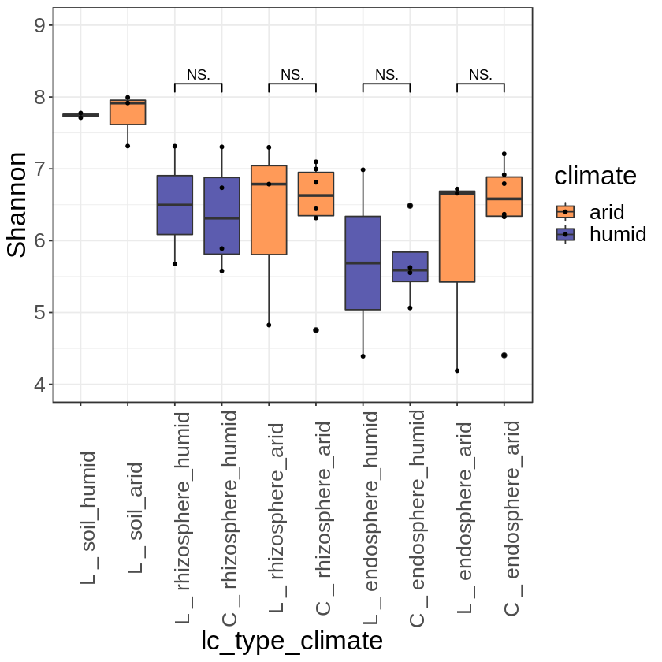
    


    [1] "Facet plot by sample type, local vs common garden"


    
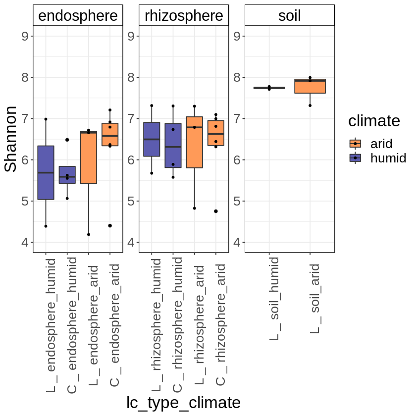
    


```R
#Estimmate diversity for soil and plant treatment: local, inoculum, fertilized inoculum, sterilized, substrate

#Subset soil samples
soil_div <- div_tab_data %>% subset(type == "soil")
soil_div <- cbind(as.data.frame(soil_div$type), as.data.frame(soil_div$Shannon))
colnames(soil_div) <- c("Treatment", "Shannon")

#Subset local, inoculum, fertilized, sterilized
trat_div <- div_tab_data %>% subset(locality != "c") %>% subset(type != "soil") %>% subset(treatment != "substrate")
trat_div <- cbind(as.data.frame(trat_div$treatment), as.data.frame(trat_div$Shannon))
colnames(trat_div) <- c("Treatment", "Shannon")

#Subset substrate samples
substrate_div <- div_tab_data %>% subset(soil == "substrate")
substrate_div <- cbind(as.data.frame(substrate_div$soil), as.data.frame(substrate_div$Shannon))
colnames(substrate_div) <- c("Treatment", "Shannon")

soil_trat_div <- rbind(soil_div, trat_div, substrate_div) 

treatment <- factor(soil_trat_div$Treatment, levels= c ("soil", "local", "inoculum", "fertilized", 
                                                   "sterilized", "substrate"))

shannon_trat <- ggplot(soil_trat_div, aes(treatment, Shannon, fill=treatment)) + geom_boxplot() + geom_point(size = 1.5) + 
                    scale_fill_manual(values = c("#aaccffff", "#aaccffff", "#ccaaffff", "#ccaaffff",
                                                "#e6e6e6ff", "#e6e6e6ff")) +
                                                 theme_light() + 
                                                 theme(text = element_text(size=15)) 

ggsave("shannon_trat.pdf", width = 20, height = 15, units = "cm")

print("Shannon diversity by treatment")
shannon_trat
```

    [1] "Shannon diversity by treatment"


    
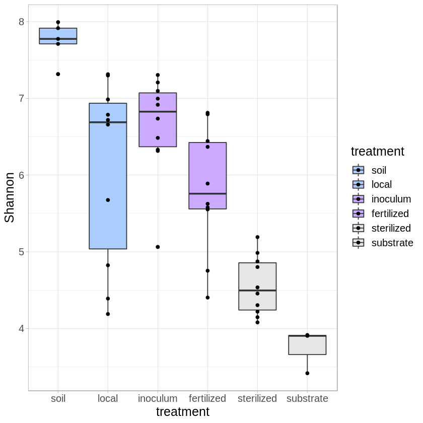
    


```R
#Test statistically differences of groups via ANOVA
library(multcompView) 

#ANOVA test for soil, local root, inoculum, fertilized, sterilized and substrate
model <- lm(soil_trat_div$Shannon ~ soil_trat_div$Treatment)
ANOVA <- aov(model)

#Make Tukey test
TUKEY <- TukeyHSD(ANOVA, "soil_trat_div$Treatment", conf.level=0.99)

# I need to group the treatments that are not different each other together.
generate_label_df <- function(TUKEY, variable){
 
     # Extract labels and factor levels from Tukey post-hoc 
     Tukey.levels <- TUKEY[[variable]][,4]
     Tukey.labels <- data.frame(multcompLetters(Tukey.levels)['Letters'])
     
     #I need to put the labels in the same order as in the boxplot :
     Tukey.labels$treatment=rownames(Tukey.labels)
     Tukey.labels=Tukey.labels[order(Tukey.labels$treatment) , ]
     return(Tukey.labels)
     }
 
# Apply the function on my dataset
LABELS <- generate_label_df(TUKEY , "soil_trat_div$Treatment")
LABELS
```


<table>
<thead><tr><th></th><th scope=col>Letters</th><th scope=col>treatment</th></tr></thead>
<tbody>
	<tr><th scope=row>fertilized</th><td>b         </td><td>fertilized</td></tr>
	<tr><th scope=row>inoculum</th><td>bc        </td><td>inoculum  </td></tr>
	<tr><th scope=row>local</th><td>b         </td><td>local     </td></tr>
	<tr><th scope=row>soil</th><td>c         </td><td>soil      </td></tr>
	<tr><th scope=row>sterilized</th><td>a         </td><td>sterilized</td></tr>
	<tr><th scope=row>substrate</th><td>a         </td><td>substrate </td></tr>
</tbody>
</table>


```R
#Plot relative abundance of Phylum of local, inocumul, fertilized and sterilized samples

#Get relative abundances of groups
phy_calabacita_substrate <- subset_samples(phy_calabacita, soil=="substrate")
phy_calabacita_substrate <- merge_samples(phy_calabacita_substrate, "treatment")

phy_calabacita_soil <- subset_samples(phy_calabacita, type=="soil")
phy_calabacita_soil <- merge_samples(phy_calabacita_soil, "type")

Samples_toKeep <- c("rhizosphere", "endosphere")
phy_calabacita_ns <- subset_samples(phy_calabacita, type %in% Samples_toKeep)
calabacita_samplec <- merge_samples(phy_calabacita_ns, "treatment")

phy_calabacita_complete <- merge_phyloseq(phy_calabacita_substrate, phy_calabacita_soil, calabacita_samplec)

calabacita_complete <- transform_sample_counts(phy_calabacita_complete, function(x) x / sum(x))

calabacita_complete_otu_phy <- t(otu_table(calabacita_complete))
calabacita_complete_tax_phy <- tax_table(calabacita_complete)
calabacita_complete_otu_tax <- cbind(calabacita_complete_otu_phy, calabacita_complete_tax_phy)
calabacita_complete_otu_tax <- calabacita_complete_otu_tax[, 1:8]

write.table(calabacita_complete_otu_tax, "calabacita_complete_otu_tax.tsv", sep = "\t")

calabacita_complete_otu_tax <- read.table("calabacita_complete_otu_tax.tsv", header=TRUE, row.names=1, 
                                 stringsAsFactors = FALSE, check.names=FALSE)
                                              
m_calabacita_complete_otu_tax <- melt(calabacita_complete_otu_tax, 
                                     measure.vars = c("soil", "local", "inoculum", "fertilized", 
                                                      "sterilized", "substrate"))

colnames(m_calabacita_complete_otu_tax) <- c("Kingdom", "Phylum", "Sample_group", "Relative_abundance")
m_calabacita_complete_otu_tax$Phylum[m_calabacita_complete_otu_tax$Relative_abundance <= 0.01] <- "Low_abundance"
                                               
cm_calabacita_complete_otu_tax <- aggregate(m_calabacita_complete_otu_tax$Relative_abundance 
                                          ,by=list(m_calabacita_complete_otu_tax$Phylum, 
                                           m_calabacita_complete_otu_tax$Sample_group),sum)
colnames(cm_calabacita_complete_otu_tax) <- c("Phylum", "Sample_group", "Relative_abundance")
                                              
#Create the plot
print("Most abundant Phylum of local, inoculum, fertilized and sterilized samples")
phylum_local_cg_plot <- ggplot(cm_calabacita_complete_otu_tax, aes(x=Sample_group, y=Relative_abundance,
                                          fill=fct_reorder(Phylum, Relative_abundance))) + 
        scale_fill_manual(values = c("Acidobacteriota" = "#dd87b4ff", 
                              "Actinobacteriota" = "#d26d7aff",
                              "Bacteroidota" = "#b6742aff", 
                              "Chloroflexi" = "#f6ef32ff",                        
                              "Firmicutes" = "#ffad12ff", 
                              "Gemmatimonadota" = "#d96d3bff",
                              "Planctomycetota" = "#5a9d5aff", 
                              "Proteobacteria" = "#419486ff", 
                              "Verrucomicrobiota" = "#66628dff",
                              "Patescibacteria" = "#7a61baff",
                              "Bdellovibrionota" = "#d8b655ff",
                              "Methylomirabilota" = "#4198d7ff",
                              "Myxococcota" = "#91569aff",
                               "Low_abundance" = "#999999ff")) +
       geom_bar(stat="identity", color="black", width=0.8) + scale_y_continuous(expand = c(0 ,0)) + 
       theme_light(base_size = 7) + theme(axis.text.y = element_text(size = 18),
                                          axis.text.x = element_text(size = 15, angle = 90))

phylum_local_cg_plot 
                                               
ggsave("phylum__treatment_plot.pdf", width=35, height=40, units="cm")     
```

    [1] "Most abundant Phylum of local, inoculum, fertilized and sterilized samples"


    
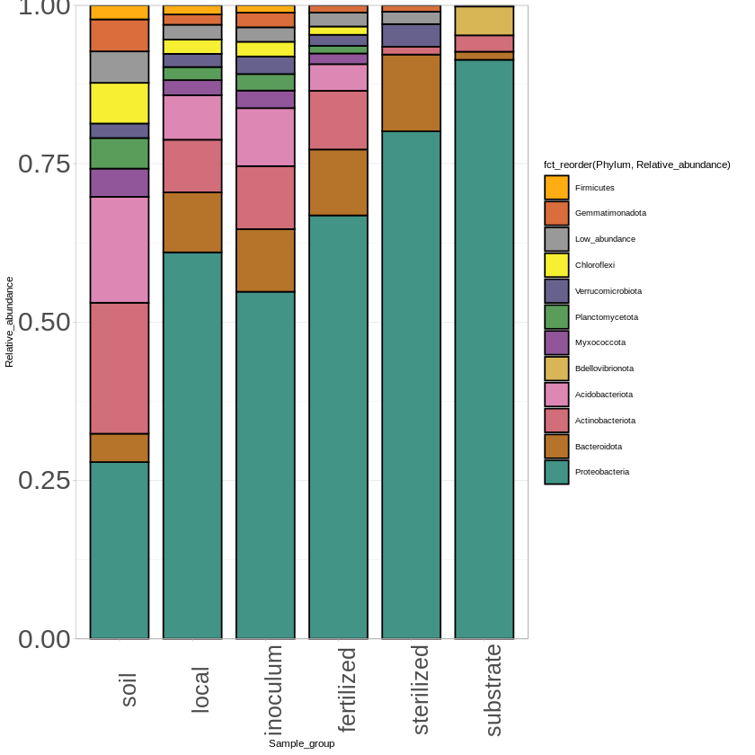
    


```R
#Estimate unifrac distance
u_dist <- distance(calabacita, "unifrac")
```

    Warning message in UniFrac(physeq, ...):
    “Randomly assigning root as -- 480126 -- in the phylogenetic tree in the data you provided.”


```R
# Whole samples MDS
tcalabacitau.mds <- ordinate(calabacita, "MDS", "unifrac")
ordum <- plot_ordination(calabacita, tcalabacitau.mds, type="sample", color="climetrat", shape="type") + 
         geom_text_repel(aes(label = name), size = 5, color = "gray") + geom_point(size=5) + theme_light() + 
         theme(text = element_text(size=15), legend.position = "bottom") + 
         scale_colour_manual(values = c("#ff9955ff", "#ffccaaff", "#8181c0ff", "#afc6e9ff", "black"))
ggsave("ordum.pdf", width = 30, height = 25, units = "cm")
ordum
```

    Warning message in UniFrac(physeq, ...):
    “Randomly assigning root as -- 118357 -- in the phylogenetic tree in the data you provided.”


    
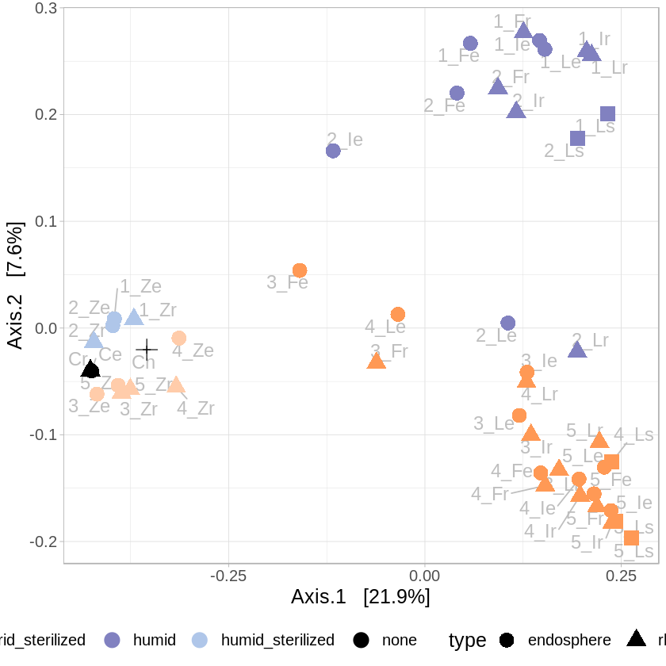
    


```R
#PERMANOVA analysis by treatment
adonis(u_dist ~sampledata$treatment)
```


    
    Call:
    adonis(formula = u_dist ~ sampledata$treatment) 
    
    Permutation: free
    Number of permutations: 999
    
    Terms added sequentially (first to last)
    
                         Df SumsOfSqs MeanSqs F.Model      R2 Pr(>F)    
    sampledata$treatment  4    3.6825 0.92062  3.9495 0.26868  0.001 ***
    Residuals            43   10.0233 0.23310         0.73132           
    Total                47   13.7058                 1.00000           
    ---
    Signif. codes:  0 ‘***’ 0.001 ‘**’ 0.01 ‘*’ 0.05 ‘.’ 0.1 ‘ ’ 1


```R
#PERMANOVA analysis by treatment
print("Test differences in beta diversity by sample type:soil, rhizosphere and endosphere")
adonis(u_dist ~sampledata$type)
```

    [1] "Test differences in beta diversity by sample type:soil, rhizosphere and endosphere"


    
    Call:
    adonis(formula = u_dist ~ sampledata$type) 
    
    Permutation: free
    Number of permutations: 999
    
    Terms added sequentially (first to last)
    
                    Df SumsOfSqs MeanSqs F.Model      R2 Pr(>F)   
    sampledata$type  3    1.2934 0.43114  1.5283 0.09437  0.008 **
    Residuals       44   12.4123 0.28210         0.90563          
    Total           47   13.7058                 1.00000          
    ---
    Signif. codes:  0 ‘***’ 0.001 ‘**’ 0.01 ‘*’ 0.05 ‘.’ 0.1 ‘ ’ 1


```R
#PERMANOVA analysis by climate, without sterilized controls

#PERMANOVA humid vs arid sources
Samples_toKeep <- c("local", "inoculum", "fertilized")
ccalabacita <- subset_samples(calabacita, treatment %in% Samples_toKeep)
c_data <- metadata %>% filter(treatment == "local" | treatment == "inoculum" | treatment == "fertilized")

uc_dist <- distance(ccalabacita, "unifrac")
adonis(uc_dist ~c_data$climate)

#PERMANOVA rhizosphere vs endosphere
print("Test permanova rhizosphere vs endosphere")
Samples_toKeep <- c("rhizosphere", "endosphere")

r_e_calabacita <- subset_samples(ccalabacita, type %in% Samples_toKeep)
u_re_dist <- distance(r_e_calabacita, "unifrac")

re_data <- c_data %>% filter(type == "rhizosphere" | type == "endosphere")
adonis(u_re_dist ~re_data$type)
```

    Warning message in UniFrac(physeq, ...):
    “Randomly assigning root as -- 376673 -- in the phylogenetic tree in the data you provided.”


    
    Call:
    adonis(formula = uc_dist ~ c_data$climate) 
    
    Permutation: free
    Number of permutations: 999
    
    Terms added sequentially (first to last)
    
                   Df SumsOfSqs MeanSqs F.Model      R2 Pr(>F)    
    c_data$climate  1    0.8845 0.88453  4.0967 0.11043  0.001 ***
    Residuals      33    7.1252 0.21591         0.88957           
    Total          34    8.0097                 1.00000           
    ---
    Signif. codes:  0 ‘***’ 0.001 ‘**’ 0.01 ‘*’ 0.05 ‘.’ 0.1 ‘ ’ 1


    [1] "Test permanova rhizosphere vs endosphere"


    Warning message in UniFrac(physeq, ...):
    “Randomly assigning root as -- 401368 -- in the phylogenetic tree in the data you provided.”


    
    Call:
    adonis(formula = u_re_dist ~ re_data$type) 
    
    Permutation: free
    Number of permutations: 999
    
    Terms added sequentially (first to last)
    
                 Df SumsOfSqs MeanSqs F.Model    R2 Pr(>F)
    re_data$type  1    0.2108 0.21079 0.89565 0.031  0.638
    Residuals    28    6.5898 0.23535         0.969       
    Total        29    6.8006                 1.000       


```R
#Canonical Analysis of Principal coordinate (CAP) for local samples
lcalabacita <- subset_samples(calabacita, treatment=="local")
lcalabacita.cap <- ordinate(lcalabacita, "CAP", "unifrac", 
                            ~ type + ph + ai + toc + tn + pt + no3 + nh4 + hpo4 + cp +cn + np + mat + map + 
                            soil + climate) 
lcalabacita.cap

cap_plot <- plot_ordination(lcalabacita, lcalabacita.cap, color="climetrat", 
                            axes =c(1,2)) + aes(shape= type) + geom_text_repel(aes(label = name), 
                            size = 5, color = "gray") + geom_point(aes(colour = climetrat), size=5) + 
                            scale_colour_manual(values = c("#ff9955ff", "#8181c0ff")) + theme_light() + 
                            theme(text = element_text(size=15), legend.position = "bottom")   

arrowmat <- vegan::scores(lcalabacita.cap, display="bp")
arrowdf <- data.frame(labels=rownames(arrowmat), arrowmat)

# Define the arrow aesthetic mapping
arrow_map <- aes(xend = CAP1,
                 yend = CAP2,
                 x = 0,
                 y = 0,
                 shape = NULL,
                 color = black,
                 label = labels)

label_map <- aes(x = 1.3 * CAP1,
                 y = 1.3 * CAP2,
                 shape = NULL,
                 color = NULL,
                 label = labels)

arrowhead = arrow(length = unit(0.02, "npc"))

capl_plot <- cap_plot  +
  geom_segment(
    mapping = arrow_map,
    size = .5,
    data = arrowdf,
    color = "black",
    arrow = arrowhead
  ) +
  geom_text(
    mapping = label_map,
    size = 4, 
    data = arrowdf,
    show.legend = FALSE
  )
ggsave("capl_plot.pdf", width = 15, height = 15, units = "cm")
capl_plot

anl <- anova(lcalabacita.cap, permutations=9999)
anl
```

    Warning message in UniFrac(physeq, ...):
    “Randomly assigning root as -- 551007 -- in the phylogenetic tree in the data you provided.”


    Call: capscale(formula = distance ~ type + ph + ai + toc + tn + pt +
    no3 + nh4 + hpo4 + cp + cn + np + mat + map + soil + climate, data =
    data)
    
                  Inertia Proportion Rank
    Total          3.1496     1.0000     
    Constrained    1.8618     0.5911    6
    Unconstrained  1.2878     0.4089    8
    Inertia is squared Unknown distance 
    Some constraints were aliased because they were collinear (redundant)
    
    Eigenvalues for constrained axes:
      CAP1   CAP2   CAP3   CAP4   CAP5   CAP6 
    0.5147 0.4673 0.3060 0.2226 0.2035 0.1478 
    
    Eigenvalues for unconstrained axes:
       MDS1    MDS2    MDS3    MDS4    MDS5    MDS6    MDS7    MDS8 
    0.23286 0.21574 0.16253 0.15467 0.14807 0.13402 0.12254 0.11740 


    Warning message:
    “Ignoring unknown aesthetics: label”


<table>
<thead><tr><th></th><th scope=col>Df</th><th scope=col>SumOfSqs</th><th scope=col>F</th><th scope=col>Pr(&gt;F)</th></tr></thead>
<tbody>
	<tr><th scope=row>Model</th><td>6       </td><td>1.861812</td><td>1.927604</td><td>1e-04   </td></tr>
	<tr><th scope=row>Residual</th><td>8       </td><td>1.287825</td><td>      NA</td><td>   NA   </td></tr>
</tbody>
</table>


    
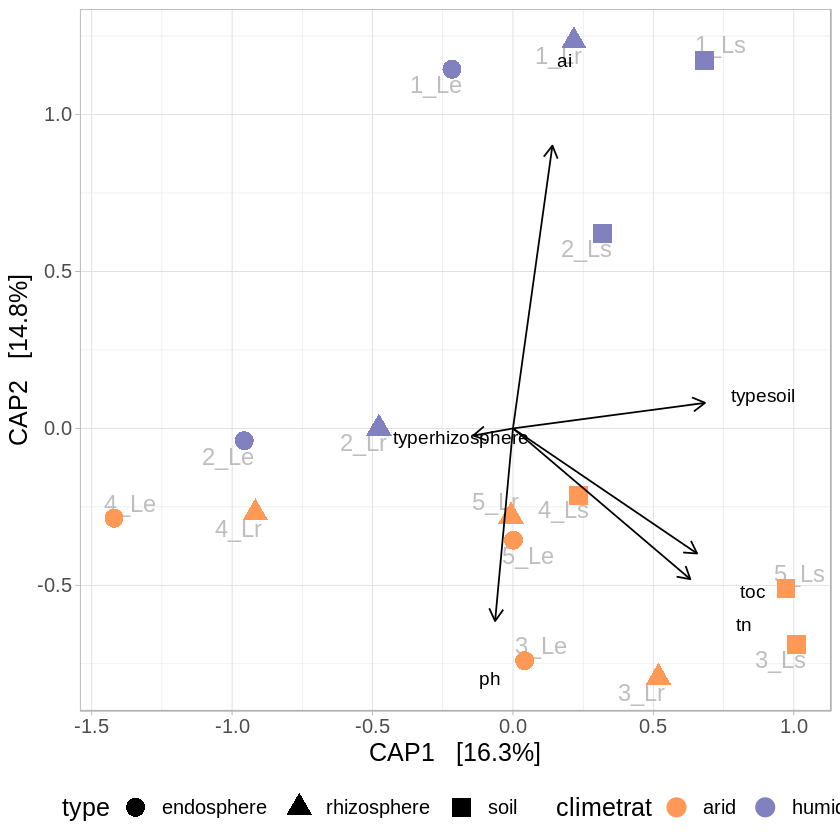
    


```R
# Subsampling for common garden experiment
cgcalabacita <- merge_phyloseq(subset_samples(calabacita, treatment=="inoculum"), 
                              subset_samples(calabacita, treatment=="fertilized"), 
                              subset_samples(calabacita, treatment=="sterilized"))
cgcalabacita.cap <- ordinate(cgcalabacita, "MDS", "wunifrac")
ordum <- plot_ordination(cgcalabacita.cap, tcalabacitau.mds, type="sample", color="climetrat", shape="type") + 
         geom_text_repel(aes(label = name), size = 5, color = "gray") + geom_point(size=5) + theme_light() + 
         theme(text = element_text(size=15), legend.position = "bottom") 
ordum
```

    Warning message in UniFrac(physeq, weighted = TRUE, ...):
    “Randomly assigning root as -- 435089 -- in the phylogenetic tree in the data you provided.”Warning message in plot_ordination(cgcalabacita.cap, tcalabacitau.mds, type = "sample", :
    “Full functionality requires `physeq` be phyloseq-class with multiple components.”Warning message in scores.pcoa(ordination, choices = axes, display = "species", :
    “scores.pcoa: Failed to access OTU table from `physeq` argument, 
    
                  needed for weighted average of OTU/taxa/species points in MDS/PCoA.”Warning message in plot_ordination(cgcalabacita.cap, tcalabacitau.mds, type = "sample", :
    “`Ordination site/sample coordinate indices did not match `physeq` index names. Setting corresponding coordinates to NULL.”Warning message in plot_ordination(cgcalabacita.cap, tcalabacitau.mds, type = "sample", :
    “Could not obtain coordinates from the provided `ordination`. 
    Please check your ordination method, and whether it is supported by `scores` or listed by phyloseq-package.”


    NULL


```R
# Subsampling for common garden experiment
cgcalabacita <- merge_phyloseq(subset_samples(calabacita, treatment=="inoculum"), 
                              subset_samples(calabacita, treatment=="fertilized"), 
                              subset_samples(calabacita, treatment=="sterilized"))
cgcalabacita.cap <- ordinate(cgcalabacita, "CAP", "unifrac", ~ treatment + carotenoids + chlorophyll + 
                              + abiomass + sla)
cgcalabacita.cap

cap_plotg <- plot_ordination(cgcalabacita, cgcalabacita.cap, color="climetrat", axes =c(1,2)) + 
             aes(shape= type) + geom_text_repel(aes(label = name), size = 5, color = "gray") + 
             geom_point(aes(colour = climetrat), size=5) + theme_light() +
             theme(text = element_text(size=15), legend.position = "bottom") + 
            scale_colour_manual(values = c("#ff9955ff", "#8181c0ff", "#ffccaaff", "#afc6e9ff", "black"))
arrowmat <- vegan::scores(cgcalabacita.cap, display="bp")

arrowdf <- data.frame(labels=rownames(arrowmat), arrowmat)

# Define the arrow aesthetic mapping
arrow_map <- aes(xend = CAP1,
                 yend = CAP2,
                 x = 0,
                 y = 0,
                 shape = NULL,
                 color = black,
                 label = labels)

label_map <- aes(x = 1.3 * CAP1,
                 y = 1.3 * CAP2,
                 shape = NULL,
                 color = NULL,
                 label = labels)

arrowhead = arrow(length = unit(0.02, "npc"))

cap_plotg <- cap_plotg  +
  geom_segment(
    mapping = arrow_map,
    size = .5,
    data = arrowdf,
    color = "black",
    arrow = arrowhead
  ) +
  geom_text(
    mapping = label_map,
    size = 3, 
    data = arrowdf,
    show.legend = FALSE
  )
ggsave("cap_plotg.pdf", width = 15, height = 15, units = "cm")
cap_plotg

anl <- anova(cgcalabacita.cap, permutations=9999)
anl
```

    Warning message in UniFrac(physeq, ...):
    “Randomly assigning root as -- 433363 -- in the phylogenetic tree in the data you provided.”


    Call: capscale(formula = distance ~ treatment + carotenoids +
    chlorophyll + +abiomass + sla, data = data)
    
                  Inertia Proportion Rank
    Total          9.1674     1.0000     
    Constrained    3.7514     0.4092    6
    Unconstrained  5.4160     0.5908   25
    Inertia is squared Unknown distance 
    
    Eigenvalues for constrained axes:
      CAP1   CAP2   CAP3   CAP4   CAP5   CAP6 
    2.0888 0.5031 0.4134 0.2976 0.2318 0.2166 
    
    Eigenvalues for unconstrained axes:
      MDS1   MDS2   MDS3   MDS4   MDS5   MDS6   MDS7   MDS8 
    0.6360 0.4614 0.4482 0.3474 0.3155 0.2746 0.2421 0.2192 
    (Showing 8 of 25 unconstrained eigenvalues)


    Warning message:
    “Ignoring unknown aesthetics: label”


<table>
<thead><tr><th></th><th scope=col>Df</th><th scope=col>SumOfSqs</th><th scope=col>F</th><th scope=col>Pr(&gt;F)</th></tr></thead>
<tbody>
	<tr><th scope=row>Model</th><td> 6      </td><td>3.751395</td><td>2.886021</td><td>1e-04   </td></tr>
	<tr><th scope=row>Residual</th><td>25      </td><td>5.416042</td><td>      NA</td><td>   NA   </td></tr>
</tbody>
</table>


    
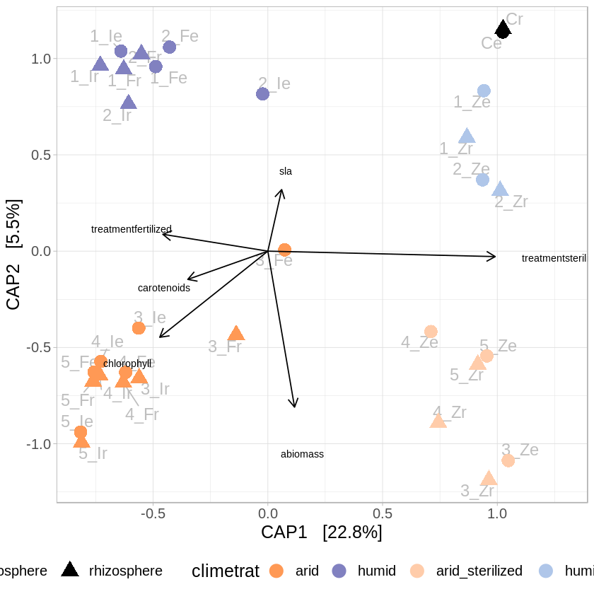
    


```R
#Most abundant genera

#Agglomerate OTUs by genus
gcalabacita <- tax_glom(calabacita, taxrank="Genus")
```


```R
gcalabacita
```


    phyloseq-class experiment-level object
    otu_table()   OTU Table:         [ 1595 taxa and 48 samples ]
    sample_data() Sample Data:       [ 48 samples by 40 sample variables ]
    tax_table()   Taxonomy Table:    [ 1595 taxa by 6 taxonomic ranks ]
    phy_tree()    Phylogenetic Tree: [ 1595 tips and 1593 internal nodes ]


```R
#Get number of bacterial genus (removing unclassified: "g_")
gen_tab <- as.data.frame(as((tax_table(gcalabacita)), "matrix"),row.names = FALSE)
gen_tab <- gen_tab %>% subset(Genus != "unclassified")
gen_list <- gen_tab$Genus
gen_list <- unique(gen_list)
length(gen_list)
```


1058


```R
#Most abundant genera

#Genus taxonomic labels

top20 <- prune_taxa(names(sort(taxa_sums(gcalabacita),TRUE)[1:20]),gcalabacita)
top20heatmap <- plot_heatmap(top20, sample.label = "name",  
                             taxa.label = "Genus", low = "#ffffffff", high = "#0a091fff",  na.value = "white",
                             taxa.order  = names(sort(taxa_sums(gcalabacita))),
                             sample.order = c("16S_1_Ls", "16S_1_Lr", "16S_1_Le", "16S_1_Ir", "16S_1_Ie", 
                                              "16S_1_Fr", "16S_1_Fe", "16S_1_Zr", "16S_1_Ze", "16S_2_Ls", 
                                              "16S_2_Lr", "16S_2_Le", "16S_2_Ir", "16S_2_Ie", "16S_2_Fr", 
                                              "16S_2_Fe", "16S_2_Zr", "16S_2_Ze", "16S_3_Ls", "16S_3_Lr", 
                                              "16S_3_Le", "16S_3_Ir", "16S_3_Ie", "16S_3_Fr", "16S_3_Fe", 
                                              "16S_3_Zr", "16S_3_Ze", "16S_4_Ls", "16S_4_Lr", "16S_4_Le", 
                                              "16S_4_Ir", "16S_4_Ie", "16S_4_Fr", "16S_4_Fe", "16S_4_Zr", 
                                              "16S_4_Ze", "16S_5_Ls", "16S_5_Lr", "16S_5_Le", "16S_5_Ir", 
                                              "16S_5_Ie", "16S_5_Fr", "16S_5_Fe", "16S_5_Zr", "16S_5_Ze", 
                                              "16S_Cr", "16S_Ce", "16S_Cn")) +
                             theme(axis.text.x = element_text(size=10), axis.text.y = element_text(size=10))

ggsave("most_abundant_genus.pdf", width=30, height=15, units="cm")
top20heatmap
```

    Warning message:
    “Transformation introduced infinite values in discrete y-axis”Warning message:
    “Transformation introduced infinite values in discrete y-axis”


    
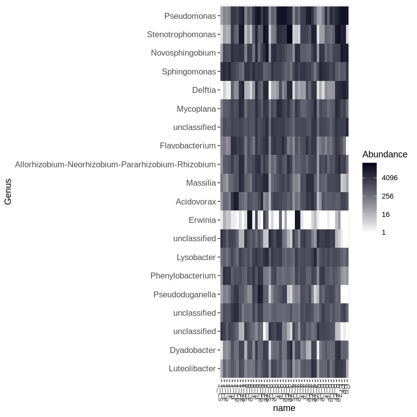
    


```R
#Most abundant genera

#Family taxonomic labels

top20 <- prune_taxa(names(sort(taxa_sums(gcalabacita),TRUE)[1:20]),gcalabacita)
top20heatmap <- plot_heatmap(top20, sample.label = "name",  
                             taxa.label = "Family", low = "#ffffffff", high = "#0a091fff",  na.value = "white",
                             taxa.order  = names(sort(taxa_sums(gcalabacita))),
                             sample.order = c("16S_1_Ls", "16S_1_Lr", "16S_1_Le", "16S_1_Ir", "16S_1_Ie", 
                                              "16S_1_Fr", "16S_1_Fe", "16S_1_Zr", "16S_1_Ze", "16S_2_Ls", 
                                              "16S_2_Lr", "16S_2_Le", "16S_2_Ir", "16S_2_Ie", "16S_2_Fr", 
                                              "16S_2_Fe", "16S_2_Zr", "16S_2_Ze", "16S_3_Ls", "16S_3_Lr", 
                                              "16S_3_Le", "16S_3_Ir", "16S_3_Ie", "16S_3_Fr", "16S_3_Fe", 
                                              "16S_3_Zr", "16S_3_Ze", "16S_4_Ls", "16S_4_Lr", "16S_4_Le", 
                                              "16S_4_Ir", "16S_4_Ie", "16S_4_Fr", "16S_4_Fe", "16S_4_Zr", 
                                              "16S_4_Ze", "16S_5_Ls", "16S_5_Lr", "16S_5_Le", "16S_5_Ir", 
                                              "16S_5_Ie", "16S_5_Fr", "16S_5_Fe", "16S_5_Zr", "16S_5_Ze", 
                                              "16S_Cr", "16S_Ce", "16S_Cn")) +
                             theme(axis.text.x = element_text(size=10), axis.text.y = element_text(size=10))

ggsave("most_abundant_family.pdf", width=60, height=30, units="cm")
top20heatmap
```

    Warning message:
    “Transformation introduced infinite values in discrete y-axis”Warning message:
    “Transformation introduced infinite values in discrete y-axis”


    
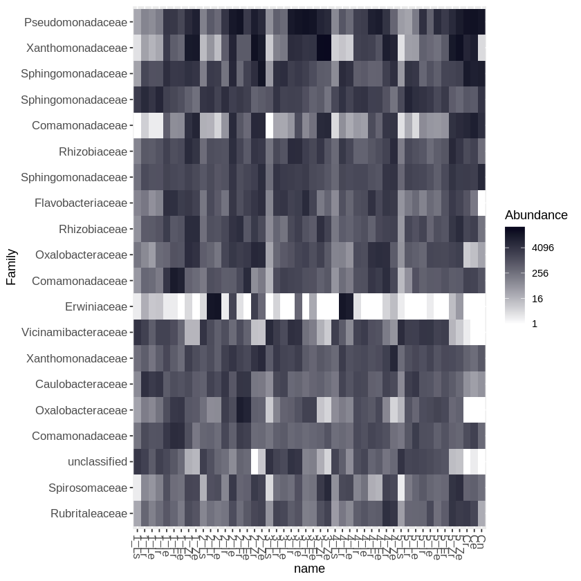
    


```R
#Most abundant genera


#Order taxonomic labels

top20 <- prune_taxa(names(sort(taxa_sums(gcalabacita),TRUE)[1:20]),gcalabacita)
top20heatmap <- plot_heatmap(top20, sample.label = "name",  
                             taxa.label = "Order", low = "#ffffffff", high = "#0a091fff",  na.value = "white",
                             taxa.order  = names(sort(taxa_sums(gcalabacita))),
                             sample.order = c("16S_1_Ls", "16S_1_Lr", "16S_1_Le", "16S_1_Ir", "16S_1_Ie", 
                                              "16S_1_Fr", "16S_1_Fe", "16S_1_Zr", "16S_1_Ze", "16S_2_Ls", 
                                              "16S_2_Lr", "16S_2_Le", "16S_2_Ir", "16S_2_Ie", "16S_2_Fr", 
                                              "16S_2_Fe", "16S_2_Zr", "16S_2_Ze", "16S_3_Ls", "16S_3_Lr", 
                                              "16S_3_Le", "16S_3_Ir", "16S_3_Ie", "16S_3_Fr", "16S_3_Fe", 
                                              "16S_3_Zr", "16S_3_Ze", "16S_4_Ls", "16S_4_Lr", "16S_4_Le", 
                                              "16S_4_Ir", "16S_4_Ie", "16S_4_Fr", "16S_4_Fe", "16S_4_Zr", 
                                              "16S_4_Ze", "16S_5_Ls", "16S_5_Lr", "16S_5_Le", "16S_5_Ir", 
                                              "16S_5_Ie", "16S_5_Fr", "16S_5_Fe", "16S_5_Zr", "16S_5_Ze", 
                                              "16S_Cr", "16S_Ce", "16S_Cn")) +
                             theme(axis.text.x = element_text(size=10), axis.text.y = element_text(size=10))

ggsave("most_abundant_order.pdf", width=60, height=30, units="cm")
top20heatmap
```

    Warning message:
    “Transformation introduced infinite values in discrete y-axis”Warning message:
    “Transformation introduced infinite values in discrete y-axis”


    
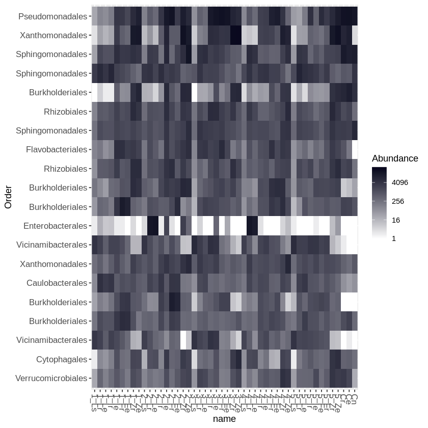
    


```R
#Comparisons between arid and humid groups

phumid <- subset_samples(gcalabacita, samplec=="rhizosphere_humid" | samplec=="endosphere_humid")
parid <- subset_samples(gcalabacita, samplec=="rhizosphere_arid" | samplec=="endosphere_arid")

m_arid_humid <- merge_samples(merge_phyloseq(phumid, parid), "climate")
m_arid_humid <- filter_taxa(m_arid_humid, function (x) {sum(x > 0) > 0}, prune=TRUE)
arid_humid_d <- t(as.data.frame(as(otu_table(m_arid_humid), "matrix"),row.names = FALSE))
colnames(arid_humid_d) <- c("Humid", "Arid")
arid_humid_t <- as.data.frame(as(tax_table(m_arid_humid), "matrix"),row.names = FALSE)
arid_humid_mi <- cbind(arid_humid_t, arid_humid_d)
arid_humid_mi <- arid_humid_mi %>% select(Genus, Humid, Arid)
arid_humid_mi[arid_humid_mi > 0] = 1
arid_humid_dat <- as.data.frame(arid_humid_mi)
row.names(arid_humid_dat) <- NULL
arid_humid_dat <- arid_humid_dat %>% subset(Genus != "unclassified")
arid_humid_dat <- unique(arid_humid_dat)

print("Genus per hystoric climatic conditions")
head(arid_humid_dat, 10)

#Venn diagram
print("Venn diagram")
arid_humid_dat$Genus <- NULL

pdf("venn_humid_arid.pdf")
venn <- vennDiagram(vennCounts(arid_humid_dat), circle.col=c("#5c5cafff", "#ff9a58ff"))
dev.off()

vennDiagram(vennCounts(arid_humid_dat), circle.col=c("#5c5cafff", "#ff9a58ff"))

#Get genus list from arid and humid climates

#Arid genera list
farid <- filter_taxa(parid, function (x) {sum(x > 0) > 0}, prune=TRUE)
aridt <- as.data.frame(as(tax_table(farid), "matrix"),row.names = FALSE)
aridt <- aridt %>% subset(Genus != "unclassified")
aridt <- unique(aridt)
a_genus <- as.vector(aridt$Genus)
write.table(a_genus, "a_genus.txt", row.names = FALSE, quote = FALSE, col.names = FALSE)

#Humid genera list
fhumid <- filter_taxa(phumid, function (x) {sum(x > 0) > 0}, prune=TRUE)
humidt <- as.data.frame(as(tax_table(fhumid), "matrix"),row.names = FALSE, quote = FALSE, col.names = FALSE)
humidt <- humidt %>% subset(Genus != "unclassified")
humidt <- unique(humidt)
h_genus <- as.vector(humidt$Genus)
write.table(h_genus, "h_genus.txt", row.names = FALSE, quote = FALSE, col.names = FALSE)

#Make Venn diagrams with online tool:
#Alternatively, venn diagrams can be made from previous lists (a_genus.txt and h_genus.txt) with online tool:

#http://bioinformatics.psb.ugent.be/webtools/Venn/
```

    Warning message in Ops.factor(left, right):
    “‘>’ not meaningful for factors”

    [1] "Genus per hystoric climatic conditions"


<table>
<thead><tr><th scope=col>Genus</th><th scope=col>Humid</th><th scope=col>Arid</th></tr></thead>
<tbody>
	<tr><td>Curvibacter            </td><td>1                      </td><td>1                      </td></tr>
	<tr><td>Hylemonella            </td><td>1                      </td><td>1                      </td></tr>
	<tr><td>Rhodoferax             </td><td>1                      </td><td>1                      </td></tr>
	<tr><td>Variovorax             </td><td>1                      </td><td>1                      </td></tr>
	<tr><td>Caenimonas             </td><td>1                      </td><td>1                      </td></tr>
	<tr><td>Pseudacidovorax        </td><td>1                      </td><td>1                      </td></tr>
	<tr><td>Simplicispira          </td><td>1                      </td><td>1                      </td></tr>
	<tr><td>Candidatus_Symbiobacter</td><td>1                      </td><td>1                      </td></tr>
	<tr><td>Pseudorhodoferax       </td><td>1                      </td><td>1                      </td></tr>
	<tr><td>Hydrogenophaga         </td><td>1                      </td><td>1                      </td></tr>
</tbody>
</table>


    [1] "Venn diagram"


<strong>png:</strong> 2


    
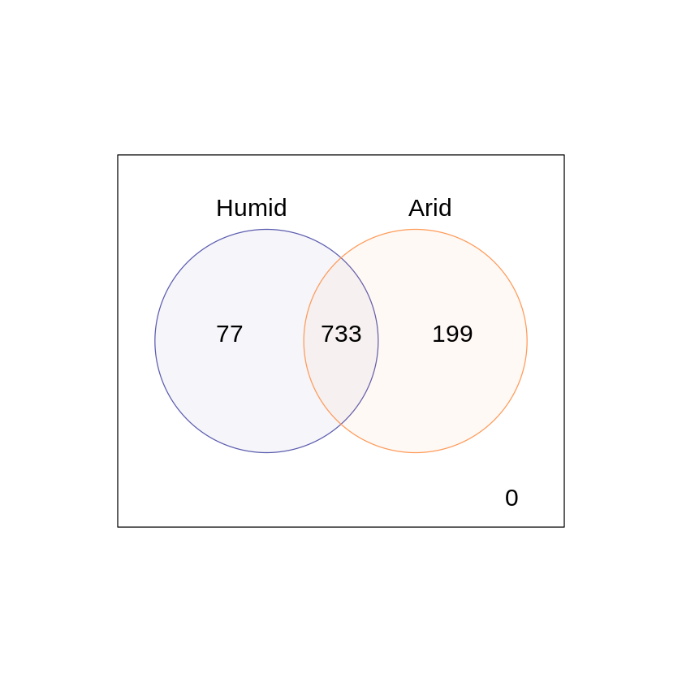
    


```R
#Plot most abundant genus associated to plants exclusive from each climatic condition

#Top genus in arid plant-associated samples

#Get exclusive genus list from arid climate
ea_genus <- setdiff(a_genus, h_genus)

e_parid <- subset_taxa(parid, Genus %in% ea_genus)

print("Most abundant genus in arid associated samples")
top10arid <- prune_taxa(names(sort(taxa_sums(e_parid),TRUE)[1:10]), e_parid)
top10_arid_heatmap <- plot_heatmap(top10arid, sample.label = "name", trans=NULL,  
                             taxa.order  = names(sort(taxa_sums(top10arid))),
                             taxa.label = "Genus", low = "#ffffffff", high = "#0a091fff",  na.value = "white",
                             sample.order = c("16S_3_Lr", "16S_3_Le", "16S_3_Ir", "16S_3_Ie", "16S_3_Fr", 
                                              "16S_3_Fe", "16S_4_Lr", "16S_4_Le", "16S_4_Ir", "16S_4_Ie",
                                              "16S_4_Fr", "16S_4_Fe", "16S_5_Lr", "16S_5_Le", "16S_5_Ir", 
                                              "16S_5_Ie", "16S_5_Fr", "16S_5_Fe")) +
                             theme(axis.text.x = element_text(size=10), axis.text.y = element_text(size=10))

ggsave("top10_arid_heatmap.pdf", width=15, height=10, units="cm")
top10_arid_heatmap


#Get exclusive genus list from arid climate
eh_genus <- setdiff(h_genus, a_genus)

e_phumid <- subset_taxa(phumid, Genus %in% eh_genus)

top10humid <- prune_taxa(names(sort(taxa_sums(e_phumid),TRUE)[1:10]), e_phumid)
top10_humid_heatmap <- plot_heatmap(top10humid, sample.label = "name", trans=NULL,  
                             taxa.order  = names(sort(taxa_sums(top10humid))),
                             taxa.label = "Genus", low = "#ffffffff", high = "#0a091fff",  na.value = "white",
                             sample.order = c("16S_1_Lr", "16S_1_Le", "16S_1_Ir", "16S_1_Ie", "16S_1_Fr",  
                                              "16S_1_Fe", "16S_2_Lr", "16S_2_Le", "16S_2_Ir", "16S_2_Ie",     
                                              "16S_2_Fr", "16S_2_Fe")) +
                             theme(axis.text.x = element_text(size=10), axis.text.y = element_text(size=10))

ggsave("top10_humid_heatmap.pdf", width=14, height=10, units="cm")
top10_humid_heatmap

print("Most abundant genus in humid associated samples")
```

    [1] "Most abundant genus in arid associated samples"


    
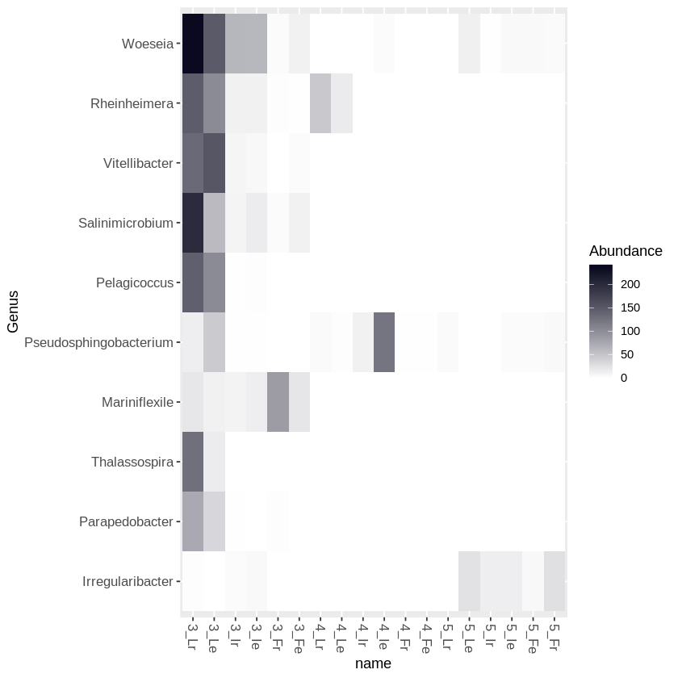
    


    [1] "Most abundant genus in humid associated samples"


    
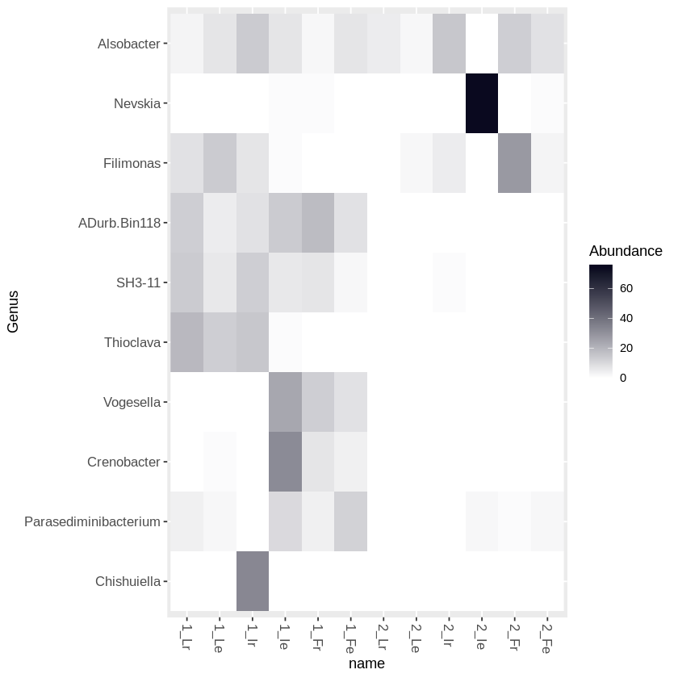
    


```R
# Make object of core genera associated to plants, with treshold of 0 and prevalence in 99% of samples. 
library(microbiome)

#Subset plant associated samples
pgcalabacita <- subset_samples(gcalabacita, type=="rhizosphere" | type=="endosphere")

#Estimate relative abundance
rel_pgcalabacita <- transform_sample_counts(pgcalabacita, function(x) x / sum(x))

pccore <- core(rel_pgcalabacita, detection = 0, prevalence = 0.99)

print("Core genus")
plot_heatmap(pccore, , sample.label = "name",  
                             taxa.label = "Genus", low = "#ffffffff", high = "#0a091fff",  na.value = "white",
                             taxa.order  = names(sort(taxa_sums(gcalabacita))), 
                             sample.order = c("16S_1_Ls", "16S_1_Lr", "16S_1_Le", "16S_1_Ir", "16S_1_Ie", 
                                              "16S_1_Fr", "16S_1_Fe", "16S_1_Zr", "16S_1_Ze", "16S_2_Ls", 
                                              "16S_2_Lr", "16S_2_Le", "16S_2_Ir", "16S_2_Ie", "16S_2_Fr", 
                                              "16S_2_Fe", "16S_2_Zr", "16S_2_Ze", "16S_3_Ls", "16S_3_Lr", 
                                              "16S_3_Le", "16S_3_Ir", "16S_3_Ie", "16S_3_Fr", "16S_3_Fe", 
                                              "16S_3_Zr", "16S_3_Ze", "16S_4_Ls", "16S_4_Lr", "16S_4_Le", 
                                              "16S_4_Ir", "16S_4_Ie", "16S_4_Fr", "16S_4_Fe", "16S_4_Zr", 
                                              "16S_4_Ze", "16S_5_Ls", "16S_5_Lr", "16S_5_Le", "16S_5_Ir", 
                                              "16S_5_Ie", "16S_5_Fr", "16S_5_Fe", "16S_5_Zr", "16S_5_Ze", 
                                              "16S_Cr", "16S_Ce", "16S_Cn")) +
                             theme(axis.text.x = element_text(size=8), axis.text.y = element_text(size=8))


#Get table of relative abundance
tax_core <- as.data.frame(as(tax_table(pccore), "matrix"),row.names = FALSE, quote = FALSE)
otu_core <- as.data.frame(as(otu_table(pccore), "matrix"),row.names = FALSE)
to_core <- cbind(tax_core, otu_core)
write.table(to_core, "to_core.tsv", row.names = FALSE, quote = FALSE, sep = "\t")


#Get list of core genera
lcore <- as.data.frame(as(tax_table(pccore), "matrix"),row.names = FALSE, quote = FALSE, col.names = FALSE)
lcore <- lcore %>% subset(Genus != "unclassified")
lcore <- unique(lcore)
lcore <- as.vector(lcore$Genus)
write.table(lcore, "core_list.txt", row.names = FALSE, quote = FALSE, col.names = FALSE)
```

    [1] "Core genus"


    
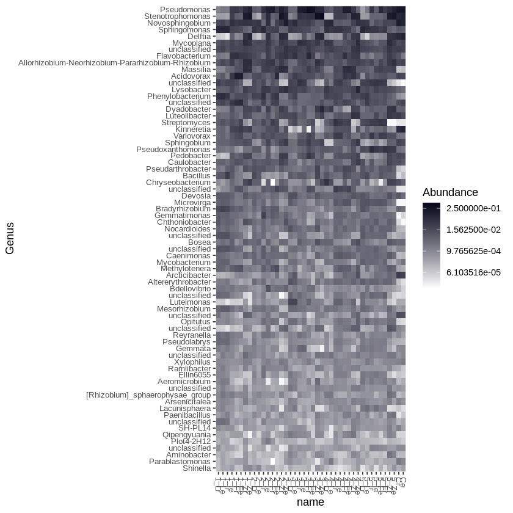
    


```R
#Enrichement analysis of humid vs arid soils
library(DESeq2)
alpha = 0.05

merge_phyloseq(subset_samples(calabacita, samplec=="soil_arid"), 
               subset_samples(calabacita,samplec=="soil_humid"))->sar.shu.phy
sar.shu.ds <- phyloseq_to_deseq2(sar.shu.phy, ~samplec)
sar.shu.ds<-DESeq(sar.shu.ds, test="Wald", fitType="local")
sar.shu.ds.res <- results(sar.shu.ds, cooksCutoff = FALSE)
sar.shu.ds.res
write.csv(sar.shu.ds.res, "sar.shu.ds.res.csv" )
sigtab.sar.shu<-sar.shu.ds.res[which(sar.shu.ds.res$padj < alpha), ]
sigtab.sar.shu<-cbind(as(sigtab.sar.shu, "data.frame"), as(tax_table(sar.shu.phy)[rownames(sigtab.sar.shu), ], 
                                                           "matrix"))
sigtab.sar.shu.x=tapply(sigtab.sar.shu$log2FoldChange, sigtab.sar.shu$Genus, function(x) max(x))
sigtab.sar.shu.x=sort(sigtab.sar.shu.x, TRUE)
sigtab.sar.shu$Genus = factor(as.character(sigtab.sar.shu$Genus), levels=names(sigtab.sar.shu.x))

#Plot significant enriched OTUs in soils by climate
print("Enriched OTUs in humid and arid soil samples")                       
write.csv(sigtab.sar.shu, "sar.shu.csv" )
sarhudes <- ggplot(sigtab.sar.shu, aes(x=Genus, y=log2FoldChange, color=Phylum)) + 
                       scale_color_manual(values = c("Acidobacteriota" = "#dd87b4ff", 
                              "Actinobacteriota" = "#d26d7aff",
                              "Bacteroidota" = "#b6742aff", 
                              "Bdellovibrionota" = "#d8b655ff",
                              "Chloroflexi" = "#f6ef32ff", 
                              "Entotheonellaeota" = "#b3b3b3ff",
                              "Fibrobacterota" = "blue",
                              "Firmicutes" = "#ffad12ff", 
                              "Gemmatimonadota" = "#d96d3bff",
                              "Methylomirabilota" = "#4198d7ff",
                              "Myxococcota" = "pink",
                              "Nitrospirota" = "#91569aff",
                              "Patescibacteria" = "#7a61baff",
                              "Planctomycetota" = "#5a9d5aff", 
                              "Proteobacteria" = "#419486ff", 
                              "RCP2-54" = "black",
                              "Verrucomicrobiota" = "#66628dff", 
                              "unclassified" = "#999999ff")) +
                     geom_point(size=2.5, alpha=1)+theme_light() + 
                        theme(text = element_text(size=10),
                              axis.text.x = element_text(angle = -90, hjust = 0, vjust=0.5)) + 
                        ggtitle("Humid soil vs arid soil ; a=0.05")

ggsave("sarhudes.pdf", width = 25, height = 15, units = "cm")   
                        
sarhudes
```

    Loading required package: S4Vectors
    Loading required package: stats4
    Loading required package: BiocGenerics
    Loading required package: parallel
    
    Attaching package: ‘BiocGenerics’
    
    The following objects are masked from ‘package:parallel’:
    
        clusterApply, clusterApplyLB, clusterCall, clusterEvalQ,
        clusterExport, clusterMap, parApply, parCapply, parLapply,
        parLapplyLB, parRapply, parSapply, parSapplyLB
    
    The following object is masked from ‘package:limma’:
    
        plotMA
    
    The following objects are masked from ‘package:dplyr’:
    
        combine, intersect, setdiff, union
    
    The following object is masked from ‘package:gridExtra’:
    
        combine
    
    The following objects are masked from ‘package:stats’:
    
        IQR, mad, sd, var, xtabs
    
    The following objects are masked from ‘package:base’:
    
        anyDuplicated, append, as.data.frame, basename, cbind, colMeans,
        colnames, colSums, dirname, do.call, duplicated, eval, evalq,
        Filter, Find, get, grep, grepl, intersect, is.unsorted, lapply,
        lengths, Map, mapply, match, mget, order, paste, pmax, pmax.int,
        pmin, pmin.int, Position, rank, rbind, Reduce, rowMeans, rownames,
        rowSums, sapply, setdiff, sort, table, tapply, union, unique,
        unsplit, which, which.max, which.min
    
    
    Attaching package: ‘S4Vectors’
    
    The following objects are masked from ‘package:dplyr’:
    
        first, rename
    
    The following object is masked from ‘package:tidyr’:
    
        expand
    
    The following object is masked from ‘package:base’:
    
        expand.grid
    
    Loading required package: IRanges
    
    Attaching package: ‘IRanges’
    
    The following object is masked from ‘package:microbiome’:
    
        coverage
    
    The following objects are masked from ‘package:dplyr’:
    
        collapse, desc, slice
    
    The following object is masked from ‘package:purrr’:
    
        reduce
    
    The following object is masked from ‘package:phyloseq’:
    
        distance
    
    Loading required package: GenomicRanges
    Loading required package: GenomeInfoDb
    Loading required package: SummarizedExperiment
    Loading required package: Biobase
    Welcome to Bioconductor
    
        Vignettes contain introductory material; view with
        'browseVignettes()'. To cite Bioconductor, see
        'citation("Biobase")', and for packages 'citation("pkgname")'.
    
    
    Attaching package: ‘Biobase’
    
    The following object is masked from ‘package:phyloseq’:
    
        sampleNames
    
    Loading required package: DelayedArray
    Loading required package: matrixStats
    
    Attaching package: ‘matrixStats’
    
    The following objects are masked from ‘package:Biobase’:
    
        anyMissing, rowMedians
    
    The following object is masked from ‘package:dplyr’:
    
        count
    
    Loading required package: BiocParallel
    
    Attaching package: ‘DelayedArray’
    
    The following objects are masked from ‘package:matrixStats’:
    
        colMaxs, colMins, colRanges, rowMaxs, rowMins, rowRanges
    
    The following object is masked from ‘package:purrr’:
    
        simplify
    
    The following objects are masked from ‘package:base’:
    
        aperm, apply
    
    converting counts to integer mode
    estimating size factors
    estimating dispersions
    gene-wise dispersion estimates
    mean-dispersion relationship
    final dispersion estimates
    fitting model and testing


    log2 fold change (MLE): samplec soil humid vs soil arid 
    Wald test p-value: samplec soil humid vs soil arid 
    DataFrame with 73277 rows and 6 columns
            baseMean log2FoldChange     lfcSE      stat    pvalue      padj
           <numeric>      <numeric> <numeric> <numeric> <numeric> <numeric>
    207464         0             NA        NA        NA        NA        NA
    107688         0             NA        NA        NA        NA        NA
    278575         0             NA        NA        NA        NA        NA
    94108          0             NA        NA        NA        NA        NA
    111072         0             NA        NA        NA        NA        NA
    ...          ...            ...       ...       ...       ...       ...
    213525         0             NA        NA        NA        NA        NA
    109559         0             NA        NA        NA        NA        NA
    107136         0             NA        NA        NA        NA        NA
    210038         0             NA        NA        NA        NA        NA
    269825         0             NA        NA        NA        NA        NA


    [1] "Enriched OTUs in humid and arid soil samples"


    
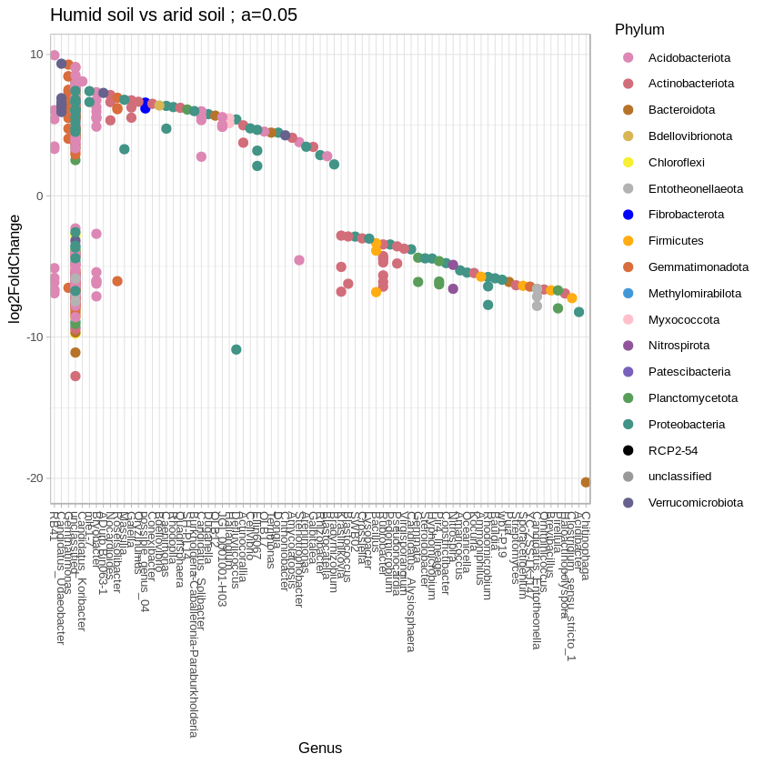
    


```R
#Enrichement analysis of humid vs arid rhizospheres
alpha = 0.05
merge_phyloseq(subset_samples(calabacita, samplec=="rhizosphere_arid"), 
               subset_samples(calabacita, samplec=="rhizosphere_humid"))->rar.rhu.phy
rar.rhu.ds <- phyloseq_to_deseq2(rar.rhu.phy, ~samplec)
rar.rhu.ds<-DESeq(rar.rhu.ds, test="Wald", fitType="local")
rar.rhu.ds.res <- results(rar.rhu.ds, cooksCutoff = FALSE)
rar.rhu.ds.res
sigtab.rar.rhu<-rar.rhu.ds.res[which(rar.rhu.ds.res$padj < alpha), ]
sigtab.rar.rhu<-cbind(as(sigtab.rar.rhu, "data.frame"), as(tax_table(rar.rhu.phy)[rownames(sigtab.rar.rhu), ], 
                                                           "matrix"))
sigtab.rar.rhu.x=tapply(sigtab.rar.rhu$log2FoldChange, sigtab.rar.rhu$Genus, function(x) max(x))
sigtab.rar.rhu.x=sort(sigtab.rar.rhu.x, TRUE)
sigtab.rar.rhu$Genus = factor(as.character(sigtab.rar.rhu$Genus), levels=names(sigtab.rar.rhu.x))
write.csv(sigtab.rar.rhu, "rar.rhu.csv" )

#Plot significant enriched OTUs in arid rhizospheres by climate
print("Enriched OTUs in humid and arid rhizosphere samples")
rarhudes <- ggplot(sigtab.rar.rhu, aes(x=Genus, y=log2FoldChange, color=Phylum)) + 
                       scale_color_manual(values = c("Acidobacteriota" = "#dd87b4ff", 
                              "Actinobacteriota" = "#d26d7aff",
                              "Armatimonadota" = "lavender",
                              "Bacteroidota" = "#b6742aff", 
                              "Bdellovibrionota" = "#d8b655ff",
                              "Chloroflexi" = "#f6ef32ff", 
                              "Cyanobacteria" = "salmon",
                              "Desulfobacterota" = "red",                    
                              "Entotheonellaeota" = "#b3b3b3ff",
                              "Fibrobacterota" = "blue",
                              "Firmicutes" = "#ffad12ff", 
                              "Gemmatimonadota" = "#d96d3bff",
                              "Latescibacterota" = "khaki",
                              "Methylomirabilota" = "#4198d7ff",
                              "Myxococcota" = "pink",
                              "NB1-j" = "springgreen",
                              "Nitrospirota" = "#91569aff",
                              "Patescibacteria" = "#7a61baff",
                              "Planctomycetota" = "#5a9d5aff", 
                              "Proteobacteria" = "#419486ff", 
                              "RCP2-54" = "black",
                              "Sumerlaeota" = "powderblue",
                              "Verrucomicrobiota" = "#66628dff", 
                              "unclassified" = "#999999ff")) +
                        geom_point(size=2, alpha=1)+theme_light() + 
                        theme(text = element_text(size=10),
                              axis.text.x = element_text(angle = -90, hjust = 0, vjust=0.5)) + 
                        ggtitle("Humid rizosphere vs arid rizosphere ; a=0.05")
ggsave("rarhudes.pdf", width = 60, height = 15, units = "cm")       
rarhudes
```

    converting counts to integer mode
    estimating size factors
    estimating dispersions
    gene-wise dispersion estimates
    mean-dispersion relationship
    final dispersion estimates
    fitting model and testing
    -- replacing outliers and refitting for 512 genes
    -- DESeq argument 'minReplicatesForReplace' = 7 
    -- original counts are preserved in counts(dds)
    estimating dispersions
    fitting model and testing


    log2 fold change (MLE): samplec rhizosphere humid vs rhizosphere arid 
    Wald test p-value: samplec rhizosphere humid vs rhizosphere arid 
    DataFrame with 73277 rows and 6 columns
            baseMean log2FoldChange     lfcSE      stat    pvalue      padj
           <numeric>      <numeric> <numeric> <numeric> <numeric> <numeric>
    207464         0             NA        NA        NA        NA        NA
    107688         0             NA        NA        NA        NA        NA
    278575         0             NA        NA        NA        NA        NA
    94108          0             NA        NA        NA        NA        NA
    111072         0             NA        NA        NA        NA        NA
    ...          ...            ...       ...       ...       ...       ...
    213525         0             NA        NA        NA        NA        NA
    109559         0             NA        NA        NA        NA        NA
    107136         0             NA        NA        NA        NA        NA
    210038         0             NA        NA        NA        NA        NA
    269825         0             NA        NA        NA        NA        NA


    [1] "Enriched OTUs in humid and arid rhizosphere samples"


    
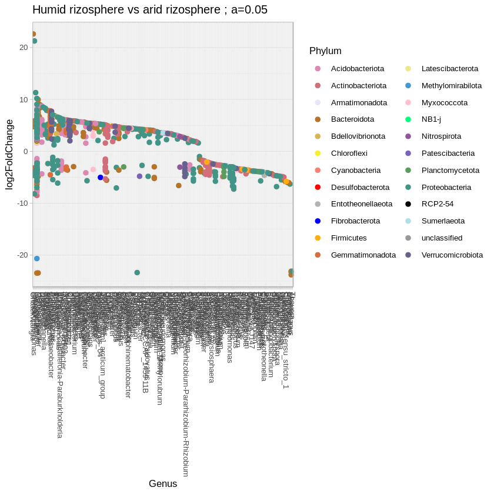
    


```R
# Humid (humid + perhumid) vs arid endospheres
alpha = 0.05
merge_phyloseq(subset_samples(calabacita, samplec=="endosphere_arid"), 
               subset_samples(calabacita, samplec=="endosphere_humid"))-> ear.ehu.phy
ear.ehu.ds <- phyloseq_to_deseq2(ear.ehu.phy, ~samplec)
ear.ehu.ds<-DESeq(ear.ehu.ds, test="Wald", fitType="local")
ear.ehu.ds.res <- results(ear.ehu.ds, cooksCutoff = FALSE)
ear.ehu.ds.res
sigtab.ear.ehu<-ear.ehu.ds.res[which(ear.ehu.ds.res$padj < alpha), ]
sigtab.ear.ehu<-cbind(as(sigtab.ear.ehu, "data.frame"), as(tax_table(ear.ehu.phy)[rownames(sigtab.ear.ehu), ], 
                                                           "matrix"))
sigtab.ear.ehu.x=tapply(sigtab.ear.ehu$log2FoldChange, sigtab.ear.ehu$Genus, function(x) max(x))
sigtab.ear.ehu.x=sort(sigtab.ear.ehu.x, TRUE)
sigtab.ear.ehu$Genus = factor(as.character(sigtab.ear.ehu$Genus), levels=names(sigtab.ear.ehu.x))
write.csv(sigtab.ear.ehu, "ear.ehu.csv" )
                        
#Plot significant enriched OTUs in arid endospheres by climate
print("Enriched OTUs in humid and arid endosphere samples")
earhudes <- ggplot(sigtab.ear.ehu, aes(x=Genus, y=log2FoldChange, color=Phylum)) + 
                       scale_color_manual(values = c("Acidobacteriota" = "#dd87b4ff", 
                              "Actinobacteriota" = "#d26d7aff",
                              "Armatimonadota" = "lavender",
                              "Bacteroidota" = "#b6742aff", 
                              "Bdellovibrionota" = "#d8b655ff",
                              "Chloroflexi" = "#f6ef32ff", 
                              "Cyanobacteria" = "salmon",
                              "Desulfobacterota" = "red",                    
                              "Entotheonellaeota" = "#b3b3b3ff",
                              "Fibrobacterota" = "blue",
                              "Firmicutes" = "#ffad12ff", 
                              "Gemmatimonadota" = "#d96d3bff",
                              "Latescibacterota" = "khaki",
                              "Methylomirabilota" = "#4198d7ff",
                              "Myxococcota" = "pink",
                              "NB1-j" = "springgreen",
                              "Nitrospirota" = "#91569aff",
                              "Patescibacteria" = "#7a61baff",
                              "Planctomycetota" = "#5a9d5aff", 
                              "Proteobacteria" = "#419486ff", 
                              "RCP2-54" = "black",
                              "Sumerlaeota" = "powderblue",
                              "Verrucomicrobiota" = "#66628dff", 
                              "unclassified" = "#999999ff")) +
                        geom_point(size=2.5, alpha=1) +
                        theme_light() + theme(text = element_text(size=10), 
                                              axis.text.x = element_text(angle = -90, hjust = 0, vjust=0.5)) + 
                        ggtitle("Humid endosphere vs arid endosphere ; a=0.05")
ggsave("earhudes.pdf", width = 45, height = 15, units = "cm")       
earhudes
```

    converting counts to integer mode
    estimating size factors
    estimating dispersions
    gene-wise dispersion estimates
    mean-dispersion relationship
    final dispersion estimates
    fitting model and testing
    -- replacing outliers and refitting for 771 genes
    -- DESeq argument 'minReplicatesForReplace' = 7 
    -- original counts are preserved in counts(dds)
    estimating dispersions
    fitting model and testing


    log2 fold change (MLE): samplec endosphere humid vs endosphere arid 
    Wald test p-value: samplec endosphere humid vs endosphere arid 
    DataFrame with 73277 rows and 6 columns
                     baseMean    log2FoldChange            lfcSE               stat
                    <numeric>         <numeric>        <numeric>          <numeric>
    207464                  0                NA               NA                 NA
    107688                  0                NA               NA                 NA
    278575                  0                NA               NA                 NA
    94108  0.0474463042614192 0.032061902948323 3.13503791676162 0.0102269585885717
    111072                  0                NA               NA                 NA
    ...                   ...               ...              ...                ...
    213525                  0                NA               NA                 NA
    109559                  0                NA               NA                 NA
    107136                  0                NA               NA                 NA
    210038 0.0327668260592136 0.032061902948323 3.13503791676162 0.0102269585885717
    269825                  0                NA               NA                 NA
                      pvalue      padj
                   <numeric> <numeric>
    207464                NA        NA
    107688                NA        NA
    278575                NA        NA
    94108  0.991840209878125        NA
    111072                NA        NA
    ...                  ...       ...
    213525                NA        NA
    109559                NA        NA
    107136                NA        NA
    210038 0.991840209878125        NA
    269825                NA        NA


    [1] "Enriched OTUs in humid and arid endosphere samples"


    Warning message:
    “Removed 1 rows containing missing values (geom_point).”Warning message:
    “Removed 1 rows containing missing values (geom_point).”


    
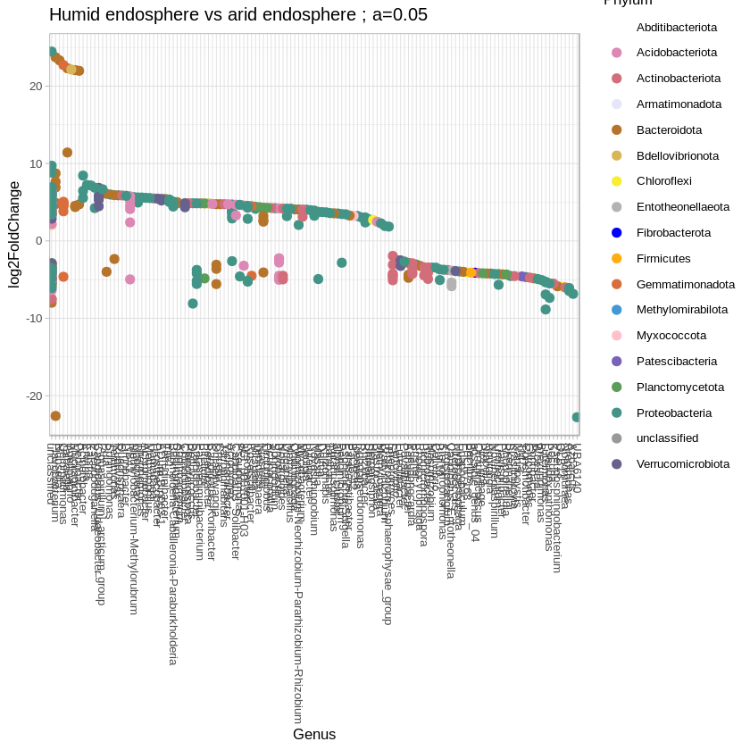
    


```R
#Comparisons between arid and humid groups

rhizosphere <- subset_samples(gcalabacita, type=="rhizosphere")
endosphere <- subset_samples(gcalabacita, type=="endosphere")

m_rhizo_endo <- merge_samples(merge_phyloseq(rhizosphere, endosphere), "type")
m_rhizo_endo <- filter_taxa(m_rhizo_endo, function (x) {sum(x > 0) > 0}, prune=TRUE)
rhizo_endo_d <- t(as.data.frame(as(otu_table(m_rhizo_endo), "matrix"),row.names = FALSE))
colnames(rhizo_endo_d) <- c("Rhizosphere", "Endosphere")
rhizo_endo_t <- as.data.frame(as(tax_table(m_rhizo_endo), "matrix"),row.names = FALSE)
rhizo_endo_mi <- cbind(rhizo_endo_t, rhizo_endo_d)
rhizo_endo_mi <- rhizo_endo_mi %>% select(Genus, Rhizosphere, Endosphere)
rhizo_endo_mi[rhizo_endo_mi > 0] = 1
rhizo_endo_dat <- as.data.frame(rhizo_endo_mi)
row.names(rhizo_endo_dat) <- NULL
rhizo_endo_dat <- rhizo_endo_dat %>% subset(Genus != "unclassified")
rhizo_endo_dat <- unique(rhizo_endo_dat)

print("Genus per sample type")
#Venn diagram
print("Venn diagram")
rhizo_endo_dat$Genus <- NULL

pdf("venn_rhizo_endo.pdf")
venn <- vennDiagram(vennCounts(rhizo_endo_dat), circle.col=c("#A0522D", "#228B22"))
dev.off()

vennDiagram(vennCounts(rhizo_endo_dat), circle.col=c("#A0522D", "#228B22"))

#Get genus list from arid and humid climates

#Arid genera list
frhizosphere <- filter_taxa(rhizosphere, function (x) {sum(x > 0) > 0}, prune=TRUE)
rhizospheret <- as.data.frame(as(tax_table(frhizosphere), "matrix"),row.names = FALSE)
rhizospheret <- rhizospheret %>% subset(Genus != "unclassified")
rhizospheret <- unique(rhizospheret)
r_genus <- as.vector(rhizospheret$Genus)
write.table(r_genus, "r_genus.txt", row.names = FALSE, quote = FALSE, col.names = FALSE)

#Humid genera list
fendosphere <- filter_taxa(endosphere, function (x) {sum(x > 0) > 0}, prune=TRUE)
endospheret <- as.data.frame(as(tax_table(fendosphere), "matrix"),row.names = FALSE)
endospheret <- endospheret %>% subset(Genus != "unclassified")
endospheret <- unique(endospheret)
e_genus <- as.vector(endospheret$Genus)
write.table(e_genus, "e_genus.txt", row.names = FALSE, quote = FALSE, col.names = FALSE)

#Make Venn diagrams with online tool:
#Alternatively, venn diagrams can be made from previous lists (a_genus.txt and h_genus.txt) with online tool:

#http://bioinformatics.psb.ugent.be/webtools/Venn/
```

    Warning message in Ops.factor(left, right):
    “‘>’ not meaningful for factors”

    [1] "Genus per sample type"
    [1] "Venn diagram"


<strong>png:</strong> 2


    
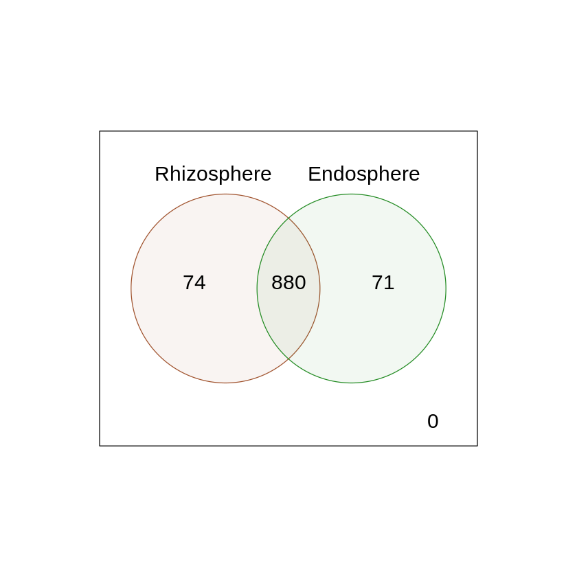
    


```R
# Rhizosphere vs endosphere
alpha = 0.05
merge_phyloseq(subset_samples(calabacita, type=="rhizosphere"), 
               subset_samples(calabacita, type=="endosphere"))->rh.en.phy
rh.en.ds <- phyloseq_to_deseq2(rh.en.phy, ~type)
rh.en.ds<-DESeq(rh.en.ds, test="Wald", fitType="local")
rh.en.ds.res <- results(rh.en.ds, cooksCutoff = FALSE)
rh.en.ds.res
```

    converting counts to integer mode
    estimating size factors
    estimating dispersions
    gene-wise dispersion estimates
    mean-dispersion relationship
    final dispersion estimates
    fitting model and testing
    -- replacing outliers and refitting for 2144 genes
    -- DESeq argument 'minReplicatesForReplace' = 7 
    -- original counts are preserved in counts(dds)
    estimating dispersions
    fitting model and testing


    log2 fold change (MLE): type endosphere vs rhizosphere 
    Wald test p-value: type endosphere vs rhizosphere 
    DataFrame with 73277 rows and 6 columns
                     baseMean    log2FoldChange            lfcSE
                    <numeric>         <numeric>        <numeric>
    207464 0.0340288399455942 0.341042988746567 2.95307877820742
    107688 0.0512497988180154 0.622428405422208 2.95294216225197
    278575 0.0336087621152546 -0.07771337061895 2.95322853448815
    94108  0.0347419171242861 0.622428405422208 2.95294216225197
    111072  0.116271413423579 0.911088643744739 2.95268955717123
    ...                   ...               ...              ...
    213525 0.0292900774083066 0.341042988746567 2.95307877820742
    109559 0.0457367659792459 0.622428405422208 2.95294216225197
    107136  0.116569862010409  0.77364211267441 2.89557454428569
    210038 0.0384249663108159 0.622428405422208 2.95294216225197
    269825 0.0395159220884029 0.622428405422208 2.95294216225197
                          stat            pvalue              padj
                     <numeric>         <numeric>         <numeric>
    207464   0.115487264093099 0.908058914713477 0.989788326471632
    107688   0.210782457367039 0.833057028004127 0.989788326471632
    278575 -0.0263147161526458 0.979006317183783 0.989788326471632
    94108    0.210782457367039 0.833057028004127 0.989788326471632
    111072   0.308562287400641 0.757654512096761 0.989788326471632
    ...                    ...               ...               ...
    213525   0.115487264093099 0.908058914713477 0.989788326471632
    109559   0.210782457367039 0.833057028004127 0.989788326471632
    107136   0.267180865435209  0.78932990796825 0.989788326471632
    210038   0.210782457367039 0.833057028004127 0.989788326471632
    269825   0.210782457367039 0.833057028004127 0.989788326471632


```R
# Rhizosphere vs endosphere
alpha = 0.05

#Remove sterilized controls
ns_calabacita <- subset_samples(calabacita, treatment!="sterilized")

merge_phyloseq(subset_samples(ns_calabacita, type=="rhizosphere"), 
               subset_samples(ns_calabacita, type=="endosphere"))->rh.en.phy
rh.en.ds <- phyloseq_to_deseq2(rh.en.phy, ~type)
rh.en.ds<-DESeq(rh.en.ds, test="Wald", fitType="local")
rh.en.ds.res <- results(rh.en.ds, cooksCutoff = FALSE)
rh.en.ds.res
sigtab.rh.en<-rh.en.ds.res[which(rh.en.ds.res$padj < alpha), ]
sigtab.rh.en<-cbind(as(sigtab.rh.en, "data.frame"), as(tax_table(rh.en.phy)[rownames(sigtab.rh.en), ], 
                                                           "matrix"))
sigtab.rh.en.x=tapply(sigtab.rh.en$log2FoldChange, sigtab.rh.en$Genus, function(x) max(x))
sigtab.rh.en.x=sort(sigtab.rh.en.x, TRUE)
sigtab.rh.en$Genus = factor(as.character(sigtab.rh.en$Genus), levels=names(sigtab.rh.en.x))
write.csv(sigtab.rh.en, "rh.en.csv" )
                        
#Plot significant enriched OTUs in arid endospheres by climate
print("Enriched OTUs in endosphere and rhizosphere")
earhudes <- ggplot(sigtab.rh.en, aes(x=Genus, y=log2FoldChange, color=Phylum)) + 
                       scale_color_manual(values = c("Acidobacteriota" = "#dd87b4ff", 
                              "Actinobacteriota" = "#d26d7aff",
                              "Armatimonadota" = "lavender",
                              "Bacteroidota" = "#b6742aff", 
                              "Bdellovibrionota" = "#d8b655ff",
                              "Chloroflexi" = "#f6ef32ff", 
                              "Cyanobacteria" = "salmon",
                              "Desulfobacterota" = "red",                    
                              "Entotheonellaeota" = "#b3b3b3ff",
                              "Fibrobacterota" = "blue",
                              "Firmicutes" = "#ffad12ff", 
                              "Gemmatimonadota" = "#d96d3bff",
                              "Latescibacterota" = "khaki",
                              "Methylomirabilota" = "#4198d7ff",
                              "Myxococcota" = "pink",
                              "NB1-j" = "springgreen",
                              "Nitrospirota" = "#91569aff",
                              "Patescibacteria" = "#7a61baff",
                              "Planctomycetota" = "#5a9d5aff", 
                              "Proteobacteria" = "#419486ff", 
                              "RCP2-54" = "black",
                              "Sumerlaeota" = "powderblue",
                              "Verrucomicrobiota" = "#66628dff", 
                              "unclassified" = "#999999ff")) +
                        geom_point(size=2.5, alpha=1) +
                        theme_light() + theme(text = element_text(size=10), 
                                              axis.text.x = element_text(angle = -90, hjust = 0, vjust=0.5)) + 
                        ggtitle("Endosphere vs rhizosphere ; a=0.05")
ggsave("rhiendes.pdf", width = 45, height = 15, units = "cm")       
earhudes
```

    converting counts to integer mode
    estimating size factors
    estimating dispersions
    gene-wise dispersion estimates
    mean-dispersion relationship
    final dispersion estimates
    fitting model and testing
    -- replacing outliers and refitting for 1502 genes
    -- DESeq argument 'minReplicatesForReplace' = 7 
    -- original counts are preserved in counts(dds)
    estimating dispersions
    fitting model and testing


    log2 fold change (MLE): type endosphere vs rhizosphere 
    Wald test p-value: type endosphere vs rhizosphere 
    DataFrame with 73277 rows and 6 columns
                     baseMean    log2FoldChange             lfcSE              stat
                    <numeric>         <numeric>         <numeric>         <numeric>
    207464                  0                NA                NA                NA
    107688                  0                NA                NA                NA
    278575                  0                NA                NA                NA
    94108  0.0278442436629294 0.707182107567878 0.835690219077998  0.84622518180014
    111072                  0                NA                NA                NA
    ...                   ...               ...               ...               ...
    213525                  0                NA                NA                NA
    109559                  0                NA                NA                NA
    107136                  0                NA                NA                NA
    210038 0.0190669493212278 0.707182361022026 0.759155669877293 0.931538008714777
    269825                  0                NA                NA                NA
                      pvalue            padj
                   <numeric>       <numeric>
    207464                NA              NA
    107688                NA              NA
    278575                NA              NA
    94108  0.397427136583386 0.9895975821799
    111072                NA              NA
    ...                  ...             ...
    213525                NA              NA
    109559                NA              NA
    107136                NA              NA
    210038 0.351575332966942 0.9895975821799
    269825                NA              NA


    [1] "Enriched OTUs in endosphere and rhizosphere"


    
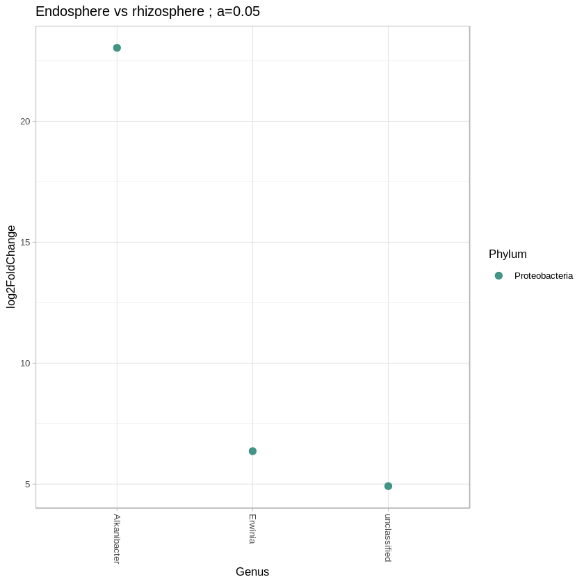
    


```R
#Infer correlations from genus overrepresented in arid and humid samples
library(corrplot)
library(psych)

#Genus from rhizosphere positevely related to plant phenotype
rhizo <- unique(sigtab.rar.rhu$Genus)
rhizo <- rhizo %>% subset(rhizo!= "unclassified")

rgcalabacita <- transform_sample_counts(gcalabacita, function(x) x / sum(x))
phylo_rhizo <- subset_samples(subset_samples(rgcalabacita, type=="rhizosphere"), treatment!="local")
phylo_rhizo <- subset_taxa(phylo_rhizo, Genus %in% rhizo)

#Get metadata for correlations
meta_num <- unlist(lapply(meta(phylo_rhizo), is.numeric))  
metadata_rhizo <- meta(phylo_rhizo)[ , meta_num]
metadata_rhizo <- metadata_rhizo[, colSums(is.na(metadata_rhizo)) != nrow(metadata_rhizo)]
metadata_rhizo <- metadata_rhizo[, 1:16]

#Get count table for the abundance of each genus
taxa_rhizo <- as.data.frame(as(tax_table(phylo_rhizo), "matrix"),row.names = FALSE)
otu_rhizo <- as.data.frame(as(t(otu_table(phylo_rhizo)), "matrix"),row.names = FALSE)
colnames(otu_rhizo) <- as.vector(taxa_rhizo$Genus)

#Bind both tables
print("Phenotypic variables and relative abundance")
tab_rhizo <- cbind(metadata_rhizo, otu_rhizo)
write.csv(tab_rhizo, "tab_rhizo.csv")
tab_rhizo <- read.csv("tab_rhizo.csv", row.names=1)

#Correlogram for rizosphere sample matrix
#Correlation are done with spearman correlations, with BH correction for false discovery rate.
col <- colorRampPalette(c("#8b5016ff", "white", "#0b655dff"))(20)
rcorr <- corr.test(tab_rhizo, method = "spearman", adjust = "BH", alpha = 0.05)

r <- rcorr$r[1:13, 17:228]
p <- rcorr$p[1:13, 17:228]

corrplot(r, method= "color", tl.col = "black", p.mat = p, sig.level = .05, insig = "blank", 
         col = col, tl.cex=0.45)

pdf(file = "rcplot.pdf", width = 40, height = 15)
ecplot <- corrplot(r, method= "color", tl.col = "black", p.mat = p, sig.level = .05, insig = "blank", col = col)
dev.off()   

```

    corrplot 0.84 loaded
    
    Attaching package: ‘psych’
    
    The following object is masked from ‘package:IRanges’:
    
        reflect
    
    The following objects are masked from ‘package:ggplot2’:
    
        %+%, alpha
    


    [1] "Phenotypic variables and relative abundance"


<strong>png:</strong> 2


    
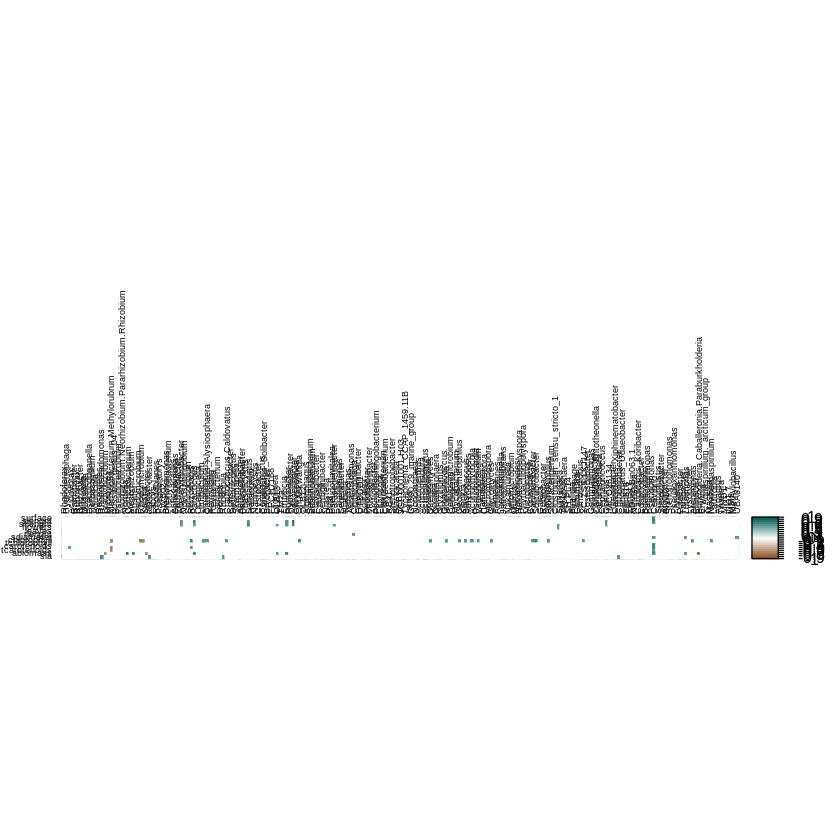
    


```R
#Genus from endosphere positevely related to plant phenotype
endo <- unique(sigtab.ear.ehu$Genus)
endo <- endo %>% subset(endo!= "unclassified")

phylo_endo <- subset_samples(subset_samples(rgcalabacita, type=="endosphere"), treatment!="local")
phylo_endo <- subset_taxa(phylo_endo, Genus %in% endo)

#Get metadata for correlations
meta_num <- unlist(lapply(meta(phylo_endo), is.numeric))  
metadata_endo <- meta(phylo_endo)[ , meta_num]
metadata_endo <- metadata_endo[, colSums(is.na(metadata_endo)) != nrow(metadata_endo)]
metadata_endo <- metadata_endo[, 1:16]

#Get count table for the abundance of each genus
taxa_endo <- as.data.frame(as(tax_table(phylo_endo), "matrix"),row.names = FALSE)
otu_endo <- as.data.frame(as(t(otu_table(phylo_endo)), "matrix"),row.names = FALSE)
colnames(otu_endo) <- as.vector(taxa_endo$Genus)

#Bind both tables
print("Phenotypic variables and relative abundance")
tab_endo <- cbind(metadata_endo, otu_endo)
write.csv(tab_endo, "tab_endo.csv")
tab_endo <- read.csv("tab_endo.csv", row.names=1)

#Correlogram for rizosphere sample matrix
#Correlation are done with spearman correlations, with BH correction for false discovery rate.
col <- colorRampPalette(c("#8b5016ff", "white", "#0b655dff"))(20)
rcorr <- corr.test(tab_endo, method = "spearman", adjust = "BH", alpha = 0.05)

r <- rcorr$r[1:13, 17:150]
p <- rcorr$p[1:13, 17:150]

corrplot(r, method= "color", tl.col = "black", p.mat = p, sig.level = .05, insig = "blank", 
         col = col, tl.cex=0.45)


pdf(file = "ecplot.pdf", width = 27, height = 15)
ecplot <- corrplot(r, method= "color", tl.col = "black", p.mat = p, sig.level = .05, insig = "blank", col = col)
dev.off()
```

    [1] "Phenotypic variables and relative abundance"


<strong>png:</strong> 2


    
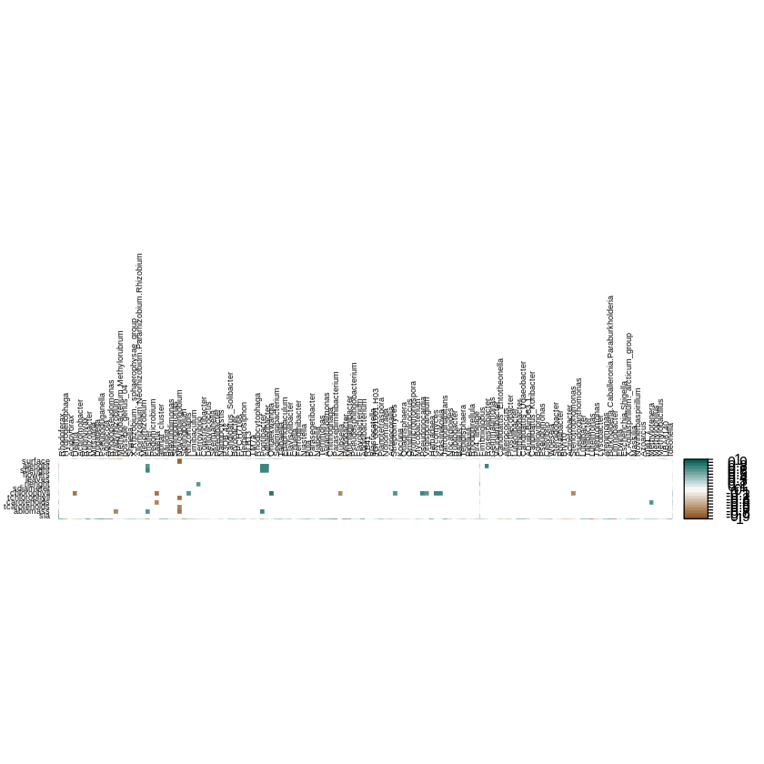
    


```R
#Infer correlations from genus overrepresented in arid and humid samples
library(corrplot)
library(psych)

#Genus from rhizosphere positevely related to plant phenotype
rhizo <- unique(sigtab.rar.rhu$Genus)
rhizo <- rhizo %>% subset(rhizo!= "unclassified")

rgcalabacita <- transform_sample_counts(gcalabacita, function(x) x / sum(x))
phylo_rhizo <- subset_samples(subset_samples(rgcalabacita, type=="rhizosphere"), treatment!="local")
phylo_rhizo <- subset_taxa(phylo_rhizo, Genus %in% rhizo)

#Get metadata for correlations
meta_num <- unlist(lapply(meta(phylo_rhizo), is.numeric))  
metadata_rhizo <- meta(phylo_rhizo)[ , meta_num]
metadata_rhizo <- metadata_rhizo[, colSums(is.na(metadata_rhizo)) != nrow(metadata_rhizo)]
metadata_rhizo <- metadata_rhizo[, 1:16]

#Get count table for the abundance of each genus
taxa_rhizo <- as.data.frame(as(tax_table(phylo_rhizo), "matrix"),row.names = FALSE)
otu_rhizo <- as.data.frame(as(t(otu_table(phylo_rhizo)), "matrix"),row.names = FALSE)
colnames(otu_rhizo) <- as.vector(taxa_rhizo$Genus)

#Bind both tables
print("Phenotypic variables and relative abundance")
tab_rhizo <- cbind(metadata_rhizo, otu_rhizo)
write.csv(tab_rhizo, "tab_rhizo.csv")
tab_rhizo <- read.csv("tab_rhizo.csv", row.names=1)

#Correlogram for rizosphere sample matrix
#Correlation are done with spearman correlations, with BH correction for false discovery rate.
col <- colorRampPalette(c("#8b5016ff", "white", "#0b655dff"))(20)
rcorr <- corr.test(tab_rhizo, method = "spearman", adjust = "BH", alpha = 0.05)

r <- rcorr$r[1:13, 17:228]
p <- rcorr$p[1:13, 17:228]

corrplot(r, method= "color", tl.col = "black", p.mat = p, sig.level = .05, insig = "blank", 
         col = col, tl.cex=0.45)

pdf(file = "rcplot.pdf", width = 80, height = 15)
ecplot <- corrplot(r, method= "number", number.font = 4, number.digits= 1, tl.col = "black", p.mat = p, sig.level = .05, insig = "blank", col = col)
dev.off()   
```

    [1] "Phenotypic variables and relative abundance"


<strong>png:</strong> 2


    

    

